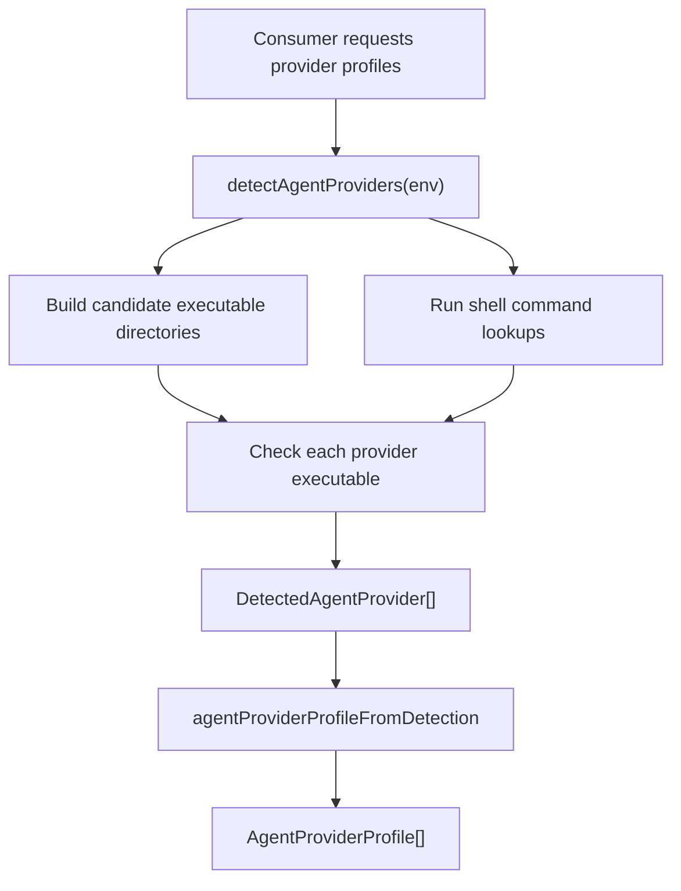
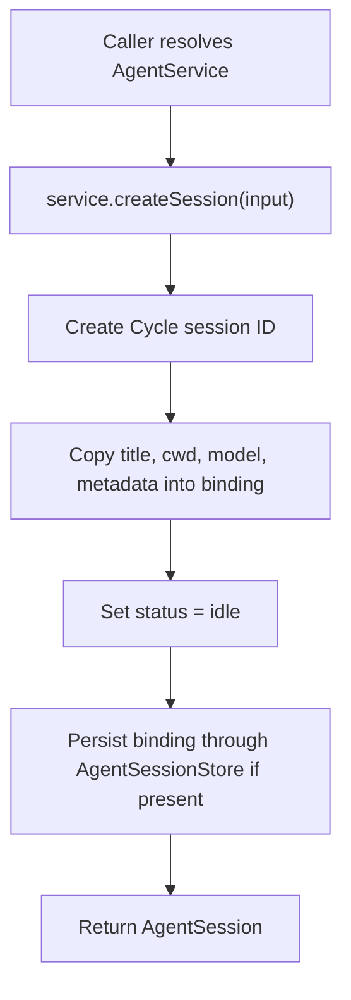
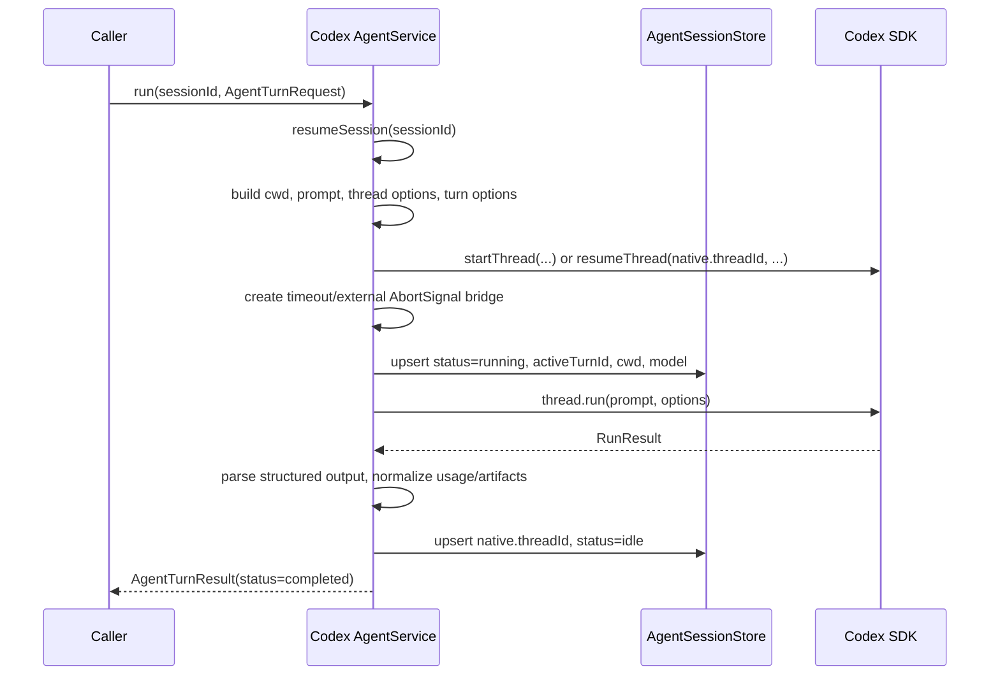
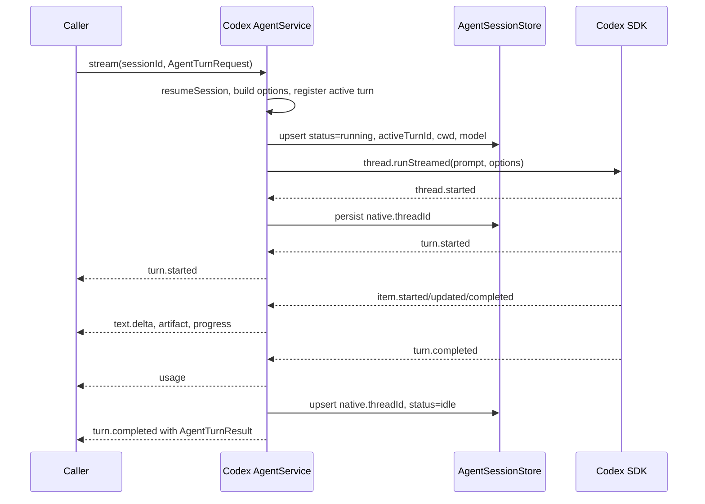
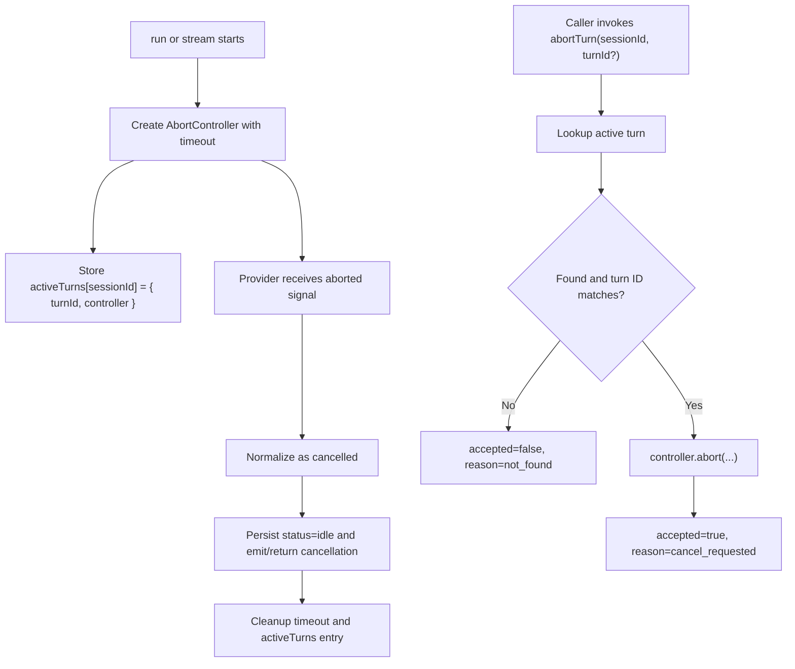

# Agents Package Architecture

`@cycle/agents` is the provider abstraction layer for local AI agent execution in Cycle. It owns the shared TypeScript contracts, local provider detection, capability metadata, service registry, and the Codex execution adapter. It deliberately does not own UI, HTTP routing, database schema, chat persistence, or request authorization; those are supplied by consuming packages.

## Goals

- Present one provider-agnostic `AgentService` contract for session creation, session resume, turn execution, streaming, cancellation, and shutdown.
- Normalize provider-specific responses into Cycle-owned result, event, artifact, usage, and error types.
- Detect locally installed provider CLIs and expose profile/capability information for API and desktop consumers.
- Keep persistence pluggable through `AgentSessionStore` so desktop, tests, and other runtimes can choose their own storage.
- Allow provider support to be added incrementally. Codex has an executable adapter today; Claude Code and OpenCode currently expose definitions and capabilities but resolve to unsupported execution unless a consumer registers a real service.

## Package Shape

```text
packages/agents/
  src/
    types.ts                  Shared contracts and normalized data model
    detection.ts              Local executable detection and Effect service layer
    providers.ts              Public provider catalog export
    service.ts                Public service registry export
    codex.ts                  Public Codex adapter export
    providers/
      catalog.ts              Provider definitions, profiles, capabilities lookup
      shared.ts               Shared job type groups
      codex/                  Codex implementation using @openai/codex-sdk
      claude/                 Claude Code definition and capability metadata
      opencode/               OpenCode definition and capability metadata
    services/
      AgentServiceRegistry.ts Provider-to-service lookup
      DefaultAgentServices.ts Default registry with Codex enabled
      UnsupportedAgentService.ts Stub execution for unsupported providers
  test/
    codex.test.ts             Codex execution, streaming, and session persistence
    detection.test.ts         Provider detection and unsupported service contracts
```

The package exports subpaths from `package.json` for the main contract, provider catalog, detection, services, and Codex-specific adapter utilities:

- `@cycle/agents`
- `@cycle/agents/types`
- `@cycle/agents/providers`
- `@cycle/agents/detection`
- `@cycle/agents/service`
- `@cycle/agents/codex`
- provider capability subpaths under `@cycle/agents/providers/*`

## Layers

### 1. Contract Layer

`src/types.ts` defines the provider-neutral API surface. The main concepts are:

- `AgentProviderId`: supported provider identifiers, currently `codex`, `claude`, and `opencode`.
- `AgentCapabilities`: what a provider can do, including streaming, structured output, workspace access, session persistence, artifacts, file changes, MCP, tool events, usage, and abort support.
- `AgentProviderProfile`: UI/API-facing provider status derived from detection and capability metadata.
- `AgentSession`: an in-process session handle returned to callers.
- `AgentSessionBinding`: a serializable persistence record that stores provider, status, cwd, model, native provider IDs, active turn ID, errors, and metadata.
- `AgentSessionStore`: the persistence boundary for session bindings.
- `AgentTurnRequest`: normalized input, model, instructions, response format, MCP attachment, context, abort signal, and metadata for a turn.
- `AgentTurnResult`: terminal result for non-streaming execution.
- `AgentEvent`: streaming event union for turn lifecycle, text deltas, progress, artifacts, usage, completion, failure, and cancellation.
- `AgentService`: the service interface implemented by executable providers.

Everything outside this layer should depend on these normalized types instead of provider SDK types.

### 2. Provider Catalog Layer

`src/providers/catalog.ts` and provider capability files describe supported providers independent of execution.

The catalog contains:

- `supportedAgentProviders`: static provider definitions for Codex, Claude Code, and OpenCode.
- `isAgentProviderId`: runtime validation for provider IDs.
- `defaultAgentCapabilities`: capability lookup by provider.
- `agentProviderProfileFromDetection`: converts detector output into API/UI-ready profiles.
- `staticAgentProviderProfile`: fallback profile generation when detection cannot run.

Codex is the only provider marked executable by the default service registry. Claude Code and OpenCode are detectable and have capability metadata, but `agentProviderProfileFromDetection` marks them `unsupported` so consumers can show that they exist without offering execution through this package.

### 3. Detection Layer

`src/detection.ts` detects local provider CLIs and exposes the same behavior both as a standalone Effect-returning function and as an Effect service.

Detection checks:

- Direct executable lookup across `PATH`.
- Common local binary directories such as user package-manager bins and Homebrew locations.
- NVM Node version bins on non-Windows platforms.
- Shell lookup through login/interactive shell command resolution, which catches tools made available by shell startup files when `PATH` is sparse.
- Windows executable extensions from `PATHEXT`.

The primary function is:

```ts
detectAgentProviders(env?: AgentProviderDetectionEnvironment)
```

It returns one `DetectedAgentProvider` per `supportedAgentProviders` entry, with status `available` or `missing`, optional `executablePath`, timestamp, executable name, display name, and capability metadata.

`AgentProviderDetectorLive` wraps detection in an Effect `Layer` for desktop/API integration.

### 4. Service Registry Layer

`src/services/AgentServiceRegistry.ts` provides provider-to-service lookup:

```ts
serviceFor(provider: AgentProviderId): Effect.Effect<AgentService>
```

`makeAgentServiceRegistry` accepts explicit provider entries and an optional fallback. If no service exists, it returns `makeUnsupportedAgentService(provider)`.

`src/services/DefaultAgentServices.ts` builds the default runtime registry:

- Registers Codex through `makeCodexAgentService`.
- Uses `makeUnsupportedAgentService` for all other providers.
- Passes through a shared optional `AgentSessionStore`.

This keeps consumers from needing to know which providers are implemented. They ask the registry for a provider service and receive either a real adapter or a normalized unsupported service.

### 5. Unsupported Provider Layer

`src/services/UnsupportedAgentService.ts` implements the full `AgentService` interface for providers without an executable adapter.

It:

- Creates and resumes sessions in memory and optionally in `AgentSessionStore`.
- Returns provider capabilities from `defaultAgentCapabilities`.
- Fails `run` with `unsupported_option`.
- Emits `turn.started` then `turn.failed` from `stream`.
- Rejects aborts with `not_supported`.

This gives API/UI layers a consistent service shape even when a provider is only represented by catalog metadata.

### 6. Codex Adapter Layer

`src/providers/codex` is the only executable provider implementation in this package. It adapts Cycle's `AgentService` contract to `@openai/codex-sdk`.

Main files:

- `service.ts`: constructs the service, owns in-memory sessions and active turn controllers, persists session bindings, and exposes `AgentService` methods.
- `client.ts`: converts Cycle requests into Codex client, thread, turn, environment, MCP, prompt, cwd, sandbox, model, schema, timeout, and abort options.
- `runTurn.ts`: non-streaming turn execution through `thread.run`.
- `streamTurn.ts`: streaming turn execution through `thread.runStreamed`.
- `events.ts`: converts Codex usage and thread items into Cycle usage, artifacts, and progress messages.
- `streamState.ts`: tracks streamed items and computes text deltas/final text.
- `session.ts`: converts between `AgentSessionBinding` and in-memory Codex sessions, including native thread IDs.
- `errors.ts`: normalizes provider errors into `AgentError`.
- `runtime.ts`: shared runtime shape passed into run/stream helpers.
- `types.ts`: Codex-specific options and SDK-like test interfaces.

`CodexAgentServiceOptions` is the adapter configuration boundary. It supports dependency injection for tests, custom Codex options, cwd fallback, environment variables, executable path override, sandbox mode, session store, and timeout.

## Services

### AgentProviderDetector

Effect service for local provider discovery.

```text
AgentProviderDetectorLive
  -> detectAgentProviders(process.env)
  -> supportedAgentProviders
  -> DetectedAgentProvider[]
```

Consumers use it when they need local availability, executable paths, or a fresh checked timestamp.

### AgentServiceRegistry

Effect service for selecting the execution adapter.

```text
makeDefaultAgentServiceRegistry(options)
  -> codex: makeCodexAgentService(options)
  -> fallback: makeUnsupportedAgentService(provider, { sessionStore })
```

Consumers use it before chat/agent execution to resolve the provider-specific `AgentService`.

### AgentSessionStore

Interface supplied by consuming packages. The agents package never chooses a database. It only calls:

- `get(sessionId)` to resume persisted bindings.
- `upsert(binding)` when session status or native thread metadata changes.
- Optional `delete`, `list`, and `close` when consumers support those operations.

The Codex adapter stores native Codex thread IDs in `binding.native.threadId` so future turns can call `resumeThread` instead of `startThread`.

## Execution Flow

### Provider Detection Flow



Important details:

- Detection is best-effort. Shell lookup failures and NVM directory failures are swallowed and return partial results.
- Every supported provider is returned, even when missing.
- Provider profiles intentionally mark non-Codex providers as `unsupported` for execution.

### Session Creation Flow



For Codex, session IDs are generated with `session_<uuid>`. `resumeSession(sessionId)` first checks `AgentSessionStore`, then the in-memory map, then creates an idle session for the given ID.

### Non-Streaming Codex Turn Flow



Failure path:

- Provider errors are normalized with `normalizeCodexError`.
- Authentication-like messages become `authentication_error`.
- Abort-like messages become `cancelled`.
- Timeout-like messages become `timeout`.
- Other failures become `provider_error`.
- The session binding is updated with `status=error` for failures or `status=idle` for cancellation.
- `run` returns a failed or cancelled `AgentTurnResult`; it does not throw for provider failures.

### Streaming Codex Turn Flow



Streaming state is accumulated by `makeCodexStreamState`:

- Agent message items produce incremental `text.delta` events.
- Tool, command, file-change, reasoning, todo-list, web-search, and error items become artifacts and/or progress events.
- Final text is reconstructed from ordered agent message items.
- The terminal `turn.completed` event carries the same normalized shape as `run`.

If the SDK stream ends without an explicit terminal event, `streamCodexTurn` still emits `turn.completed` using the accumulated text and artifacts.

### Cancellation Flow



`close()` aborts all active turns and clears the active-turn map.

## Codex Request Mapping

Cycle request field mapping:

| Cycle field | Codex mapping |
| --- | --- |
| `input` | Text prompt input. Structured part input currently joins text parts with blank lines. |
| `instructions` | Prepended to input in `buildPrompt`. |
| `context.cwd` | Preferred working directory for the Codex thread. Falls back to service option `cwd`. |
| `model.id` | `ThreadOptions.model`. |
| `responseFormat.type = "json_schema"` | `TurnOptions.outputSchema`; result text is parsed with `format.parse` or `JSON.parse`. |
| `mcp.mode = "http"` | Adds a `cycle` MCP server to Codex config. Bearer token is extracted into `CYCLE_AGENT_MCP_TOKEN`. |
| `signal` | Bridged into the per-turn controller. |
| `metadata` | Copied to `AgentTurnResult.metadata`. |

`AgentMcpAttachment` also defines `stdio` attachments at the normalized contract layer, but the current Codex client mapping only configures HTTP MCP servers.

Default Codex thread options:

- `approvalPolicy: "never"`
- `sandboxMode: options.sandboxMode ?? "read-only"`
- `skipGitRepoCheck: true`
- Optional `workingDirectory`
- Optional `model`

Default timeout is `120_000` milliseconds.

## Artifact and Event Normalization

Codex `ThreadItem` values are converted into Cycle artifacts:

| Codex item type | Cycle output |
| --- | --- |
| `agent_message` | `text.delta` events; no artifact. |
| `command_execution` | `AgentToolArtifact` named `command_execution` plus progress text. |
| `file_change` | `AgentPatchArtifact` with changed file paths and raw change metadata. |
| `mcp_tool_call` | `AgentToolArtifact` named `<server>.<tool>` plus progress text. |
| `reasoning` | Raw artifact and `Reasoning.` progress. |
| `todo_list` | Raw artifact and `Updated plan.` progress. |
| `web_search` | Raw artifact and search progress. |
| `error` | Raw artifact and error message progress. |

Codex usage is normalized into:

- `inputTokens`
- `outputTokens`
- `reasoningTokens`
- `cacheReadTokens`
- `totalTokens`

## Persistence Model

The agents package persists only `AgentSessionBinding` records. The binding is intentionally small and serializable:

- Cycle session identity: `sessionId`, `provider`.
- Runtime status: `idle`, `starting`, `running`, `waiting`, `stopped`, or `error`.
- User/session metadata: `title`, `cwd`, `model`, `metadata`.
- Integration metadata: `threadId` for the consuming app, `native.threadId` for the provider.
- Active execution state: `activeTurnId`, `lastError`, timestamps.

Codex persistence rules:

- `createSession` stores an idle binding.
- `run` and `stream` store `running` before invoking the SDK.
- Native Codex thread IDs are stored as soon as they are known.
- Completed and cancelled turns return the binding to idle.
- Failed turns store `status=error` and `lastError`.
- Active turn IDs are cleared when status is no longer active.

## Error Handling

The package exposes provider failures as `AgentError` rather than raw SDK errors.

The Codex adapter uses message-based normalization:

- Login/authentication text -> `authentication_error`.
- Abort text -> `cancelled`.
- Timeout text -> `timeout`.
- Everything else -> `provider_error`.

Unsupported providers return `unsupported_option`. Raw errors are preserved on internal result objects but consumers that expose data publicly should strip `raw`, as the API layer does.

## Testing

The current tests cover:

- Codex request mapping for cwd, MCP config, token environment, sandbox, turn signal, and usage.
- Streaming event normalization, text deltas, artifacts, progress, usage, completion, and native thread resume.
- Session binding persistence and resume through `AgentSessionStore`.
- Provider detection through direct PATH lookup and shell lookup.
- Unsupported service behavior for failed run/stream execution.

Run the package tests with:

```sh
pnpm --filter @cycle/agents test
```

Run type checking with:

```sh
pnpm --filter @cycle/agents typecheck
```

## Extension Points

To add an executable provider adapter:

1. Add or update provider capability metadata under `src/providers/<provider>/`.
2. Implement `AgentService` for the provider.
3. Normalize provider-specific usage, artifacts, tool events, and errors into `src/types.ts` contracts.
4. Persist any provider-native resume identifier in `AgentSessionBinding.native`.
5. Register the service in `makeDefaultAgentServiceRegistry` or pass it to `makeAgentServiceRegistry`.
6. Update tests for request mapping, streaming, persistence, cancellation, and unsupported fallback behavior.

To add a new provider ID:

1. Extend `AgentProviderId`.
2. Add an `AgentProviderDefinition`.
3. Add default capabilities.
4. Add the provider to `supportedAgentProviders`.
5. Update detection/profile tests and any consumer-side provider selection UI.

## Non-Goals

- The package does not manage chat threads, chat messages, SSE framing, or HTTP envelopes.
- The package does not own database schema or storage engines.
- The package does not authorize requests or issue MCP tokens.
- The package does not implement workspace opening, project selection, or UI state.
- The package does not currently execute Claude Code or OpenCode turns through real adapters.
