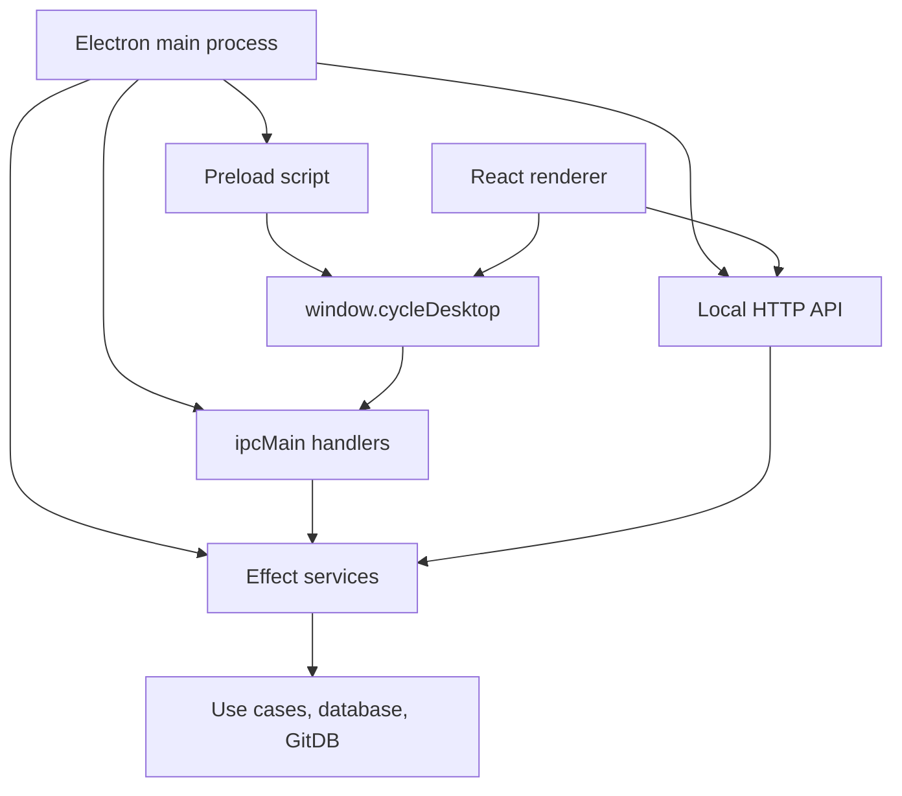
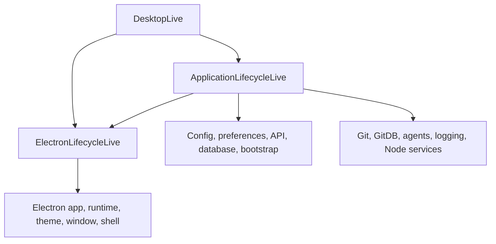
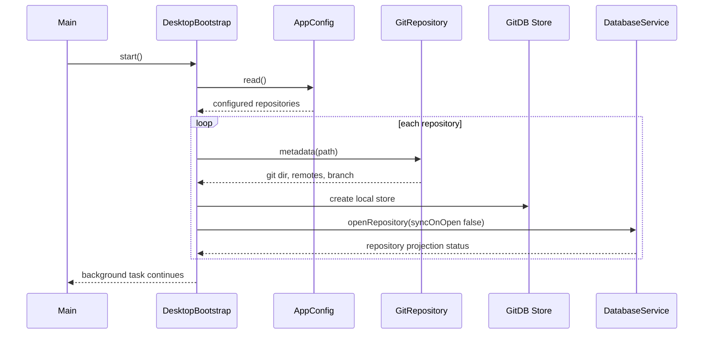
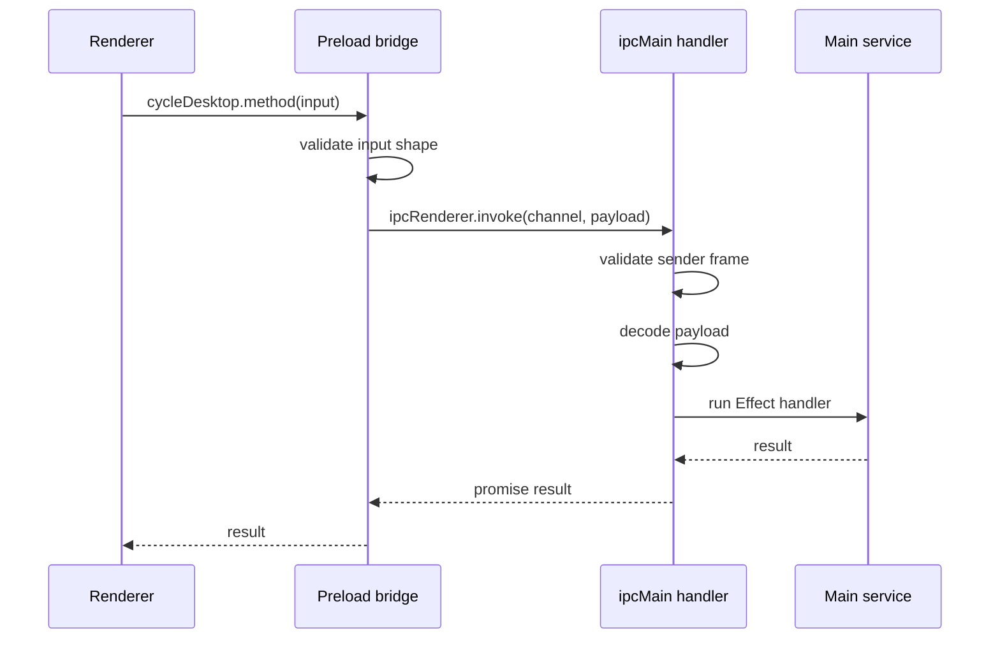

# Desktop Architecture

This document describes the current implemented architecture of `@cycle/desktop`.
It is based on the code in `packages/desktop` and describes the application as it
exists today, not an intended future design.

## Package Role

`@cycle/desktop` is the Electron application shell for Cycle. It owns desktop
process orchestration, secure IPC, local desktop configuration, repository
registration, bootstrap status, and renderer composition.

It does not own reusable product UI, domain contracts, ticket use cases, Git
repository primitives, GitDB storage, or database projection logic. Those live in
workspace packages consumed by the desktop package.

## Source Hierarchy

```text
packages/desktop/
  electron.vite.config.ts      Electron main/preload/renderer build config.
  package.json                 Package exports, scripts, and dependencies.
  src/
    index.ts                   Package barrel.
    ipc/                       Shared IPC channel names, bridge type, guards.
    main/                      Main process entrypoint, app layer, and startup workflow.
    Electron*.ts               Thin Electron app/window/shell/theme wrappers as Effect services.
    ProcessLifecycle.ts        Process failure event wrapper used by app supervision.
    preload/                   contextBridge implementation.
    renderer/                  React app, routes, queries, mutations, screens.
    shared/                    Shared service contracts and schemas.
  test/                        Vitest coverage for config, routes, shortcuts.
```

The exported package surfaces are:

```text
@cycle/desktop
@cycle/desktop/ipc
@cycle/desktop/main
@cycle/desktop/renderer
@cycle/desktop/shared
```

## Process Hierarchy



### Main Process

Entry point: `src/main/Main.ts`

The main process runs `Effect.scoped(runDesktop())` with `DesktopLive`.
`runDesktop()` performs the startup sequence:

1. Wait for `ElectronApp.whenReady()`.
2. Sync the persisted theme preference into Electron `nativeTheme`.
3. Register IPC handlers.
4. Create the main window.
5. Start repository bootstrap in the background.
6. Start Electron lifecycle supervision.
7. Wait for shutdown.
8. Destroy all windows.

### Preload Process

Entry point: `src/preload/index.ts`

The preload process exposes a narrow `window.cycleDesktop` bridge through
Electron `contextBridge`. It validates renderer input before invoking named IPC
channels with `ipcRenderer.invoke`. It also exposes a theme state subscription
that returns an unsubscribe function.

The renderer does not receive raw Electron, Node.js, shell, filesystem, or
database objects.

### Renderer Process

Entry point: `src/renderer/main.tsx`

The renderer mounts `DesktopRendererApp`, which wraps the app in:

1. `QueryClientProvider`
2. `ThemeProvider`
3. `NotificationProvider`
4. `ShortcutProvider`
5. `RouterProvider`

The renderer uses hash routing. Native desktop capabilities still go through
`window.cycleDesktop`, while ticket and repository data is fetched from the
local Cycle HTTP API started by the desktop main process.

## Ownership Model

| Area                            | Owner                                        | Responsibility                                                                                      |
| ------------------------------- | -------------------------------------------- | --------------------------------------------------------------------------------------------------- |
| Electron lifecycle              | `ElectronApp.ts`                             | App readiness, quit, shutdown signal, activate/window lifecycle hooks.                              |
| Process failure events          | `ProcessLifecycle.ts`                        | Captures uncaught exceptions and unhandled rejections for app supervision.                          |
| Windows                         | `ElectronWindow.ts`, `DesktopWindowLive.ts`  | BrowserWindow construction, secure web preferences, main window focus/destruction.                  |
| Runtime callback execution      | `ElectronRuntime.ts`                         | Runs fire-and-forget Effect work from Electron callbacks and logs task failures.                    |
| Theme                           | `ElectronTheme.ts`, `ElectronPreferences.ts` | Reads and writes Electron theme source, broadcasts theme updates to renderer.                       |
| Shell access                    | `ElectronShell.ts`                           | Opens external URLs and filesystem paths behind validated main-process calls.                       |
| Desktop config paths            | `shared/DesktopConfigLive.ts`                | Derives preload path, renderer HTML path, renderer dev URL, and dev/prod mode.                      |
| Persisted app config            | `AppConfigLive.ts`                           | Reads, validates, migrates, salvages, backs up, and writes `app-config.json`.                       |
| Profile                         | `ProfileLive.ts`                             | Normalizes profile/onboarding input and stores it in app config.                                    |
| Local workspace                 | `LocalWorkspaceLive.ts`                      | Registers repositories in app config, validates Git repos, initializes missing Git repos.           |
| Provider detection              | `@cycle/agents/detection`                    | Detects local Codex, Claude Code, and OpenCode executables from PATH/shell.                         |
| Database projection             | `DesktopDatabaseLive.ts`                     | Creates the local projection database and provides database identity/id generation.                 |
| Repository bootstrap            | `DesktopBootstrapLive.ts`                    | Opens configured repositories, maintains bootstrap status, runs background sync/push orchestration. |
| IPC                             | `DesktopIpc.ts`, `ipc/Channels.ts`           | Defines bridge contracts, validates input/senders, dispatches requests to services.                 |
| Renderer routes and workflow UI | `renderer/`                                  | App shell composition, queries, mutations, navigation, shortcut and notification state.             |

## Layer Composition

`main/AppLayer.ts` composes two lifecycle layers. The top-level layer exported to `Main.ts` is
`DesktopLive`.



Key composition details:

- `ElectronLifecycleLive` owns Electron-facing services: app lifecycle, process lifecycle,
  callback runtime, theme, shell, and window construction.
- `ApplicationLifecycleLive` owns Cycle application services that run on Electron: app config,
  profile, local workspace, preferences, API startup, projection database, and repository bootstrap.
- `AppConfigLive` reads and writes `~/.cycle/app-config.json` through schema-driven Effect config
  parsing, with recovery only at the file boundary.
- `DesktopBootstrapLive` remains the main repository orchestration service and is the largest
  remaining candidate for simplification.

## Persistent State

### App Config

Path: `~/.cycle/app-config.json`

Schema owner: `src/shared/AppConfig.ts`

Current schema version: `4`

Persisted sections:

- `onboarding`: completion state and timestamp.
- `profile`: display name and email.
- `theme`: `light`, `dark`, or `system`.
- `agentProviders`: enabled preferences for supported local agent tools.
- `localWorkspace.repositories`: registered repositories and their preferences.

Repository records include:

- stable id derived from the root commit of `refs/gitdb/cycle/main`
- display name
- absolute path
- added/opened timestamps
- preferences: `autoSync`, `commitStyle`, `sidebarExpanded`

`AppConfigLive` handles first-run creation, atomic writes through a temporary
file and rename, unsupported version backup, invalid JSON backup, and salvage of
valid sections from partially invalid config.

### Projection Database

Path: `~/.cycle/cycle.db`

Owner: `DesktopDatabaseLive`, backed by `@cycle/database`.

The database identity is derived from the current desktop profile. Empty display
names fall back to `Cycle User`; empty email addresses become `undefined`.

Desktop-generated database ids use `crypto.randomUUID()` with prefixes:

```text
drf_  draft ids
PREFIX-BASE36 ticket ids
lbl_  label ids
rec_  record ids
tpl_  template ids
view_ view ids
```

### GitDB Stores

Owner: `DesktopBootstrapLive`, backed by `@cycle/git-db`.

Each opened repository receives:

- a local filesystem GitDB store for projection reads/materialization
- a transport GitDB store when remote pull/push is needed

The current GitDB database name is `cycle`, and the default pointer used for
remote sync/push is `main`.

### In-Memory State

Main process:

- `DesktopBootstrapLive` owns opened repositories, in-flight opens, per-repo
  remote operations, and bootstrap status snapshots.
- `DesktopWindowLive` owns the current main window reference.
- `ElectronRuntimeLive` owns a queue for callback-triggered Effect work.

Renderer process:

- React Query owns server-state cache.
- `ShortcutProvider` owns active shortcut registrations and multi-key sequences.
- `NotificationProvider` owns transient notifications and dismissal timers.
- `WorkspaceScreen` owns local UI state for onboarding, create issue dialog,
  route history, and repository initialization prompts.

## Bootstrap Flow



Bootstrap phases and stages are shared through `src/shared/Bootstrap.ts`.
Renderer boot UI polls `getBootstrapStatus` every 250 ms until
`blocking === false`.

Repository open behavior:

1. Read configured repositories from app config.
2. Mark each repository as `pending`.
3. Inspect Git metadata.
4. Create a local GitDB store for the repository.
5. Open the repository projection in `DatabaseService`.
6. Store runtime repository metadata in memory.
7. Mark the repository `ready` or `failed`.
8. Finish the blocking phase even if individual repositories failed.
9. Start background remote sync for repositories with `autoSync: true`.

Local projection polling uses `60_000` ms.

## Repository Sync And Push

There are two current sync paths:

1. Manual sync requests outside the renderer use the local HTTP API and route to
   `DatabaseService.syncRepository(repositoryId)` through `@cycle/usecases`.
   This materializes the local projection.
2. Bootstrap auto-sync uses `DesktopBootstrap.syncRepositoryFromRemote`. It
   materializes local state, pulls GitDB refs from the repository default remote
   when one exists, and materializes again.

Push orchestration lives in `DesktopBootstrapLive`:

1. Main validates the repository id and ensures the repository is configured and
   opened.
2. `DesktopBootstrap.pushRepositoryToRemote(repositoryId)` runs.
3. Bootstrap materializes locally before pushing.
4. Bootstrap creates a transport GitDB store.
5. Bootstrap runs `store.sync({ mode: "full", pointers: ["main"], remote })`.
6. Bootstrap materializes the projection again and updates status.

Remote operations are serialized per repository by `DesktopBootstrapLive` so a
second remote operation waits for the current one to settle.

## IPC Contract

Contract owner: `src/ipc/Channels.ts`

The bridge type is `CycleDesktopBridge`. It includes:

- app config and onboarding APIs
- API connection discovery
- theme APIs and theme-change subscription
- local repository APIs
- provider detection
- backend log path
- bootstrap status
- external URL opening
- cache clearing
- current platform string

IPC request flow:



Main-process sender validation rejects:

- unavailable sender frames
- destroyed sender frames
- non-top-frame senders

Main-process payload decoding rejects malformed requests. `openExternal`
additionally parses URLs and only allows `http:`, `https:`, and `mailto:`.

IPC handlers are registered with `Effect.acquireRelease`, and removed when the
Effect scope is released.

## Renderer HTTP API Flow

Renderer client: `src/renderer/lib/cycleApiClient.ts`

Server side: `@cycle/api` -> named `@cycle/usecases` definitions -> `DatabaseService`

Flow:

1. Renderer query or mutation calls `cycleApiClient.call(method, payload)`.
2. The client maps the domain method alias to a `/v1` HTTP endpoint.
3. In Electron, the client reads API host, port, and token from
   `window.cycleDesktop.getAppConfig()`.
4. In a local browser, the client uses same-origin `/cycle-api` by default.
5. The Vite dev server proxy reads the desktop API runtime discovery file and
   `app-config.json` token, then forwards the request to the local API with bearer auth.
6. The API validates auth, decodes path/query/body input, and runs the matching
   use case.
7. The renderer adapter unwraps API envelopes back into the page/resource shapes
   expected by React Query.

For browser testing without the dev proxy, pass `cycleApiUrl` and
`cycleApiToken` query parameters or set `cycle.api.baseUrl` and `cycle.api.token`
in `localStorage`.

## Renderer Route Hierarchy

Router owner: `src/renderer/Router.tsx`

Routes are hash routes. `/` redirects to the last valid stored workspace route,
or `/inbox` when none exists.

Top-level workspace routes:

```text
/inbox
/issues
/initiatives
/views
/settings
```

Repository routes:

```text
/repositories/:repositoryId/issues
/repositories/:repositoryId/issues/:issueId
/repositories/:repositoryId/views
/repositories/:repositoryId/views/:viewId
/repositories/:repositoryId/views/:viewId/issues/:issueId
/repositories/:repositoryId/history
/repositories/:repositoryId/settings
```

Route parsing, encoding, parent-route calculation, invalid repository fallback,
and last-route storage are implemented in
`src/renderer/screens/workspace/workspaceRoute.ts`.

## Renderer Screen Flow

`WorkspaceScreen` is the primary screen for all workspace routes.

High-level render flow:

1. Load bootstrap status and app config.
2. Show `BootloaderScreen` while bootstrap is blocking or config is loading.
3. If onboarding is incomplete, show `SetupScreen`.
4. If no repositories are configured, show `AddRepositoryStep`.
5. Otherwise render `AppShellRoot` with sidebar, header, and page body.

Main page body selection:

| Condition                              | Component                  |
| -------------------------------------- | -------------------------- |
| Workspace settings                     | `ApplicationSettingsPanel` |
| Repository settings                    | `RepositorySettingsPanel`  |
| Issue detail                           | `ViewIssuePanel`           |
| Repository views list                  | `ViewsPanel`               |
| Issues, initiatives, saved view detail | `IssuesPanel`              |
| Repository history                     | `RepositoryHistoryPanel`   |
| No repository configured               | `AddRepositoryStep`        |
| Other implemented shell pages          | `PageBodyPlaceholder`      |

`WorkspaceScreen` also owns:

- active repository resolution
- create issue dialog state
- repository initialize dialog state
- page header actions
- route history and Escape/back behavior
- sidebar expansion toggles
- shortcut registrations
- query invalidation when repository generation changes

## User Workflows

### First Run And Onboarding

1. `useAppConfigQuery` reads app config through the bridge.
2. `useAgentProvidersQuery` detects local supported providers.
3. `SetupScreen` collects profile, email, and enabled provider choices.
4. `completeOnboarding` writes profile, provider preferences, onboarding state,
   and the current theme preference through `ElectronPreferences`.
5. Main syncs Electron theme source and broadcasts the new theme state.
6. Renderer updates the app config query cache and navigates to `/inbox`.

### Add Repository

1. Renderer calls `selectRepositoryFolder`.
2. Main opens an Electron folder dialog.
3. Selected path is passed to `LocalWorkspace.upsertRepositoryPath`.
4. `LocalWorkspaceLive` normalizes the path and requires it to be a Git repo.
5. `LocalWorkspaceLive` ensures `refs/gitdb/cycle/main` exists, creating an empty-tree root commit
   with a random seed in the commit message when needed.
6. A stable repository id is derived as `repo_` plus the first five hex characters of that GitDB
   root commit.
7. The repository is inserted or updated in `app-config.json`.
8. Renderer refreshes the app config query cache.

If the folder is not a Git repository, the result is `not-git`. The renderer
opens `RepositoryInitialiseDialog`; confirming it calls
`initializeRepositoryPath`, which runs `git init` and then registers the
repository.

### Open Configured Repositories

1. Bootstrap reads configured repositories after the window is created.
2. Each repository is opened into the database projection using a local GitDB
   store.
3. Bootstrap status is updated for boot UI and later status views.
4. Auto-sync repositories start background remote sync after the blocking phase.

### Create Or Update Issue

1. Renderer gathers metadata queries for labels, users, templates, and views.
2. Create/update forms call HTTP API mutations through `cycleApiClient`.
3. The local API validates repository scope through the route and bearer token.
4. `@cycle/api` runs the concrete usecase definition with the desktop-provided
   database layer.
5. Renderer invalidates affected React Query keys, usually issue detail, issue
   list root, records, history, and sometimes metadata.

### Theme Updates

1. Renderer calls `setThemePreference`.
2. Main writes app config and sets Electron `nativeTheme.themeSource`.
3. Main broadcasts `themeStateChangedChannel`.
4. Renderer updates `ThemeProvider` mode from the bridge event.

### Navigation And Shortcuts

`ShortcutProvider` supports single-key and multi-key bindings. It ignores
shortcuts in editable targets unless an action opts in. Latest registration wins
on binding conflicts.

Implemented workspace navigation shortcuts include:

```text
Escape    Go back or parent route
g n       Inbox
g i       Issues
g p       Initiatives
g v       Views
g ,       Workspace settings
g r i     Active repository issues
g r v     Active repository views
g r h     Active repository history
g r ,     Active repository settings
```

## Renderer Data Model

React Query is the renderer server-state boundary.

Desktop bridge queries:

- `appConfigQueryKey`
- `bootstrapStatusQueryKey`
- `agentProvidersQueryKey`

HTTP API query groups:

- repository status, warnings, history
- issue lists, issue detail, issue records
- issue history and search
- users, labels, saved views, templates
- initiative progress

Mutations invalidate by domain:

- repository sync/push invalidate repository status, status list,
  materialization warnings, and issue list roots
- issue create invalidates issue list roots
- issue update/comment/archive/delete/restore/relation mutations invalidate
  issue detail, lists, records, history, and related issue detail where needed
- metadata mutations invalidate users, labels, views, templates, or initiative
  progress as appropriate
- config mutations update `appConfigQueryKey` directly after main process writes

## Security Design

Window security defaults are centralized in `secureWebPreferences`:

```text
allowRunningInsecureContent: false
contextIsolation: true
nodeIntegration: false
sandbox: true
webSecurity: true
```

Main window creation additionally:

- hides the window until ready to show
- enables devtools only in development mode
- uses the preload script from `DesktopConfigLive`
- loads the dev server URL when `ELECTRON_RENDERER_URL` is set
- otherwise loads the built renderer HTML file

IPC security rules:

- expose narrow bridge methods only
- validate in preload and main
- check sender frame identity and top-frame origin
- keep side effects in main process services
- allowlist external URL schemes
- keep raw Electron/Node objects out of the renderer

## Build And Runtime Configuration

Build tool: `electron-vite`

Main build:

- entry: `src/main/Main.ts`
- output format: ES module
- output file: `out/main/index.js`

Preload build:

- entry: `src/preload/index.ts`
- output format: CommonJS
- output file: `out/preload/index.cjs`

Renderer build:

- React plugin
- Tailwind Vite plugin
- React/react-dom dedupe
- dev server host: `127.0.0.1`
- dev server port: `5173`
- strict port: `true`

`DesktopConfigLive` treats `ELECTRON_RENDERER_URL` as development mode when it
is present and valid. Otherwise the app runs in production mode and loads the
built renderer HTML file.

## Dependencies

Workspace package dependencies:

| Package            | Used for                                                             |
| ------------------ | -------------------------------------------------------------------- |
| `@cycle/ui`        | Renderer visual components, theme provider, styles.                  |
| `@cycle/api`       | Local HTTP API server used by renderer, CLI, MCP, and browser tests. |
| `@cycle/contracts` | Ticket/domain types used by renderer queries and mutations.          |
| `@cycle/usecases`  | Named usecase definitions run by the local HTTP API.                 |
| `@cycle/database`  | Projection database, repository status, ticket operations.           |
| `@cycle/git`       | Git repository validation, initialization, and metadata inspection.  |
| `@cycle/git-db`    | GitDB local and transport stores, remote sync/push result types.     |

Third-party runtime dependencies:

| Package                 | Used for                                                    |
| ----------------------- | ----------------------------------------------------------- |
| `effect`                | Main-process service model, layers, scopes, errors, queues. |
| `react`, `react-dom`    | Renderer UI runtime.                                        |
| `react-router`          | Hash routing and navigation.                                |
| `@tanstack/react-query` | Renderer server-state cache.                                |
| `lucide-react`          | Renderer icons.                                             |

Build/test dependencies:

- `electron`
- `electron-vite`
- `vite`
- `@vitejs/plugin-react`
- `@tailwindcss/vite`
- `vitest`
- `@swc/core`
- React type packages

## Error Handling And Logging

Error types:

- `ElectronError`: Electron, configuration, and security failures.
- `AppConfigError`: app config, profile, workspace, and provider detection
  failures.
- Domain/use-case/database errors are mapped by the packages that own those
  layers.

Logging:

- `@cycle/logging.defaultLayer` writes Effect logs to `~/.cycle/logs/cycle.jsonl`.
- Database events are forwarded to the desktop logger.
- `ElectronRuntimeLive` logs failed queued tasks.
- Electron window load/render failures are logged through Effect logs.
- Process lifecycle failures request app shutdown.

The renderer can request the backend log path through `getBackendLogPath`.

## Testing Boundaries

Current desktop tests cover:

- app config schema validation, first-run creation, persistence, invalid JSON
  recovery, partial salvage, and unsupported data handling
- profile update and onboarding persistence
- repository registration, dedupe, removal, preferences, and Git initialization
- agent provider detection through PATH and shell lookup
- workspace route parsing, storage, parent route, and fallback behavior
- shortcut registry dispatch, multi-key sequences, editable target guards, and
  binding conflicts

The current desktop test suite does not exercise a full Electron main/preload/
renderer integration run. Most Electron behavior is isolated behind service
interfaces so lower-level services can be tested with replacement layers.

## Extension Workflows

### Add A New Bridge API

1. Add channel constants, request/response types, and type guards in
   `src/ipc/Channels.ts`.
2. Add a method to `CycleDesktopBridge`.
3. Implement preload validation and `ipcRenderer.invoke` in
   `src/preload/index.ts`.
4. Register a main-process handler in `src/DesktopIpc.ts`.
5. Validate sender and payload in main before touching services.
6. Add a renderer query or mutation wrapper.
7. Add focused tests for parsing, service behavior, or renderer helpers.

### Add A Renderer API Data Operation

1. Define or reuse the contract in `@cycle/contracts`.
2. Expose or reuse the matching route in `@cycle/api`.
3. Implement the behavior in the use-case/database layer that owns it.
4. Add the method mapping in `renderer/lib/cycleApiClient.ts`.
5. Use `cycleApiClient.call()` from renderer queries or mutations.
6. Ensure the payload includes `repository.id` for repository-scoped methods.
7. Invalidate React Query keys for every data shape affected by the operation.

### Add A Renderer Page

1. Add the hash route in `src/renderer/Router.tsx`.
2. Update `WorkspaceLocation` parsing and serialization if the route is part of
   the workspace hierarchy.
3. Add navigation entries in `workspace/navigation.tsx` when appropriate.
4. Render the page from `WorkspaceScreen`.
5. Add query/mutation wrappers instead of calling the bridge directly from deep
   UI components.
6. Add route helper tests for new path shapes.
