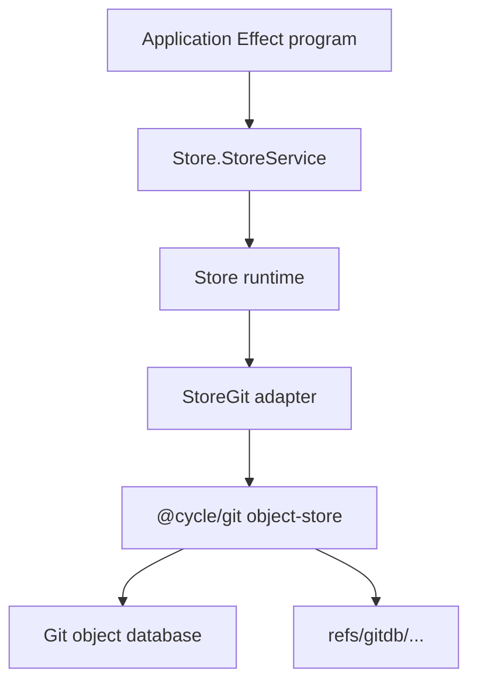
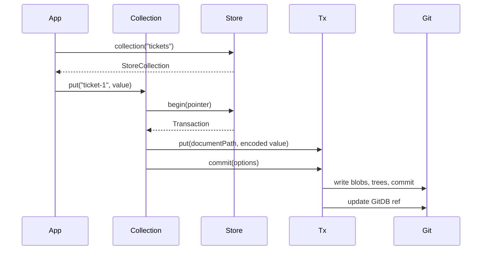

# GitDB Architecture

This document describes the current implemented architecture of `@cycle/git-db`.
It is based on the code in `packages/git-db` and the Git object-store adapters
provided by `@cycle/git`.

## Package Role

`@cycle/git-db` is an Effect service for storing application documents as Git
objects under a dedicated Git ref namespace. It provides JSON-oriented
collections, snapshot commits, mutable pointers, optimistic transactions,
history, diff, and explicit synchronization of GitDB refs.

The package does not own business-domain models, query planning, full-text
search, merge/conflict resolution, CRDT semantics, worktree checkout, Git index
mutation, or normal branch management.

## Source Hierarchy

```text
packages/git-db/
  README.md                  User-facing API documentation and examples.
  SPEC_v0.2.md               Product/API specification context.
  TARGET_ARCHITECTURE.md     Target architecture notes.
  PERFORMANCE_PLAN.md        Performance planning and benchmark notes.
  package.json               Package export, scripts, and dependencies.
  scripts/
    benchmark-local.ts       Local benchmark over real GitDB refs.
  src/
    index.ts                 Public package exports.
    domain/                  Public domain types and schemas.
    errors/                  Typed GitDB error classes and constructors.
    internals/               Byte and hash helpers.
    schemas/                 Runtime schemas for options, ids, paths, snapshots, sync.
    store/                   Store service, layers, path/tree/document/sync helpers.
  test/
    effect-vitest.ts         Effect-aware Vitest wrapper.
    git-db.test.ts           Store, backend, conflict, sync, and validation tests.
```

## Public Surface

Package export: `@cycle/git-db`

Primary exports from `src/index.ts`:

- `GitDbLive`: Git CLI backend layer.
- `GitDbFilesystem`: direct `.git` filesystem object/ref backend layer.
- `GitDbInMemory`: deterministic in-memory backend layer for tests/examples.
- `Store`: Store service namespace and service types.
- `Collection`, `Document`, `Pointer`, `Snapshot`, `Sync`, `Transaction`,
  `Tree`: helper namespaces.
- `Schemas`: schema namespace.
- typed errors from `errors/`.
- selected public domain types such as `CollectionOptions`, `SyncResult`, and
  `PointerSyncResult`.

## Concept Model

| GitDB concept | Implemented representation |
| --- | --- |
| Store | Existing Git object database plus `StoreConfig`. |
| Database | Ref segment under the namespace, default `default`. |
| Collection | Git tree under `collections/<collection>`. |
| Document | Blob under a sharded collection path. |
| Snapshot | Git commit whose tree is the full database state. |
| Pointer | Git ref under `<namespace>/<database>/<pointer>`. |
| Remote pointer | Tracking ref under `<namespace>/<database>/remotes/<remote>/<pointer>`. |
| Transaction | In-memory staged path mutations applied to a base snapshot. |
| Sync | Explicit fetch/push/fast-forward of GitDB refs. |

Default identity:

```text
namespace:       refs/gitdb
database:        default
defaultPointer:  main
local pointer:   refs/gitdb/default/main
remote pointer:  refs/gitdb/default/remotes/origin/main
```

Documents are stored in the snapshot tree, not in the worktree. Normal Git
branches, `HEAD`, the Git index, and checked-out files are not changed by GitDB
store operations.

## Architecture Overview



The Store service owns GitDB behavior. The `@cycle/git` object-store service
owns low-level Git operations. Layers connect the Store service to a concrete Git
backend.

## Layer Ownership

Layer factory owner: `src/store/Layer.ts`

```text
GitDbLive(options)
  -> Store.layer(options)
  -> @cycle/git/object-store/GitCli.layer
  -> NodeServices.layer
  -> Store.live

GitDbFilesystem(options)
  -> Store.layer(options)
  -> @cycle/git/object-store/GitFilesystem.layer
  -> NodeServices.layer
  -> Store.live

GitDbInMemory(options)
  -> Store.layer({ ...options, verifyGitDir: false })
  -> @cycle/git/object-store/GitInMemory.layer
  -> NodeCrypto.layer
  -> Store.live
```

Backend responsibilities:

| Layer | Backend | Responsibility |
| --- | --- | --- |
| `GitDbLive` | Git CLI | Production/default backend. Uses Git commands for object/ref I/O and transport. |
| `GitDbFilesystem` | Direct filesystem | Reads/writes loose and packed Git objects/refs without shelling out for local I/O. No fetch/push transport. |
| `GitDbInMemory` | In-memory Git service | Deterministic tests/examples. No real `.git` directory required. |

`GitDbFilesystem` intentionally fails fetch and push with transport errors. Use
`GitDbLive` when remote synchronization is required.

## Store Configuration

Config owner: `src/store/Store.ts` and `src/schemas/Store.ts`

`Store.make(options)` normalizes and validates:

- `cwd`: current working directory, defaulting to `Path.resolve()`.
- `gitDir`: resolved from `cwd` and `options.gitDir ?? ".git"`.
- `namespace`: default `refs/gitdb`.
- `database`: default `default`.
- `defaultPointer`: default `main`.
- `shardLength`: default `2`.
- `verifyGitDir`: default `true`.
- `allowBranchNamespace`: default `false`.

When `verifyGitDir` is true, the configured Git directory must exist or
`StoreNotFoundError` is returned.

Namespaces must start with `refs/`. `refs/heads` is rejected unless
`allowBranchNamespace` is explicitly enabled.

## Store Service

Service owner: `src/store/Store.ts`

`StoreServiceShape` is the central runtime API. It exposes:

- raw reads: `get`, `list`
- collection access: `collection`, `collections`
- transaction start: `begin`
- pointer access: `pointer`, `localPointers`, `pointerRef`
- remote ref helpers: `remoteRefPrefix`, `remotePointerRef`
- snapshot access: `resolveSnapshotId`, `snapshot`, `currentSnapshotForPointer`
- history and diff: `history`, `diff`
- synchronization: `sync`
- immutable runtime config: `config`, `refPrefix`

Helper modules such as `Collection.ts`, `Pointer.ts`, `Snapshot.ts`, `Sync.ts`,
and `Transaction.ts` are thin module-first wrappers over this service. They do
not own separate state.

## Runtime Caches

Cache owner: `Store.live`

The Store runtime creates Effect caches for:

| Cache | Key | Capacity | Purpose |
| --- | --- | ---: | --- |
| `commits` | object id | 4096 | Cache parsed Git commit objects. |
| `trees` | object id | 8192 | Cache sorted Git tree entries. |
| `listEntries` | `snapshotId + "\0" + path` | 8192 | Cache immediate tree listings. |
| `flatEntries` | `snapshotId + "\0" + path` | 8192 | Cache recursive tree walks. |

Writes populate the tree cache for newly written tree objects. Collection
pagination benefits from cached recursive tree walks because it pages entry
paths before hydrating blob documents.

## Git Object Layout

Path helper owner: `src/store/Path.ts`

The snapshot tree stores application data under `collections/`.

Collection root:

```text
collections/<collection>
```

Collection metadata:

```text
collections/<collection>/.meta.json
```

Document path with default `shardLength: 2`:

```text
collections/<collection>/<sha1(id).slice(0, 2)>/<id>.<extension>
```

Examples:

```text
collections/tickets/0f/ticket-1.json
collections/users/7a/robert.pitt+cycle@example.com.json
collections/notes/91/note-1.md
```

If `shardLength <= 0`, the shard directory is skipped:

```text
collections/<collection>/<id>.<extension>
```

`idFromDocumentPath` ignores `.meta.json` and extracts document ids from files
matching the configured extension.

## Document Encoding

Document owner: `src/store/Document.ts`

JSON encoding owner: `src/store/Json.ts`

`Document` wraps raw blob bytes with:

- `bytes`
- `objectId`
- `path`
- computed `size`
- `text(encoding = "utf-8")`
- `json<T>()`

Default collection encoding:

- `Uint8Array` values are stored unchanged.
- strings are UTF-8 encoded as provided.
- other values are normalized into stable JSON and written with a trailing
  newline.

Stable JSON behavior:

- object keys are sorted
- `undefined` object properties are omitted
- `undefined` array entries become `null`
- `Date` values become ISO strings
- top-level `undefined` is rejected

Collections can provide a custom codec:

```ts
{
  extension: "md",
  codec: {
    decode: (document) => ...,
    encode: (value) => ...
  }
}
```

Custom codec output is declared as a string or `Uint8Array` and is still passed
through the same `encodeValue` path before storage.

## Collection Workflow

Collection owner: `makeStoreCollection` in `src/store/Store.ts`



Collection operations:

- `put`: begin transaction, stage document write, commit snapshot.
- `delete`: begin transaction, stage document delete, commit snapshot.
- `get`: resolve document path, read blob, decode through collection codec.
- `document`: read the raw `Document`.
- `list`: recursively find matching document entries and hydrate all values.
- `page`: recursively find matching document entries, page by path cursor, then
  hydrate only the selected page.
- `meta`: read `.meta.json`.
- `setMeta`: write `.meta.json` through a transaction.

`collections()` lists tree entries under `collections/`, then reads optional
`.meta.json` for each collection.

The current implementation does not write derived index entries. Tests assert
that `store.list("indexes")` remains empty after collection writes, updates, and
deletes.

## Transaction Workflow

Transaction owner: `makeTransaction` in `src/store/Store.ts`

Transactions are optimistic, pointer-based, and in-memory until committed.

Transaction state:

```text
active: boolean
mutations: HashMap<normalized path, PendingMutation>
base: Snapshot | null
pointer: string
```

Pending mutations:

- `put`: path plus encoded bytes.
- `delete`: path deletion.

Commit flow:

1. Read active transaction state.
2. Determine expected snapshot:
   - `options.expectedSnapshot` when supplied
   - otherwise transaction base snapshot id, or `null` for a new pointer
3. Determine target pointer:
   - `options.pointer` when supplied
   - otherwise the transaction pointer
4. If there are no mutations and the transaction has a base, assert the pointer
   is still current and return the base snapshot.
5. Load a mutable tree from the base snapshot root, or an empty tree for a new
   store.
6. Apply staged path mutations.
7. Write changed blobs and trees.
8. Write a Git commit whose parent is the base snapshot when present.
9. Move the target pointer ref with the expected old value.
10. Mark the transaction inactive.
11. Return the written `Snapshot`.

After `abort()` or `commit()`, additional transaction operations fail with
`TransactionInactiveError`.

The tests also exercise transaction rollback with `Effect.tx` because staged
state is held in an Effect `TxRef`.

## Tree Materialization

Tree helper owner: `src/store/Tree.ts`

Tree operations are implemented against a small `GitTree` interface:

- `readTree`
- `writeBlob`
- `writeTree`

`loadMutableTree` recursively reads a snapshot root tree into mutable tree/blob
nodes. Existing blobs carry object ids without reading blob content until needed.

`applyMutation` either:

- creates/replaces a blob at a path with mode `100644`
- deletes a path and prunes empty parent trees

`writeMutableTree` recursively writes non-empty trees and blob objects. Empty
trees are omitted from the resulting Git tree.

`flattenTree` produces path-to-object-id maps used by snapshot diff.

## Pointer Model

Pointer owner: `makeStorePointer` in `src/store/Store.ts`

Pointers are named refs under the store ref prefix.

Pointer operations:

- `current()`: read the current snapshot for the pointer.
- `begin()`: begin a transaction at the pointer's current snapshot.
- `move(target, options)`: move pointer to an existing commit with optimistic
  expected-snapshot checks.
- `delete(options)`: delete pointer, optionally with expected-snapshot checks.
- `fork(targetName)`: create a new pointer from the current pointer snapshot.
- `forkFrom(source)`: create or move this pointer from another pointer or
  snapshot id.
- `history(options)`: read history from this pointer.

`movePointerRef` wraps `adapter.updateRef`. If the underlying ref update fails,
it rereads the actual ref and returns `PointerConflictError` when the actual
value differs from the expected value.

## Snapshot, History, And Diff

Snapshot owner: `store.snapshot`, `store.history`, `store.diff`

Snapshot representation:

```text
id          Git commit id
root        Git tree id
parents     parent commit ids
message     trimmed commit message, omitted when empty
author      Git author identity when present
committer   Git committer identity when present
createdAt   committer date or author date
```

Snapshot resolution:

1. If `from` is omitted, use the default pointer.
2. If the source is a valid pointer name and the ref exists, use that ref target.
3. If the source looks like an object id and is a commit, use it directly.
4. Otherwise return `null`.

`snapshot(id)` requires the id to be a commit or returns
`SnapshotNotFoundError`.

`history(from, options)` walks commit parents breadth-first from the resolved
start snapshot. It supports:

- `max`
- `since`
- `until`
- `path`
- `from` override inside options

Path-filtered history includes snapshots whose object id at that path differs
from the first parent.

`diff(a, b)` resolves both inputs to snapshots, recursively flattens both root
trees, then returns sorted `added`, `deleted`, and `modified` path changes.

## Sync Workflow

Sync owner: `sync` in `src/store/Store.ts`

Inputs:

- `remote`, default `origin`
- `mode`, default `full`
- `pointers`, default all local pointers
- `onDiverged`, default `error`

Modes:

| Mode | Implemented behavior |
| --- | --- |
| `fetch` | Fetch remote GitDB refs into remote-tracking refs; do not move local pointers. |
| `pull` | Fetch, then fast-forward local pointers when remote is ahead. Does not push. |
| `push` | Push local pointers when local is ahead or remote is missing. Does not fetch first. |
| `full` | Fetch, then pull or push as needed for fast-forwardable pointer pairs. |

Fetch refspec:

```text
+<refPrefix>/*:<refPrefix>/remotes/<remote>/*
```

Per-pointer sync flow:

1. Read local pointer ref.
2. Read remote-tracking pointer ref.
3. If both point to the same snapshot, report `up-to-date`.
4. In `fetch` mode, leave refs as-is and report `up-to-date`.
5. If local is missing and remote exists in `pull` or `full`, create local ref
   from remote and report `fast-forwarded`.
6. If local exists and remote is missing in `push` or `full`, push local ref and
   report `pushed`.
7. If one side is missing in an unsupported mode, report `rejected`.
8. If remote descends from local in `pull` or `full`, move local to remote and
   report `fast-forwarded`.
9. If remote descends from local in `push`, report `rejected`.
10. If local descends from remote in `push` or `full`, push local and report
    `pushed`.
11. If local descends from remote in `pull`, keep local and report
    `up-to-date`.
12. If both sides diverged:
    - `keep-local`: force-push local and report `pushed`
    - `keep-remote`: move local to remote and report `fast-forwarded`
    - `error`: return `SyncConflictError` with pointer, local snapshot, remote
      snapshot, and merge base when available

The domain type allows `diverged` as a pointer status, but the current sync
implementation returns `up-to-date`, `fast-forwarded`, `pushed`, `rejected`, or
fails with `SyncConflictError`.

## Validation Rules

Validation owners: `src/store/Path.ts` and `src/schemas/`

Identifier rules:

- database names, remote names, and safe path segments use
  `[A-Za-z0-9][A-Za-z0-9._-]*`
- collection names use the same safe segment rule and must not start with `.`
- document ids use `[A-Za-z0-9][A-Za-z0-9._@+-]*`
- path segments must not be `.`, `..`, end with `.lock`, or contain `/`
- store paths must be slash-separated normalized segments, with no backslashes
  or NUL bytes
- mutation paths cannot be the snapshot root
- document extensions use `[A-Za-z0-9][A-Za-z0-9_-]*`
- pointer names are delegated to `@cycle/git` pointer-name validation

Supported examples:

```text
database: default
collection: tickets
document id: robert.pitt+cycle@example.com
remote: origin
pointer: review/provider-rollout
```

Rejected examples include path-like ids (`bad/id`), unsafe paths
(`../secret`), `refs/heads/main` as a pointer name, and branch namespaces unless
explicitly enabled.

## Error Model

Error owner: `src/errors/`

`GitDbError` is a union of GitDB errors and Git adapter/transport errors.

GitDB error classes:

| Error | Meaning |
| --- | --- |
| `StoreNotFoundError` | Configured Git directory was not found. |
| `InvalidNamespaceError` | Namespace is not a valid allowed Git ref namespace. |
| `InvalidIdentifierError` | Database, collection, document id, remote, extension, or page limit was invalid. |
| `InvalidPointerNameError` | Pointer name failed Git pointer-name validation. |
| `InvalidPathError` | Store path or mutation path was invalid. |
| `PointerNotFoundError` | Pointer-dependent operation had no source snapshot. |
| `SnapshotNotFoundError` | Snapshot input did not resolve to a commit. |
| `DocumentNotFoundError` | Public constructor exists, but current store reads return `null` for missing documents. |
| `PointerConflictError` | Optimistic expected snapshot did not match actual ref value. |
| `SyncConflictError` | Local and remote pointer histories diverged and `onDiverged` was `error`. |
| `InvalidJsonDocumentError` | Encoding or decoding a document failed. |
| `TransactionInactiveError` | Operation attempted after transaction commit/abort. |

Low-level Git failures are supplied by `@cycle/git/errors` and included in the
`GitDbError` union.

## Backend Integration

`Store.live` binds the selected `@cycle/git` object-store service to the current
`Store` config through a private `StoreGit` adapter.

The bound adapter annotates operations with Effect spans/log metadata:

```text
gitdb.blob.read
gitdb.blob.write
gitdb.tree.read
gitdb.tree.write
gitdb.commit.read
gitdb.commit.write
gitdb.pointer.read
gitdb.pointer.update
gitdb.pointer.delete
gitdb.transport.fetch
gitdb.transport.push
gitdb.conflict.isAncestor
gitdb.conflict.mergeBase
gitdb.sync
```

Span/log attributes include database, Git directory, namespace, operation, and
operation-specific fields such as ref, snapshot, remote, parents, entries, or
byte counts.

Backend capability summary:

| Capability | Git CLI | Filesystem | In-memory |
| --- | --- | --- | --- |
| Read/write blobs | Yes | Yes | Yes |
| Read/write trees | Yes | Yes | Yes |
| Read/write commits | Yes | Yes | Yes |
| Read/list/update/delete refs | Yes | Yes | Yes |
| Packed object/ref reads | Via Git | Yes | Not applicable |
| Fetch/push transport | Yes | No | No-op success |
| Ancestor/merge-base checks | Via Git | Implemented locally | Implemented locally |

## Performance Design

Current performance choices:

- documents are sharded by SHA-1 prefix to avoid very large flat trees
- tree and commit reads are cached
- immediate and recursive listings are cached per snapshot id and path
- collection pages select paths before hydrating blob content
- the filesystem backend avoids Git CLI process overhead for local object I/O
- the local benchmark defaults to filesystem backend

`scripts/benchmark-local.ts`:

- writes benchmark issues into a configurable database, default `benchmark`
- optionally resets the benchmark pointer before seeding
- measures cold/warm first page, cached page navigation, sample point reads, and
  full collection list
- writes only GitDB refs and Git objects

## Dependencies

Runtime dependencies:

| Package | Used for |
| --- | --- |
| `effect` | Services, layers, schemas, errors, caches, TxRef, crypto, filesystem/path abstractions. |
| `@effect/platform-node` | Node service layer for CLI/filesystem backends. |
| `@cycle/git` | Git object-store adapters, schemas, and Git error types. |

Dev dependency:

| Package | Used for |
| --- | --- |
| `vitest` | Test runner. |

Node built-ins used by scripts/tests include `child_process`, `crypto`, `fs`,
`os`, `path`, `perf_hooks`, and `util`.

## Test Coverage

Current tests cover:

- collection document storage through replaceable Effect services
- raw document and raw tree reads
- collection metadata reads/writes
- document deletion
- custom collection codecs and extensions
- cursor paging before hydration
- absence of derived index entries
- raw transaction paths, delete, abort, inactive transaction errors
- snapshot resolution, historical reads, history filters, and path-level diffs
- pointer move/fork/delete/list behavior with optimistic expectations
- validation errors for invalid identifiers, pointers, paths, remotes, JSON, and
  namespace
- email-style document ids and rejection of path-like ids
- module-first helper APIs
- pointer conflict detection
- Effect transaction rollback of staged mutations
- real Git safety: no mutation of normal worktree, index, `HEAD`, or branches
- CLI backend writing valid Git objects and refs
- filesystem backend writing valid objects readable by the CLI backend
- filesystem backend reading packed objects after `git gc`
- sync push, fetch, fast-forward, rejected, conflict, keep-remote, and
  keep-local behavior

## Extension Workflows

### Add A Store Operation

1. Add the method to `StoreServiceShape`.
2. Implement it in `makeStore`.
3. Keep low-level Git I/O behind the bound adapter.
4. Validate all path, pointer, remote, and id inputs through existing schema
   helpers.
5. Use typed errors from `src/errors/`.
6. Add module-first helper wrappers only if the operation belongs in the public
   helper API.
7. Add tests for in-memory behavior and real Git behavior when object/ref
   semantics matter.

### Add A Collection Capability

1. Prefer implementing through transactions so pointer conflict behavior stays
   consistent.
2. Keep document path derivation in `Path.ts`.
3. Keep encoding/decoding at the collection codec boundary.
4. Preserve the current no-derived-index behavior unless a separate index design
   is intentionally introduced.
5. Add tests for default JSON and custom codec behavior when relevant.

### Add A Sync Mode Or Policy

1. Update domain and schema types in `src/domain` and `src/schemas`.
2. Implement pointer-by-pointer behavior in `sync`.
3. Decide whether the policy fetches, pushes, moves local refs, or only reports.
4. Preserve explicit divergence handling.
5. Add tests using real temporary repositories and a bare remote.

### Add A Backend

1. Implement the `@cycle/git/object-store/Git` service contract in `@cycle/git`.
2. Expose a layer in `src/store/Layer.ts`.
3. Compose it with `Store.layer(options)` and required platform services.
4. Document whether fetch/push transport is supported.
5. Add interoperability tests with at least one existing backend.
