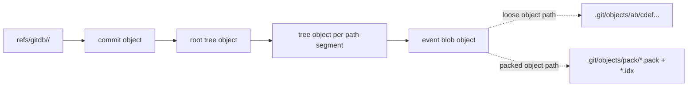
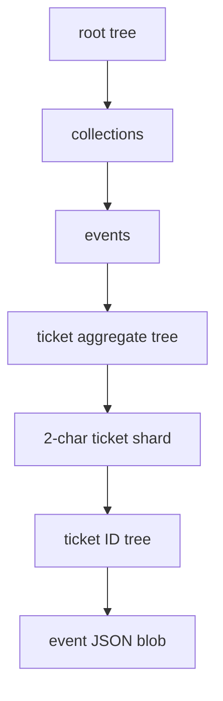
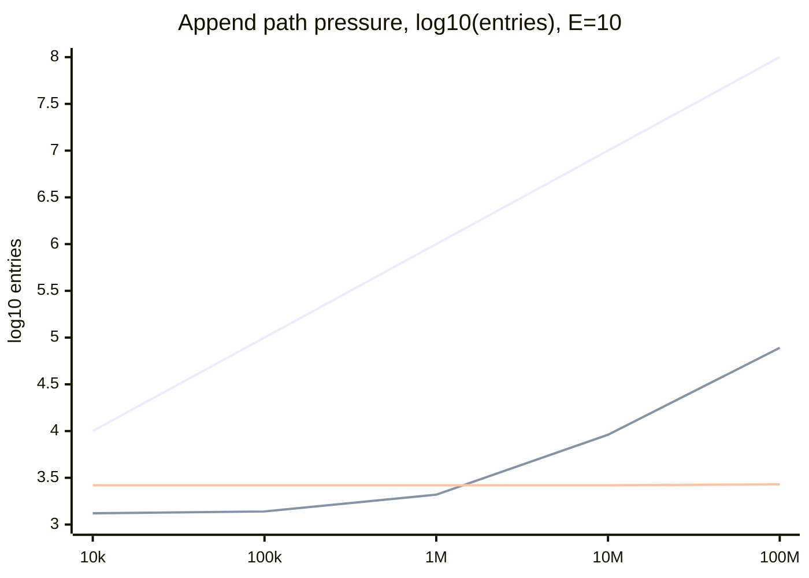

# GitDB Scalability Experiment

Status: analysis draft

This document models where the GitDB event filesystem will scale, where it will slow down, and
which storage layouts should be benchmarked before Cycle stores millions of tickets or long-lived
ticket histories.

The core distinction:

- Git's object database sharding keeps loose object files and packed-object indexes scalable.
- Git tree objects do not shard directory entries automatically. A wide application directory is
  still one wide Git tree object.

## Current Layout

Generic event aggregates use:

```text
collections/events/<aggregate-type>/<aggregate-id>/<event-id>.json
```

Ticket aggregates currently add one logical shard level:

```text
collections/events/ticket/<ticket-shard>/<ticket-id>/<event-id>.json
```

`ticket-shard` is the first two characters of the ticket ID segment after the prefix. For example,
`UKN-A7ABC` maps to:

```text
collections/events/ticket/A7/UKN-A7ABC/<event-id>.json
```

This avoids one huge `collections/events/ticket` tree only if those first two ticket ID characters
are well distributed.

## Git Object Resolution

Git stores content-addressed objects. The first two hex characters shard loose object files under
`.git/objects`, and pack indexes use a 256-entry fanout table plus sorted object IDs for packed
lookups.



Important consequence: Git object sharding helps find object bytes by ID, but it does not reduce the
number of entries inside a tree object. If `collections/events/ticket` has 1,000,000 child entries,
GitDB still has to parse and rewrite that large tree when a child under it changes.

## Logical Tree Resolution

For a ticket event path, GitDB resolves one tree level at a time:



Each append writes one blob, a commit object, and new tree objects for every dirty tree on the path.
For a single ticket event append in the current sharded layout, that is roughly:

| Object type | Count | Why                                                                   |
| ----------- | ----: | --------------------------------------------------------------------- |
| Blob        |     1 | The new canonical event JSON payload.                                 |
| Trees       |     6 | `root`, `collections`, `events`, `ticket`, shard, and ticket ID tree. |
| Commit      |     1 | The GitDB snapshot that moves the pointer.                            |

Batching multiple events into one transaction amortizes the shared ancestor tree and commit objects,
but increases transaction memory and merge/diff blast radius.

## Wide Tree Cost Model

Let:

- `N` be the number of ticket aggregates.
- `E` be the average event files per ticket.
- `S` be the number of effective first-level ticket shards.
- `S2` be the number of second-level shards if a two-level layout is used.

Approximate sibling entries parsed or rewritten on the append path:

| Layout                    | Approximate append path pressure          |
| ------------------------- | ----------------------------------------- |
| Unsharded tickets         | `N + E`                                   |
| One balanced shard level  | `S + ceil(N / S) + E`                     |
| Two balanced shard levels | `S + S2 + ceil(N / (S * S2)) + E`         |
| Hot shard                 | `S_effective + ceil(N / S_effective) + E` |

For the current one-level ticket layout, a base36 two-character shard has a theoretical `S = 1,296`
fanout. The table assumes `E = 10` and balanced shards.

|     Tickets | Unsharded entries | Current 2-char balanced | 2-level 2+2 char balanced |   Hot shard |
| ----------: | ----------------: | ----------------------: | ------------------------: | ----------: |
|      10,000 |            10,010 |                   1,314 |                     2,603 |      10,011 |
|     100,000 |           100,010 |                   1,384 |                     2,603 |     100,011 |
|   1,000,000 |         1,000,010 |                   2,078 |                     2,603 |   1,000,011 |
|  10,000,000 |        10,000,010 |                   9,023 |                     2,608 |  10,000,011 |
| 100,000,000 |       100,000,010 |                  78,467 |                     2,662 | 100,000,011 |



Interpretation:

- One balanced 2-character ticket shard is enough for millions of tickets.
- It becomes questionable around tens of millions if appends must stay very low-latency.
- A two-level hash-derived shard keeps append path width nearly flat for hundreds of millions.
- If shard distribution is not balanced, the current layout collapses toward the unsharded case.

## Breakpoints

| Pressure point      | Where it appears                                              | Why it breaks                                                                                   | Mitigation                                                                                  |
| ------------------- | ------------------------------------------------------------- | ----------------------------------------------------------------------------------------------- | ------------------------------------------------------------------------------------------- |
| Wide aggregate tree | `collections/events/<type>` or a hot shard tree               | Tree objects are full directory listings; appends rewrite the changed tree.                     | Hash-derived sharding by aggregate ID.                                                      |
| Hot ticket          | `<ticket-id>/<event-id>.json`                                 | One ticket with thousands of records creates a wide ticket tree.                                | Event sub-shards by event ID or time if a single ticket can exceed thousands of events.     |
| Full event scan     | `Event.list` and cold projection rebuilds                     | Recursive listing reads every tree and every matching blob.                                     | SQLite projection for queries, incremental projection from `Event.introduced`, checkpoints. |
| History replay      | `store.history` plus per-commit `Event.introduced`            | One event per commit means millions of commits to walk.                                         | Batch related events, use commit summary caches, add projection checkpoints.                |
| Diff/merge          | `store.diff`, `mergeDivergedPointer`, `rebaseDivergedPointer` | Added or deleted subtrees are flattened to event paths; large batches create large change sets. | Keep batches bounded, preserve append-only paths, avoid moving large subtrees.              |
| Loose object count  | `.git/objects/??/*` before packing                            | Each event creates blob, tree, and commit objects; loose files grow quickly.                    | Run `git gc`/maintenance, batch events, rely on pack indexes for cold storage.              |
| Pack memory         | `GitFilesystem` pack reads                                    | The current filesystem backend caches whole pack files. Very large packs can pressure RSS.      | Stream or window pack reads before very large production stores.                            |
| Shard imbalance     | Current `ticket-shard` derivation                             | Leading ticket ID characters may be sequential or time-clustered.                               | Derive shards from a stable hash of the aggregate ID, not visible ID prefixes.              |

## Ticket ID Shard Risk

The current ticket sharding avoids repository-prefix hot spots by ignoring `UKN-`, but it still uses
the first two characters of the generated ticket ID seed.

That is only safe if those characters are random enough. It is risky when:

- Deterministic or sequential IDs start with long zero prefixes.
- UUIDv7-derived base36 IDs expose timestamp-heavy leading characters.
- Imported tickets arrive in sorted key ranges.

The more robust rule is:

```text
ticket-shard = stable_hash(normalized_ticket_id).slice(0, 2)
```

For long-term scale, use two hash-derived levels:

```text
collections/events/ticket/<hash-0-1>/<hash-2-3>/<ticket-id>/<event-id>.json
```

This keeps the human-readable ticket ID in the path while making distribution independent of the ID
format.

## Recommended Layouts

| Volume target                   | Recommended event path                                     | Notes                                                                        |
| ------------------------------- | ---------------------------------------------------------- | ---------------------------------------------------------------------------- |
| Up to 1,000,000 tickets         | `ticket/<hash2>/<ticket-id>/<event-id>.json`               | One hash-derived shard is enough if projections handle reads.                |
| 1,000,000 to 50,000,000 tickets | `ticket/<hash2>/<hash2>/<ticket-id>/<event-id>.json`       | Keeps shard directories small while adding one tree read/write.              |
| Single ticket with many events  | `ticket/<hash2>/<ticket-id>/<event-hash2>/<event-id>.json` | Only needed if individual tickets can reach thousands of events.             |
| Thousands of users              | `user/<user-id>/<event-id>.json`                           | No shard needed unless user count or per-user event volume grows materially. |
| Millions of records/comments    | `record/<hash2>/<hash2>/<record-id>/<event-id>.json`       | Records tend to grow faster than users; shard independently.                 |

The durable Git layout should optimize append and sync. Query performance should come from the
SQLite projection, not from listing Git tree directories directly.

## Experiment Matrix

Benchmark these layouts before changing the path contract:

| Scenario                           |                                Tickets | Events per ticket | Commit batch size | Expected signal                            |
| ---------------------------------- | -------------------------------------: | ----------------: | ----------------: | ------------------------------------------ |
| Unsharded baseline                 |                          10k, 100k, 1M |                 1 |        100, 1,000 | Measures wide tree failure curve.          |
| Current ticket shard, balanced IDs |                     10k, 100k, 1M, 10M |             1, 10 |        100, 1,000 | Validates one-level shard model.           |
| Current ticket shard, hot IDs      |                          10k, 100k, 1M |             1, 10 |        100, 1,000 | Shows risk if ID prefixes cluster.         |
| Two-level hash shard               |                          100k, 1M, 10M |             1, 10 |        100, 1,000 | Validates the future-proof layout.         |
| Hot ticket                         |                               1 ticket |     1k, 10k, 100k |        100, 1,000 | Tests per-ticket event directory width.    |
| Cold rebuild                       |                        100k, 1M events |             mixed |  existing history | Measures projection rebuild from Git only. |
| Incremental sync                   | 100k base plus 100, 1k, 10k new events |             mixed |        100, 1,000 | Measures normal startup and pull.          |

Capture:

- Seed transaction time and memory.
- Cold `Event.list` time.
- Warm `Event.list` time.
- Point read latency for first, middle, and last tickets.
- Incremental `Event.introduced` time.
- `store.diff` and merge/rebase time on diverged branches.
- Loose object count before `git gc`.
- Pack size, pack count, and packed read RSS after `git gc`.

## Working Hypothesis

The current GitDB direction is sound if event files remain append-only and user-facing queries are
served from projections. The first serious scalability risk is not Git's object database; it is
logical tree width caused by unbalanced or under-sharded aggregate paths.

For millions of tickets, make the ticket shard hash-derived before relying on the current layout. For
tens of millions or long-lived imported repositories, plan a two-level hash-derived shard and treat
full Git event scans as administrative rebuild work, not an interactive query path.
