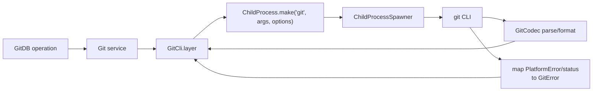
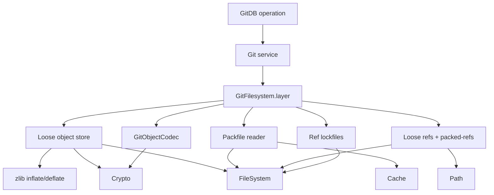
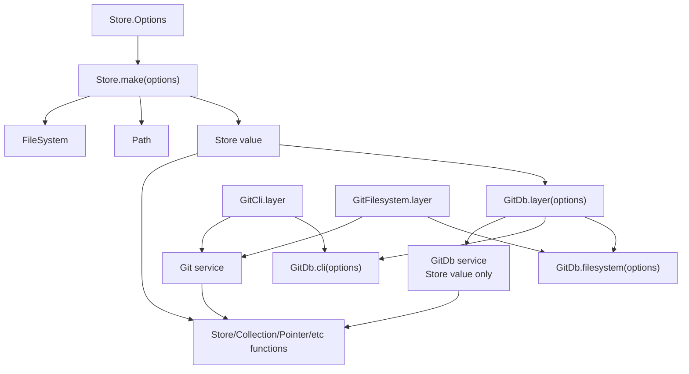
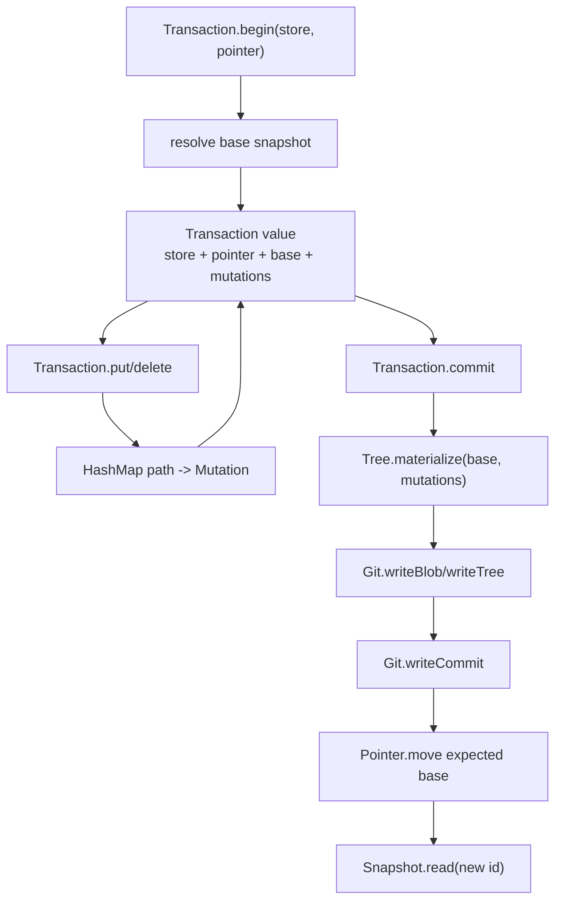
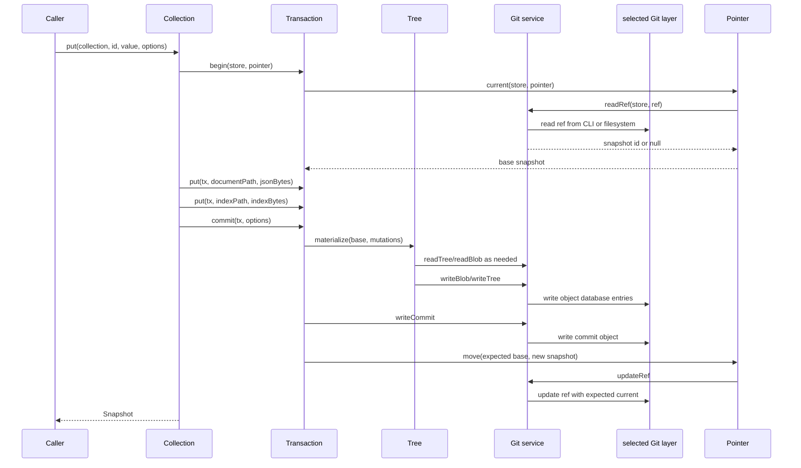
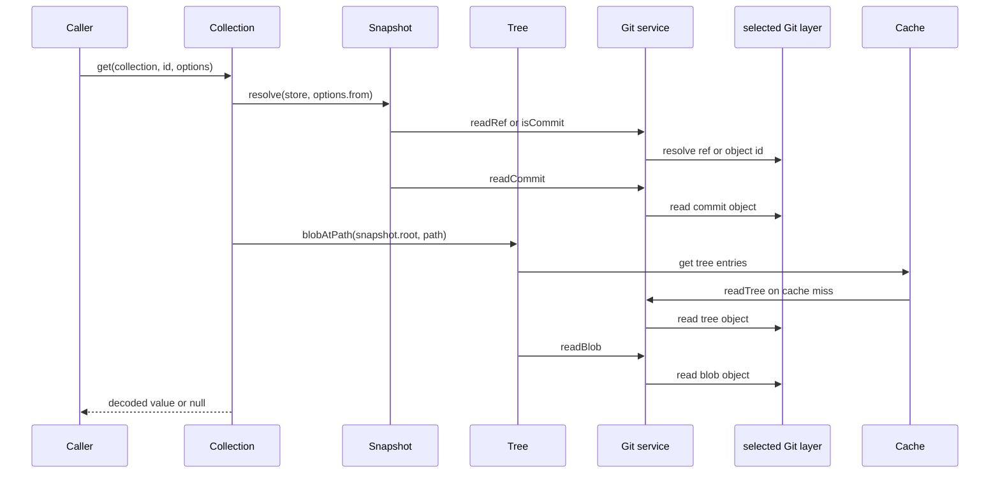
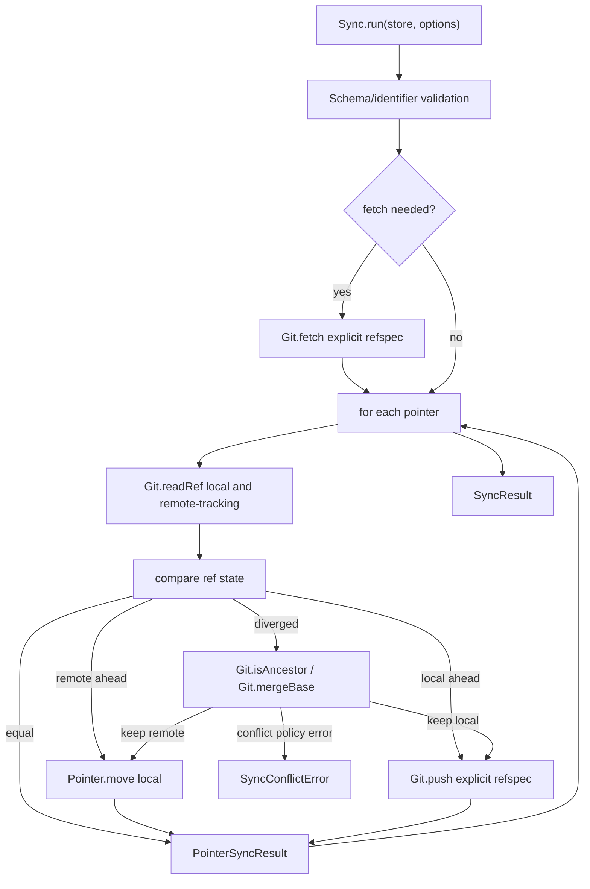
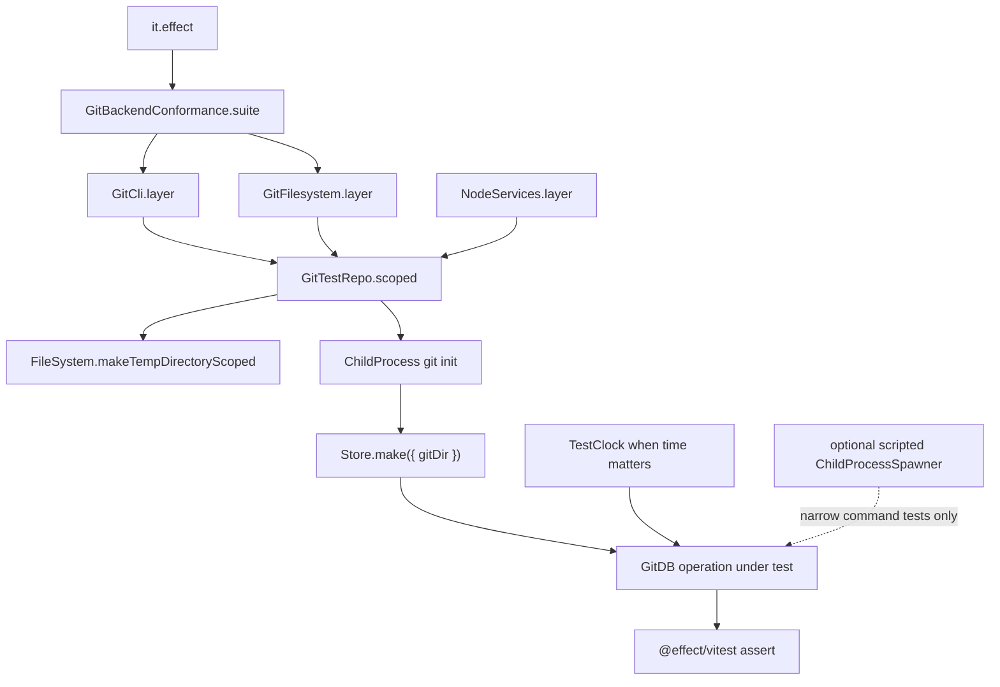

# GitDB Target Architecture

Status: proposal

This document proposes a simpler GitDB design that uses Effect's existing package surfaces as the
primary dependency model. It intentionally uses public Effect exports and `effect/unstable/*`
exports. It does not depend on private `effect/internal/*` modules because those are not package
exports.

## Design Direction

The active runtime service is `Store.StoreService`, backed by the narrow `Git` service and a
configured `Store` value.

The target design is module-first:

- A `Store` is a small validated value, not the main dependency container.
- Pure entity invariants live in `schemas/`; store and adapter modules decode through those schemas
  and map parse failures into GitDB's typed errors.
- Git storage is represented by one narrow `Git` service contract with two concrete layers:
  `GitCli.layer` and `GitFilesystem.layer`.
- GitDB operations are exported as module functions over `Store` and require the `Git` capability
  where they touch Git objects, refs, ancestry, fetch, or push.
- One optional `GitDb` service layer MAY exist for applications that want to inject an opened
  store through the Effect environment.
- Tests use real scoped Git repositories and Effect platform services by default. A scripted
  `ChildProcessSpawner` test layer can be used for narrow process-boundary tests, and both Git
  layers should run the same GitDB conformance suite.

## Effect Package Mapping

| Package concern                | Effect-backed approach                                                                                                             |
| ------------------------------ | ---------------------------------------------------------------------------------------------------------------------------------- |
| dynamic store configuration    | `Store.make(options)` validates schema-backed options with `Path.Path` and `FileSystem.FileSystem`.                                |
| entity and identifier rules    | `schemas/` owns `Schema` values for store options, refs, paths, identifiers, Git objects, snapshots, collections, and sync results. |
| Git storage boundary           | Narrow `Git` service with Git object, ref, ancestry, and transport primitives.                                                     |
| local git command backend      | `GitCli.layer`, implemented with `ChildProcess.make` and `ChildProcessSpawner` from `effect/unstable/process`.                     |
| direct object/ref access       | `GitFilesystem.layer`, implemented with `FileSystem`, `Path`, `Crypto`, Git object codecs, pack reads, and ref lockfile semantics. |
| mutable transaction maps       | `HashMap` for staged mutations, with `SynchronizedRef` only if the public transaction API remains mutable.                         |
| ad hoc object wrappers         | `Schema.Class`, `Schema.TaggedClass`, `Schema.TaggedErrorClass`, and `Data` for typed values and errors.                           |
| repeated tree and commit reads | Scoped `Cache` instances inside high-read operations such as diff, history, and collection listing.                                |
| hidden runtime concerns        | `FileSystem`, `Path`, `Crypto`, `Clock`, `ChildProcessSpawner`, logging, spans, and test clock remain visible Effect requirements. |
| manual observability           | `Effect.withSpan`, `Effect.annotateLogs`, `Effect.logDebug`, and typed errors at GitDB boundaries.                                 |

`effect/unstable/persistence/KeyValueStore` is not a good core abstraction for GitDB. It models a
mutable key/value store, while GitDB's core model is immutable snapshots, Git trees, refs, history,
diff, and explicit sync. It can be added later as an adapter over the current pointer view, but it
should not drive the storage design.

## Proposed Source Layout

```txt
src/
  domain/
    ChangeSet.ts
    CommitObject.ts
    Entry.ts
    Identity.ts
    Snapshot.ts
    TreeEntry.ts

  schemas/
    Collection.ts
    Commit.ts
    Document.ts
    Identifier.ts
    ObjectId.ts
    Path.ts
    Ref.ts
    Snapshot.ts
    Store.ts
    Sync.ts
    Tree.ts
    index.ts

  errors/
    GitDbError.ts
    GitError.ts
    IdentifierError.ts
    PointerError.ts
    SnapshotError.ts
    SyncError.ts

  git/
    Git.ts
    GitCli.ts
    GitCommand.ts
    GitFilesystem.ts
    GitObjectCodec.ts
    GitPack.ts
    GitRefStore.ts

  store/
    Store.ts
    Path.ts
    Json.ts
    Document.ts
    Tree.ts
    Snapshot.ts
    Pointer.ts
    Transaction.ts
    Collection.ts
    Sync.ts
    Layer.ts

  index.ts
```

The important split is not the exact folders. The important split is that Git storage, snapshot tree
algorithms, transactions, collections, pointers, and sync are separate modules with plain function
APIs.

The public barrel should export these modules as namespaces so callers use the same shape as Effect
packages:

```ts
export * as Store from "./store/Store.ts";
export * as Schemas from "./schemas/index.ts";
export * as GitDb from "./store/Layer.ts";
export * as GitCli from "./git/GitCli.ts";
export * as GitFilesystem from "./git/GitFilesystem.ts";
export * as Collection from "./store/Collection.ts";
export * as Pointer from "./store/Pointer.ts";
export * as Snapshot from "./store/Snapshot.ts";
export * as Sync from "./store/Sync.ts";
export * as Transaction from "./store/Transaction.ts";
export * as Tree from "./store/Tree.ts";
```

## Target Dependency Graph

```mermaid
flowchart TD
  subgraph PublicAPI["public API"]
    Index["index.ts"]
    StoreModule["Store module"]
    CollectionModule["Collection module"]
    TransactionModule["Transaction module"]
    PointerModule["Pointer module"]
    SnapshotModule["Snapshot module"]
    SyncModule["Sync module"]
    LayerModule["optional Layer module"]
  end

  subgraph Core["core GitDB modules"]
    StoreValue["Store value"]
    SchemaRules["Schema-backed validation"]
    PathRules["Path/ref helpers"]
    JsonCodec["JSON/document codec"]
    TreeEngine["Tree materialization"]
    Errors["Tagged errors"]
    Domain["Schema-backed domain types"]
  end

  subgraph GitBoundary["Git boundary"]
    GitService["Git service contract"]
    GitCliLayer["GitCli.layer"]
    GitFilesystemLayer["GitFilesystem.layer"]
    GitCommand["Git command runner"]
    GitCodec["Git object codecs"]
    GitRefs["Git ref store"]
    GitObjects["Git object store"]
    GitPacks["Git pack reader"]
    Process["effect/unstable/process<br/>ChildProcess + ChildProcessSpawner"]
  end

  subgraph EffectPlatform["Effect platform services"]
    FileSystem["FileSystem"]
    Path["Path"]
    Crypto["Crypto"]
    Clock["Clock"]
    Cache["Cache"]
    Compression["node:zlib wrapped in Effect"]
    LoggerTracer["Logger / Tracer"]
  end

  Index --> StoreModule
  Index --> CollectionModule
  Index --> TransactionModule
  Index --> PointerModule
  Index --> SnapshotModule
  Index --> SyncModule
  Index --> LayerModule

  StoreModule --> StoreValue
  StoreModule --> SchemaRules
  StoreModule --> PathRules
  StoreModule --> FileSystem
  StoreModule --> Path

  CollectionModule --> StoreValue
  CollectionModule --> SchemaRules
  CollectionModule --> PathRules
  CollectionModule --> JsonCodec
  CollectionModule --> SnapshotModule
  CollectionModule --> TransactionModule

  TransactionModule --> StoreValue
  TransactionModule --> SchemaRules
  TransactionModule --> TreeEngine
  TransactionModule --> GitService
  TransactionModule --> Crypto
  TransactionModule --> Clock

  PointerModule --> StoreValue
  PointerModule --> GitService
  SnapshotModule --> StoreValue
  SnapshotModule --> GitService
  SyncModule --> StoreValue
  SyncModule --> GitService

  TreeEngine --> GitService
  TreeEngine --> Cache
  GitCliLayer --> GitService
  GitCliLayer --> GitCommand
  GitCommand --> Process
  GitFilesystemLayer --> GitService
  GitFilesystemLayer --> GitCodec
  GitFilesystemLayer --> GitRefs
  GitFilesystemLayer --> GitObjects
  GitFilesystemLayer --> GitPacks
  GitFilesystemLayer --> FileSystem
  GitFilesystemLayer --> Path
  GitFilesystemLayer --> Crypto
  GitFilesystemLayer --> Compression

  StoreModule --> Errors
  PathRules --> SchemaRules
  CollectionModule --> Errors
  TransactionModule --> Errors
  PointerModule --> Errors
  SnapshotModule --> Domain
  SyncModule --> Domain
  GitCliLayer --> LoggerTracer
  GitFilesystemLayer --> LoggerTracer
```



## Target Public API Shape

The primary API should be functions over an explicit `Store`.

```ts
import { Effect } from "effect";
import { NodeServices } from "@effect/platform-node";
import { Collection, GitCli, Store } from "@cycle/git-db";

const program = Effect.gen(function* () {
  const store = yield* Store.make({ gitDir: ".git" });
  const tickets = Collection.of<{ readonly title: string; readonly status: string }>(
    store,
    "tickets",
  );

  const snapshot = yield* Collection.put(tickets, "ticket-1", {
    status: "open",
    title: "Fix sync conflict reporting",
  });

  return yield* Collection.get(tickets, "ticket-1", { from: snapshot.id });
}).pipe(Effect.provide([NodeServices.layer, GitCli.layer]));
```

Applications that prefer environment injection can still use a very small layer.

```ts
import { Effect } from "effect";
import { Collection, GitCli, GitDb } from "@cycle/git-db";

const program = Effect.gen(function* () {
  const store = yield* GitDb;
  const tickets = Collection.of(store, "tickets");
  return yield* Collection.list(tickets);
}).pipe(Effect.provide([GitDb.layer({ gitDir: ".git" }), GitCli.layer]));
```

In this shape, the store service is just a constructed store value. It is not a facade containing
every operation.

## Git Boundary

`Git.ts` should define the only Git storage-engine service. It is deliberately narrower than the
old adapter: it maps to Git object database, ref database, ancestry, and transport primitives.

```ts
export class Git extends Context.Service<
  Git,
  {
    readonly deleteRef: (store: Store, input: DeleteRefInput) => Effect.Effect<void, GitError>;
    readonly fetch: (store: Store, input: FetchInput) => Effect.Effect<void, GitTransportError>;
    readonly isAncestor: (
      store: Store,
      ancestor: ObjectId,
      descendant: ObjectId,
    ) => Effect.Effect<boolean, GitError>;
    readonly isCommit: (store: Store, id: string) => Effect.Effect<boolean, GitError>;
    readonly listRefs: (
      store: Store,
      prefix: string,
    ) => Effect.Effect<ReadonlyArray<GitRef>, GitError>;
    readonly mergeBase: (
      store: Store,
      a: ObjectId,
      b: ObjectId,
    ) => Effect.Effect<ObjectId | null, GitError>;
    readonly push: (store: Store, input: PushInput) => Effect.Effect<void, GitTransportError>;
    readonly readBlob: (store: Store, id: ObjectId) => Effect.Effect<Uint8Array, GitError>;
    readonly readCommit: (store: Store, id: ObjectId) => Effect.Effect<CommitObject, GitError>;
    readonly readRef: (store: Store, name: string) => Effect.Effect<ObjectId | null, GitError>;
    readonly readTree: (
      store: Store,
      id: ObjectId,
    ) => Effect.Effect<ReadonlyArray<TreeEntry>, GitError>;
    readonly updateRef: (store: Store, input: UpdateRefInput) => Effect.Effect<void, GitError>;
    readonly writeBlob: (store: Store, bytes: Uint8Array) => Effect.Effect<ObjectId, GitError>;
    readonly writeCommit: (
      store: Store,
      input: WriteCommitInput,
    ) => Effect.Effect<ObjectId, GitError>;
    readonly writeTree: (
      store: Store,
      entries: ReadonlyArray<TreeEntry>,
    ) => Effect.Effect<ObjectId, GitError>;
  }
>()("@cycle/git-db/Git") {}
```

There are two production layers:

- `GitCli.layer`: shells out to the local `git` command. This is the safest default and should
  support all current behavior, including fetch and push.
- `GitFilesystem.layer`: reads and writes `.git` directly using Git's object and ref formats. This
  removes process startup cost and gives us a storage implementation we fully control.

### Git CLI Layer

`GitCli.layer` uses `ChildProcess.make("git", args, options)` and the spawner helpers where
possible:

- `ChildProcessSpawner.string` for stdout-as-string commands.
- `ChildProcessSpawner.spawn` plus `Stream.runCollect` when binary stdout or stdin is required.
- `Effect.scoped` for process lifetime.
- `Effect.withSpan` and `Effect.annotateLogs` around Git commands.



### Git Filesystem Layer

`GitFilesystem.layer` implements the local Git object/ref database directly.

| Area               | Required behavior                                                                                                                                                                          |
| ------------------ | ------------------------------------------------------------------------------------------------------------------------------------------------------------------------------------------ |
| Loose object read  | Read `.git/objects/aa/bb...`, inflate zlib bytes, parse `<type> <size>\0<payload>`, verify object id.                                                                                      |
| Loose object write | Encode `<type> <size>\0<payload>`, SHA-1 the full object bytes, zlib-compress, write via temp file then atomic rename.                                                                     |
| Tree codec         | Decode and encode binary tree entries: `<mode> <name>\0<20-byte object id>`.                                                                                                               |
| Commit codec       | Decode and encode tree, parent, author, committer, and message fields exactly enough to produce Git-compatible commit objects.                                                             |
| Ref read           | Read loose refs under `.git/refs/*`, read `packed-refs`, handle missing refs as `null`.                                                                                                    |
| Ref update         | Use `.lock` files, expected-current checks, atomic rename, and cleanup on failure.                                                                                                         |
| Ref delete         | Use the same expected-current and lockfile semantics as update.                                                                                                                            |
| Ref list           | Merge loose refs and `packed-refs`, with loose refs taking precedence.                                                                                                                     |
| Ancestry           | Walk commit parents with scoped caches for `isAncestor` and `mergeBase`.                                                                                                                   |
| Packfiles          | Needed for drop-in reads of existing repositories and fetched objects; implement `.idx` lookup and pack object inflate before calling this layer complete.                                 |
| Transport          | Fetch/push are Git protocol concerns. Either delegate transport to `GitCliTransport` or fail with a typed unsupported-transport error until direct transport is intentionally implemented. |

The direct layer should be implemented in visible Effect terms:

- `FileSystem.FileSystem` and `Path.Path` for object, ref, lockfile, and packfile access.
- `Crypto.Crypto` for SHA-1 object IDs.
- A tiny zlib helper in the provider module, wrapped with `Effect.tryPromise` or `Effect.try`, for
  Git object compression and inflation.
- `Cache` for pack indexes, commit reads, and tree reads inside high-volume operations.
- `Effect.acquireRelease` or scoped finalizers for lockfile cleanup.



## Store and Layer Boundary

`Store.make` validates and returns a plain store value. This follows the Effect package convention
where `make(options)` constructs the runtime value and `layer(options)` provides it through a
dynamically configured layer.

```ts
export class Store extends Schema.Class<Store>("@cycle/git-db/Store")({
  cwd: Schema.String,
  database: DatabaseName,
  defaultPointer: PointerName,
  gitDir: Schema.String,
  namespace: RefNamespace,
  shardLength: Schema.Number,
}) {
  get refPrefix(): string {
    return `${this.namespace}/${this.database}`;
  }
}

export const Options = Schema.Struct({
  allowBranchNamespace: Schema.optional(Schema.Boolean),
  cwd: Schema.optional(Schema.String),
  database: Schema.optional(Schema.String),
  defaultPointer: Schema.optional(Schema.String),
  gitDir: Schema.optional(Schema.String),
  namespace: Schema.optional(Schema.String),
  shardLength: Schema.optional(Schema.Number),
  verifyGitDir: Schema.optional(Schema.Boolean),
});
export type Options = typeof Options.Type;

export const make = (
  options: Options = {},
): Effect.Effect<Store, GitDbError, FileSystem.FileSystem | Path.Path> =>
  Effect.gen(function* () {
    // validate paths, namespace, database, pointer, shard length, and gitDir access
    return new Store(validated);
  });
```

The optional layer remains small:

```ts
export class GitDb extends Context.Service<GitDb, Store>()("@cycle/git-db/GitDb") {}

export const layer = (options: Store.Options = {}) => Layer.effect(GitDb, Store.make(options));
```

That keeps composition roots Effect-native without forcing all core logic through a large service
object. Git storage is still selected independently:

```ts
export const cli = (options: Store.Options = {}) =>
  Layer.mergeAll(GitDb.layer(options), GitCli.layer);

export const filesystem = (options: Store.Options = {}) =>
  Layer.mergeAll(GitDb.layer(options), GitFilesystem.layer);
```

Applications choose `GitCli.layer` when they want Git command compatibility and choose
`GitFilesystem.layer` when they want direct object/ref access.



## Transaction Model

Transactions should be data plus functions, not nested API objects.

Two viable shapes:

1. Immutable transaction builder:

```ts
const tx0 = yield * Transaction.begin(store, "main");
const tx1 = yield * Transaction.put(tx0, path, value);
const tx2 = yield * Transaction.delete(tx1, oldPath);
const snapshot = yield * Transaction.commit(tx2, { message: "Update tickets" });
```

2. Mutable transaction handle:

```ts
const tx = yield * Transaction.begin(store, "main");
yield * Transaction.put(tx, path, value);
yield * Transaction.delete(tx, oldPath);
const snapshot = yield * Transaction.commit(tx, { message: "Update tickets" });
```

The immutable builder is simpler to reason about and test. The mutable handle is closer to the
current API. If we keep mutation, use `SynchronizedRef` for serialized state transitions and active
state checks.



## Collection API

Collections should be thin typed path helpers over transactions and reads.

```ts
const tickets = Collection.of<Ticket>(store, "tickets");

yield *
  Collection.put(tickets, "ticket-1", ticket, {
    indexes: { "by-status": ticket.status },
  });

const open =
  yield *
  Collection.index(tickets, "by-status").pipe(
    Effect.flatMap((index) => CollectionIndex.get(index, "open")),
  );
```

Collections should not create transactions through hidden store methods. `Collection.put` may remain
a convenience, but it should call `Transaction.begin` and `Transaction.commit` directly so the flow
is visible in code and tests.

## Write Flow



## Read Flow



## Sync Flow

Sync should be a standalone use case in `Sync.ts`, depending only on `Store`, `Pointer`, and `Git`
functions.



## Testing Model

The package is Git-specific, so the primary deterministic test fixture should be a scoped real Git
repository, not a hand-rolled fake object database. The CLI and filesystem layers should run the
same behavior suite.



Direct filesystem tests need extra interoperability checks:

- Objects written by `GitFilesystem.layer` are readable by `git cat-file`.
- Objects written by the Git CLI are readable by `GitFilesystem.layer`, including packed objects.
- Ref updates honor expected-current semantics and clean up stale lockfiles after failures.
- The filesystem backend either passes fetch/push tests or fails them with the documented typed
  unsupported-transport error.

This removes the maintenance cost of maintaining a separate fake Git storage engine while still not
proving compatibility with real Git storage.

## Migration Plan

1. Keep `store/Store.ts`, `git/Git.ts`, `git/GitCli.ts`, and `git/GitFilesystem.ts` as the active
   backend architecture.
2. Keep `store/Path.ts`, `store/Json.ts`, `store/Document.ts`, `store/Tree.ts`, `store/Snapshot.ts`,
   `store/Pointer.ts`, `store/Transaction.ts`, `store/Collection.ts`, `store/Sync.ts`, and
   `store/Layer.ts` as the active store module layout.
3. Expand shared Git backend conformance tests for refs, ancestry, history, diff, sync, packed
   objects, and transport behavior.
4. Continue moving workflow implementation from `store/Store.ts` into the dedicated store modules.
5. Move callers and tests to the module-first API.

## Acceptance Criteria

- Core GitDB operations expose only the Effect services they actually require.
- No core module calls `Effect.provide` to hide process, file system, path, crypto, clock, or cache
  dependencies.
- Git storage is owned by one narrow `Git` boundary service with two production layers:
  `GitCli.layer` and `GitFilesystem.layer`.
- Both Git layers pass the same object, ref, ancestry, transaction, history, diff, and sync
  conformance tests, except where filesystem transport is explicitly unsupported.
- Filesystem objects and refs are compatible with the local `git` command.
- Store, collection, pointer, transaction, snapshot, diff, and sync are individually testable.
- Tests no longer need an in-memory implementation of Git semantics.
- The old facade can remain temporarily, but it is implemented as a thin adapter over the new
  modules.
