# Git Store Package Specification

Status: Draft implementation specification

Version: 0.1.0

Package: `@cycle/git-store`

Location: `packages/git-store`

## 1. Purpose

`@cycle/git-store` is a new Effect-native package for storing Cycle documents and append-only event
files directly in a Git object database and Git refs. It is a greenfield replacement candidate for
`@cycle/git-db`, not an in-place refactor of that package.

The package MUST preserve compatibility with Git data already written by `@cycle/git-db`, including
standard Git loose and packed objects, commits, trees, refs under `refs/gitdb/<database>/<pointer>`,
event paths under `collections/events`, and Cycle repository identity derived from the GitDB root
commit.

This specification authorizes work inside `packages/git-store` only. It MUST NOT require edits to
`packages/git-db`, downstream consumers, or other packages during the initial implementation phase.

## 2. Normative Language

The key words `MUST`, `MUST NOT`, `REQUIRED`, `SHOULD`, `SHOULD NOT`, and `MAY` in this document
are to be interpreted as described in RFC 2119 and RFC 8174 when, and only when, they appear in all
capitals.

`Implementation-defined` means an implementation may choose the mechanism, but it MUST document the
choice when callers, tests, or operators need to reason about behavior.

## 3. Problem Statement

`@cycle/git-db` currently provides the required product behavior, but it carries historical API
shape, package coupling, and an adapter boundary centered on `@cycle/git`. Cycle now needs a smaller
package that uses Effect primitives directly for local Git storage: `FileSystem`, `Path`, `Scope`,
`Stream`, `Crypto`, `Encoding`, `Clock`, `Config`, `Cache`, `Semaphore`, `Context.Service`, and
`Layer`.

The correctness boundary for the new package is the Git filesystem protocol. Objects MUST be stored
as canonical Git object bytes. Refs MUST be updated through Git-compatible lockfiles and atomic
renames. Transactions MUST write objects before moving refs. The package MUST keep remote fetch,
pull, push, and CLI interop out of core storage so local behavior remains small, testable, and
deterministic.

## 4. Goals

`@cycle/git-store` MUST:

1. Provide a new streamlined API that preserves core GitDB functionality without preserving the
   current public `@cycle/git-db` API names or subpaths.
2. Read existing GitDB data stored under `refs/gitdb/<database>/<pointer>` without migration.
3. Write standard Git blobs, trees, commits, loose objects, and refs that normal Git tooling can
   inspect.
4. Support a document transaction workflow where callers can add, replace, delete, read, list, and
   commit documents under a pointer with optimistic expected-ref validation.
5. Support append-only event files compatible with current GitDB event paths and canonical JSON
   payloads.
6. Resolve Cycle repository identity from the root commit reachable from `refs/gitdb/cycle/main`,
   and initialize it only through an explicit ensure operation, compatible with
   `specs/GITDB_REPOSITORY_ID_SPEC.md` except for remote fetch/push behavior that is delegated
   outside this package.
7. Use Effect services and layers for mutable state, dependencies, side effects, resource lifetime,
   typed errors, configuration, and validation.
8. Keep service files in `src/` as one primary `ServiceName.ts` file per `Context.Service` class.
   Each service file MUST export the service and its `ServiceNameLive` layer.
9. Keep internal helpers under `src/internal/` and testing-only layers under `src/testing/`.
10. Avoid convenience facade packages and cross-package re-exports. Every public symbol MUST have a
    clear owning module inside `@cycle/git-store`.

## 5. Non-Goals

`@cycle/git-store` MUST NOT:

1. Modify `packages/git-db` or migrate existing consumers in the initial package implementation.
2. Preserve `@cycle/git-db` public API compatibility for `StoreService`, old package subpaths,
   pointer wrappers, sync helpers, or in-memory GitDB layers.
3. Own remote fetch, pull, push, rebase, merge, transport authentication, or force-with-lease
   behavior. Those workflows MAY be implemented by another package using `git-store` refs and
   commits.
4. Mutate the normal Git worktree, Git index, `HEAD`, user branches, tags, notes, or checked-out
   files.
5. Guarantee atomic multi-ref transactions across multiple ref files. Normal filesystems cannot
   provide this without a journal or single-file backend.
6. Write packfiles or perform garbage collection. The package writes loose objects and MUST read
   packed objects for compatibility.
7. Store repository identity in committed metadata files, `.cycle` directories, Git notes, tags, or
   working-tree manifests.
8. Depend on `@cycle/git` for core runtime storage. Existing `@cycle/git` code MAY be used as
   context or test comparison, but `git-store` core MUST own its local filesystem protocol.
9. Support SHA-256 object-format Git repositories in the initial implementation.

## 6. System Overview

### 6.1 Abstraction Layers

The package is layered as follows:

| Layer | Public abstraction | Primary Effect APIs |
| --- | --- | --- |
| Repository discovery | `RepositoryPaths` | `FileSystem`, `Path`, `Config` |
| Raw file operations | internal `GitFiles` helper | `FileSystem`, `Path`, `Scope` |
| Object IDs and codecs | `ObjectId`, `ObjectCodec` | `Crypto.digest`, `Encoding.encodeHex` |
| Loose objects | `LooseObjectStore` | `FileSystem`, `Path`, `Crypto`, `Scope` |
| Pack objects | `PackIndexStore`, `PackObjectStore` | `FileSystem.stream`, `Stream`, binary parsing |
| Unified objects | `ObjectStore` | loose objects, pack objects, `Cache` |
| Loose refs | `LooseRefStore` | `FileSystem`, `Path`, `Scope` |
| Packed refs | `PackedRefsStore` | `FileSystem`, `Path`, pure parser |
| Unified ref reads | `RefReader` | loose refs, packed refs |
| Ref updates | `RefTransaction` | `RefReader`, `FileSystem.open({ flag: "wx" })`, file sync, `Scope`, `Effect.uninterruptibleMask`, optional `Semaphore` |
| Public ref facade | `RefStore` | `RefReader`, `RefTransaction` |
| Reflog | `ReflogStore` | `FileSystem`, `Clock` |
| Commit object creation | `CommitWriter` | `ObjectStore`, `RefTransaction`, `Clock` |
| Repository identity | `RepositoryIdentity` | `CommitWriter`, `RefReader`, `Crypto` |
| Document/event store | `GitStore`, `EventStore` | `CommitWriter`, `ObjectStore`, `RefReader`, `Schema` |
| Runtime store registry | `GitStoreInstances`, `GitStores` | `LayerMap.Service`, `Scope`, `Config` |

The layer dependency graph MUST be implemented with `Layer.effect`, `Layer.succeed`,
`Layer.provide`, and `Layer.provideMerge`. Production Node entrypoints SHOULD provide
`NodeServices.layer` at the edge. Package service layers MUST depend on the portable Effect service
tags such as `FileSystem.FileSystem`, `Path.Path`, and `Crypto.Crypto`; they MUST NOT import Node
filesystem, path, or crypto modules directly outside implementation-defined internal adapters such
as compression.

In the graph below, arrows point from a provided dependency to the service that consumes it.

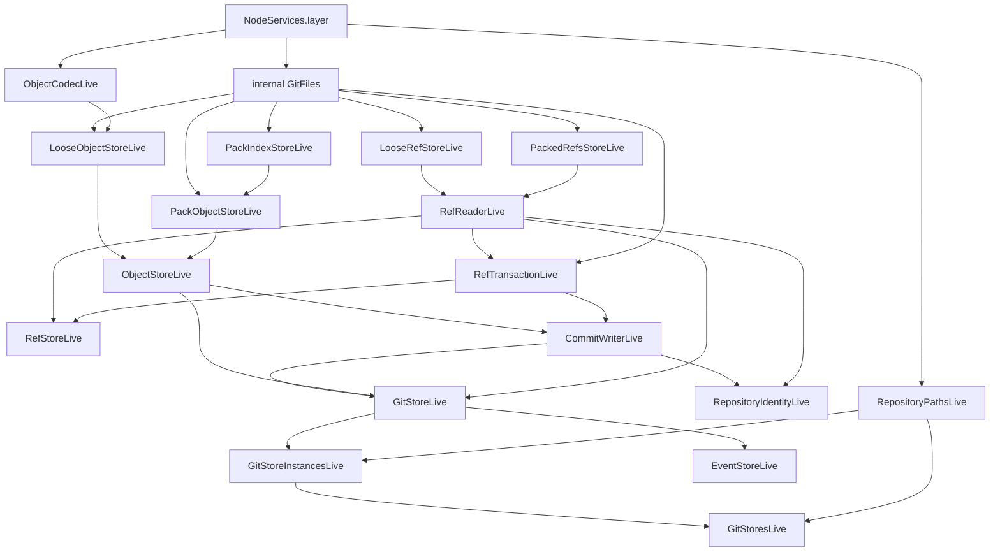

### 6.2 Core Dependency Policy

Runtime source under `packages/git-store/src` SHOULD depend only on:

- `effect`;
- `@effect/platform-node` when a Node live layer is needed to provide platform services;
- platform compression only through an internal utility or a small documented adapter.

The package MUST NOT use `node:child_process` or the real `git` CLI in core source. CLI comparison is
allowed only in tests, benchmarks, or debug-only helpers outside the core service graph.

### 6.3 Effect Component Usage Requirements

The package MUST use Effect v4 primitives as follows:

| Effect component | Required usage in `@cycle/git-store` |
| --- | --- |
| `Context.Service` | Define each public service key as `export class ServiceName extends Context.Service<ServiceName, ServiceShape>()("@cycle/git-store/ServiceName") {}`. Reuse the class as the only service tag. |
| `Layer.effect` | Build services that need dependencies, caches, semaphores, or config. Return implementations with `ServiceName.of(...)`. |
| `Layer.succeed` | Provide already-available pure service implementations or deterministic test fakes. |
| `Layer.provide` | Hide implementation dependencies when exporting a final live layer. |
| `Layer.provideMerge` | Compose lower-level services when the caller should still receive both the high-level service and lower-level services. |
| `Layer.unwrap` | Select a layer from `Config` or another effect only when construction depends on runtime config. |
| `LayerMap.Service` | Manage keyed `GitStore` instances for runtimes that have several repositories or databases open at once. The implementation MUST NOT hand-roll a mutable map of open stores. |
| `Effect.fn("name")` | Define exported functions and service methods that return effects. The name SHOULD be `ServiceName.method` or match the exported function name. Add tracing options or transforms through `Effect.fn`, not by wrapping the constructed function value. |
| `Effect.gen` | Sequence multi-step workflows such as object writes, ref transactions, commit creation, and identity initialization. |
| `Effect.succeed` | Wrap already-available pure values. |
| `Effect.sync` | Wrap non-throwing synchronous side effects or synchronous allocation that is not already exposed as an Effect API. |
| `Effect.try` | Wrap synchronous code that can throw, such as zlib compression or UTF-8 decoder construction. Map failures into typed package errors. |
| `Effect.tryPromise` | Wrap Promise APIs only at platform boundaries not already covered by Effect services. Core filesystem operations SHOULD use `FileSystem` instead. |
| `Effect.acquireRelease` / `Effect.addFinalizer` | Manage lockfiles, temporary files, and other resources whose cleanup must run when a scope exits. |
| `Effect.scoped` / `Scope` | Bound file handles and temporary file lifetimes. Any `FileSystem.open` use MUST run inside a scope. |
| `Effect.uninterruptibleMask` | Protect the critical rename/release section of ref updates and object finalization while allowing interruptible acquisition and validation. |
| `Semaphore` | Optionally serialize same-process writes per ref. It MUST complement, not replace, lockfiles. |
| `Ref` | Hold process-local mutable structures such as a map of per-ref semaphores or in-memory test state. |
| `TxRef` | Hold transaction-local active/mutation state when multiple transaction operations must remain atomic from the caller's perspective. |
| `Cache` | Cache decoded immutable objects, commit graphs, tree entries, pack indexes, and packed refs with bounded capacities. |
| `Stream` | Read packfiles and large files incrementally through `FileSystem.stream`, `Stream.mapAccum*`, and `Stream.runFold*`. |
| `Crypto` | Generate secure random bytes and compute Git object digests. SHA-1 is allowed only for Git compatibility. |
| `Encoding` | Encode digest bytes with `Encoding.encodeHex`; decode user-provided hex with `Encoding.decodeHex` or schema validation. |
| `Clock` | Generate commit timestamps and reflog timestamps. Code MUST NOT use `Date.now()` or `new Date()` in business logic. |
| `Config` / `ConfigProvider` | Define structured config with `Config.schema`, `Config.all`, `Config.nested`, and `Config.withDefault`. Tests SHOULD provide deterministic config through `ConfigProvider.layer` or `ConfigProvider.layerAdd`. |
| `Schema` | Define public DTOs, branded identifiers, tagged errors, and document/event payload codecs. |
| `Effect.withSpan` / `Effect.annotateLogs` | Add operation spans and structured log annotations at service method boundaries. |

The implementation MUST NOT introduce zero-argument functions whose only purpose is returning an
already-created `Effect`. Reusable effects SHOULD be values. Functions returning effects SHOULD be
defined with `Effect.fn("name")`.

### 6.4 Effect Workflow Principles

Every service method MUST follow this workflow shape unless the operation is pure:

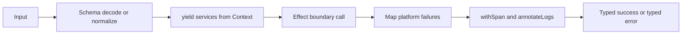

Boundary selection MUST be deliberate:

1. Use pure functions for byte parsing, tree ordering, and path derivation that cannot fail through
   side effects.
2. Use `Effect.succeed` for already-computed values.
3. Use `Effect.sync` for non-throwing synchronous allocation or side effects.
4. Use `Effect.try` for synchronous code that can throw, such as compression and decoding.
5. Use `Effect.tryPromise` only when a required platform API returns a Promise and no Effect service
   exists for the operation.
6. Use `FileSystem`, `Path`, `Crypto`, `Clock`, and `Config` services before any direct platform API.

### 6.5 Service Construction Procedure

Each `ServiceName.ts` file MUST use this construction procedure:

1. Define package-local schemas and input/output types owned by that service.
2. Define `export type ServiceNameShape = { ... }`.
3. Define `export class ServiceName extends Context.Service<ServiceName, ServiceNameShape>()("@cycle/git-store/ServiceName") {}`.
4. Define service methods with `Effect.fn("ServiceName.method")`, using span options or additional
   transforms for logging, error recovery, or argument-derived annotations.
5. Define `export const ServiceNameLive = Layer.effect(ServiceName, Effect.gen(function* () { ... }))`.
6. Read dependencies with `yield* DependencyService`.
7. Allocate caches, refs, or semaphores inside the layer effect.
8. Return `ServiceName.of({ ...methods })`.
9. Use `Layer.provide` or `Layer.provideMerge` in package live composition, not ad hoc
   `Effect.provide` inside individual methods.

Service layers MUST NOT create long-lived resources outside `Layer` construction. Any long-lived
background resource MUST be created in a layer scope and registered with finalizers.

### 6.6 Effect Design Diagrams

Core service construction:

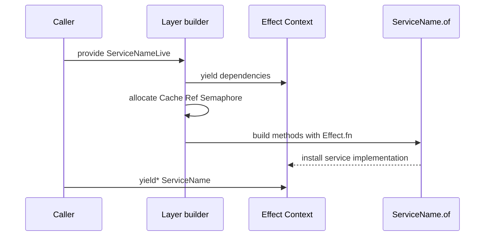

Runtime method flow:

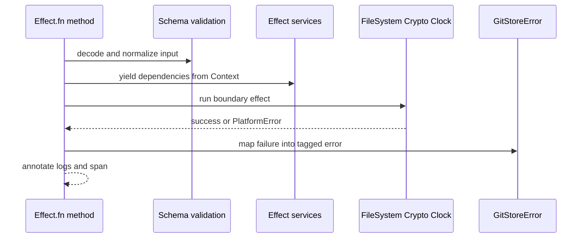

### 6.7 Vendor Source Basis

This specification is based on the local Effect v4 source in `vendor/effect-v4`:

- `packages/effect/src/FileSystem.ts` for scoped file handles, `open`, `writeAll`, `sync`, `rename`,
  and `stream`.
- `packages/effect/src/Path.ts` for portable path resolution and normalization.
- `packages/effect/src/Crypto.ts` for `randomBytes` and `digest("SHA-1")`.
- `packages/effect/src/Encoding.ts` for hex encoding and decoding.
- `packages/effect/src/Context.ts` and `packages/effect/src/Layer.ts` for class services and layer
  composition.
- `packages/effect/src/LayerMap.ts` for keyed, scoped `GitStore` instance management.
- `packages/effect/src/Effect.ts` for `Effect.gen`, `Effect.fn`, boundary constructors, scoped
  resources, interruption control, tracing, and log annotations.
- `packages/effect/src/Scope.ts` for finalizer registration.
- `packages/effect/src/Semaphore.ts`, `Ref.ts`, and `TxRef.ts` for concurrency and mutable state.
- `packages/effect/src/Cache.ts` for bounded effectful caches.
- `packages/effect/src/Stream.ts` for chunked packfile parsing.
- `packages/effect/src/Config.ts` and `ConfigProvider.ts` for schema-backed configuration and test
  providers.
- `packages/effect/src/Schema.ts` for schema DTOs and yieldable tagged errors.
- `packages/platform-node/src/NodeServices.ts` for production Node service provision.

### 6.8 Source Layout

The package SHOULD use this source shape:

```text
src/
  CommitWriter.ts
  Document.ts
  EventStore.ts
  GitStore.ts
  GitStoreInstances.ts
  GitStoreErrors.ts
  GitStoreSchemas.ts
  GitStores.ts
  LooseObjectStore.ts
  LooseRefStore.ts
  ObjectCodec.ts
  ObjectStore.ts
  PackIndexStore.ts
  PackObjectStore.ts
  PackedRefsStore.ts
  RefReader.ts
  RefStore.ts
  RefTransaction.ts
  ReflogStore.ts
  RepositoryIdentity.ts
  RepositoryPaths.ts
  index.ts
  internal/
    GitFiles.ts
    bytes.ts
    compression.ts
    config.ts
    event-path.ts
    git-object.ts
    refs.ts
    tree.ts
  testing/
    index.ts
```

Every root service file MUST export exactly one primary `Context.Service` class and a matching live
layer named `<ServiceName>Live`. It MAY export service-local input/output types and helper schemas
owned by that service. Non-service root files such as `Document.ts`, `GitStoreSchemas.ts`,
`GitStoreErrors.ts`, and `index.ts` MUST NOT define `Context.Service` classes.

Testing layers, in-memory fakes, deterministic clocks, and test-only identity defaults MUST live
under `src/testing/`.

## 7. Public Package Contract

### 7.1 Package Identity

The package manifest MUST use:

```json
{
  "name": "@cycle/git-store",
  "private": true,
  "type": "module"
}
```

The root workspace already includes `packages/*`, so adding `packages/git-store/package.json` is
sufficient for workspace discovery. No root workspace manifest changes are required by this spec.

### 7.2 Public Exports

The implementation MUST define a minimal export map. The export map MUST satisfy these rules:

- public service modules MUST be importable from explicit package subpaths;
- `./schemas`, `./errors`, and `./testing` MUST be public subpaths;
- `src/internal/*` MUST NOT be exported;
- test-only layers MUST be exported only through `./testing`;
- no package subpath MAY re-export symbols from `@cycle/git-db` or `@cycle/git`.

The initial package implementation MUST use this export map unless a later specification changes the
public surface:

```json
{
  "exports": {
    ".": "./src/index.ts",
    "./commit-writer": "./src/CommitWriter.ts",
    "./document": "./src/Document.ts",
    "./errors": "./src/GitStoreErrors.ts",
    "./events": "./src/EventStore.ts",
    "./loose-object-store": "./src/LooseObjectStore.ts",
    "./loose-refs": "./src/LooseRefStore.ts",
    "./object-codec": "./src/ObjectCodec.ts",
    "./object-store": "./src/ObjectStore.ts",
    "./pack-index-store": "./src/PackIndexStore.ts",
    "./pack-object-store": "./src/PackObjectStore.ts",
    "./packed-refs": "./src/PackedRefsStore.ts",
    "./ref-reader": "./src/RefReader.ts",
    "./ref-transaction": "./src/RefTransaction.ts",
    "./refs": "./src/RefStore.ts",
    "./reflog": "./src/ReflogStore.ts",
    "./repository-identity": "./src/RepositoryIdentity.ts",
    "./repository-paths": "./src/RepositoryPaths.ts",
    "./schemas": "./src/GitStoreSchemas.ts",
    "./store": "./src/GitStore.ts",
    "./store-instances": "./src/GitStoreInstances.ts",
    "./stores": "./src/GitStores.ts",
    "./testing": "./src/testing/index.ts"
  }
}
```

### 7.3 High-Level Store API

The public API MUST distinguish the runtime registry from a single opened store:

- `GitStores` is the plural runtime-facing service for programs that may have several repositories,
  databases, or pointers active at once.
- `GitStore` is the per-open repository/database handle used after an instance has been selected.
- `GitStoreInstances` is the keyed `LayerMap.Service` behind `GitStores`. It provides `GitStore`
  layers keyed by a normalized `GitStoreKey`.

`GitStoreKey` MUST be a normalized, stable key derived from repository discovery. It MUST include
at least the absolute `commonGitDir`, namespace, and database. Two open requests that resolve to the
same key MUST share same-process caches and same-process ref semaphores. Two requests with different
keys MUST NOT share mutable transaction state.

`GitStores.ts` SHOULD expose a service shape equivalent to:

```ts
export type GitStoresShape = {
  readonly scoped: (
    options: GitStoreOpenOptions
  ) => Effect.Effect<GitStoreShape, GitStoreError, Scope.Scope>

  readonly withStore: <A, E, R>(
    options: GitStoreOpenOptions,
    use: (store: GitStoreShape) => Effect.Effect<A, E, R>
  ) => Effect.Effect<A, GitStoreError | E, R>

  readonly invalidate: (
    options: GitStoreOpenOptions
  ) => Effect.Effect<void, GitStoreError>
}
```

`GitStoreInstances.ts` MUST use `LayerMap.Service` or an equivalent Effect `LayerMap` service, not a
hand-written `Map`, to cache and release keyed `GitStore` contexts. The live layer SHOULD configure
an implementation-defined idle TTL so long-running runtimes can release stores that are no longer
in use.

`GitStore.ts` MUST define the primary per-store document and transaction API. It SHOULD expose a
service shape equivalent to:

```ts
export type GitStoreShape = {
  readonly key: GitStoreKey
  readonly config: GitStoreConfig

  readonly transaction: <A, E, R>(
    options: TransactionOptions,
    use: (tx: GitStoreTransaction) => Effect.Effect<A, E, R>
  ) => Effect.Effect<TransactionResult<A>, GitStoreError | E, R>

  readonly get: (
    path: string,
    options?: ReadOptions
  ) => Effect.Effect<Document | null, GitStoreError>
  readonly list: (
    path?: string,
    options?: ReadOptions
  ) => Effect.Effect<ReadonlyArray<TreeEntry>, GitStoreError>
  readonly snapshot: (id: string) => Effect.Effect<Snapshot, GitStoreError>
  readonly resolveSnapshotId: (from?: string) => Effect.Effect<ObjectId | null, GitStoreError>
  readonly history: (
    from?: string,
    options?: HistoryOptions
  ) => Effect.Effect<ReadonlyArray<Snapshot>, GitStoreError>
  readonly diff: (a: string, b: string) => Effect.Effect<ChangeSet, GitStoreError>
  readonly pointerRef: (pointer: string) => Effect.Effect<RefName, GitStoreError>
}
```

`TransactionOptions` MUST include the pointer selection and commit metadata needed to write a commit,
including at least `message`, optional `pointer`, optional `expectedSnapshot`, and optional explicit
author/committer identity overrides.

`TransactionResult<A>` SHOULD expose:

```ts
export type TransactionResult<A> = {
  readonly snapshot: Snapshot
  readonly value: A
}
```

`GitStoreTransaction` SHOULD expose only scoped transaction view operations:

```ts
export type GitStoreTransaction = {
  readonly base: Snapshot | null
  readonly delete: (path: string) => Effect.Effect<void, GitStoreError>
  readonly get: (path: string) => Effect.Effect<Document | null, GitStoreError>
  readonly list: (path?: string) => Effect.Effect<ReadonlyArray<TreeEntry>, GitStoreError>
  readonly put: (path: string, input: DocumentInput) => Effect.Effect<void, GitStoreError>
}
```

The implementation MUST NOT expose a public `begin` method that returns a long-lived transaction
handle. Transactions MUST be created and consumed through `GitStore.transaction(options, use)`.
When the callback succeeds, `GitStore.transaction` MUST attempt to commit the staged changes and
return `{ snapshot, value }`. When the callback fails or is interrupted, staged mutations MUST be
discarded. If a caller captures `GitStoreTransaction` and uses it after the callback exits, every
method MUST fail with a typed `TransactionInactiveError`.

### 7.4 Document Input Contract

`DocumentInput` MUST be explicit and schema-friendly. It MUST NOT be an unvalidated `unknown` value
whose encoding is guessed by runtime type inspection.

The package SHOULD support tagged inputs equivalent to:

```ts
type DocumentInput =
  | { readonly _tag: "Bytes"; readonly bytes: Uint8Array }
  | { readonly _tag: "Text"; readonly text: string; readonly encoding?: string }
  | { readonly _tag: "Json"; readonly value: unknown; readonly schema?: Schema.Top }
```

`Document.ts` SHOULD export small constructors equivalent to `Document.bytes`, `Document.text`, and
`Document.json` so callers do not hand-write input tags in normal application code.

JSON document writes MUST use canonical stable-key JSON encoding. If a schema is supplied, the value
MUST be encoded through the schema before stable JSON serialization.

## 8. Core Domain Model

### 8.1 Git Store Config

`GitStoreConfig` MUST contain:

- `cwd`: absolute repository working directory or repository root path;
- `gitDir`: absolute path to the resolved Git directory for the current worktree;
- `commonGitDir`: absolute path to the common Git directory that owns shared objects, refs,
  `packed-refs`, and common config. For normal repositories this equals `gitDir`;
- `namespace`: Git ref namespace, default `refs/gitdb`;
- `database`: safe database segment, default `cycle`;
- `defaultPointer`: safe pointer name, default `main`;
- `identity`: optional explicit default author/committer identity for commits.

The initial implementation is SHA-1-only. `GitStoreConfig` MUST NOT expose a configurable
`objectFormat`. Repository discovery MUST reject SHA-256 repositories rather than attempting partial
support.

Configuration MUST be read through `Config` or explicit layer options. Business logic MUST NOT read
raw `process.env`.

Configuration values define defaults for opening stores. They MUST NOT make `GitStore` a process-wide
singleton. A runtime MAY open many stores by passing different `GitStoreOpenOptions` values to
`GitStores.scoped` or `GitStores.withStore`; those options override or complete the configured
defaults before the normalized `GitStoreKey` is derived.

Config loading MUST follow this procedure:

1. Define a `GitStoreConfigSchema` in `GitStoreSchemas.ts`.
2. Define a `Config.schema(GitStoreConfigSchema, "gitStore")` or equivalent structured `Config.all`
   value.
3. Apply `Config.withDefault` only for missing keys with safe defaults. Validation errors MUST
   remain fatal.
4. Use `Config.nested` for scoped config groups when composing package-level config.
5. Install test config with `ConfigProvider.layer(ConfigProvider.fromUnknown(...))` or
   `ConfigProvider.layerAdd(...)`.
6. Convert parsed config into `GitStoreConfig` in a layer, not inside individual business methods.

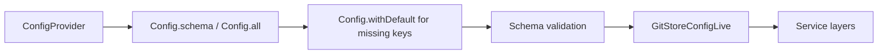

### 8.2 Identifiers

`GitStoreSchemas.ts` MUST define schema-first identifiers:

- `ObjectId`: branded lowercase hexadecimal SHA-1 object ID, exactly 40 hex characters.
- `RefName`: full Git ref path validated with the ref safety rules below.
- `PointerName`: relative pointer name under `namespace/database`, built only from `SafeSegment`
  values.
- `SafeSegment`: non-empty path/ref segment with no slash, NUL, `.`, `..`, leading `.`, trailing
  `.`, `.lock` suffix, `@{`, or any ref-forbidden character listed below.
- `StorePath`: normalized slash-separated document path with no backslash, NUL, empty segment,
  `.`, `..`, or `.lock` segment.
- `MutationPath`: `StorePath` excluding the root path.

The implementation MUST normalize object IDs to lowercase before returning them from public APIs.

`RefName` validation MUST follow the safety-relevant Git `check-ref-format` constraints:

- MUST be a normalized slash-separated path containing at least one slash, with no leading slash,
  trailing slash, empty segment, or repeated slash.
- MUST NOT be the single character `@`.
- MUST NOT contain `..` or `@{`.
- MUST NOT contain ASCII control characters, DEL, or space.
- MUST NOT contain `~`, `^`, `:`, `?`, `*`, `[`, or backslash.
- MUST NOT end with `.`.
- Each path segment MUST be a `SafeSegment`.

Ref validation MUST run before deriving filesystem paths or lockfile paths. Invalid refs MUST fail
with a typed invalid-ref error and MUST NOT touch the filesystem.

### 8.3 Git Object Types

The object model MUST support:

- `blob`;
- `tree`;
- `commit`;
- `tag` for reading when encountered, even if Cycle does not write tags.

Cycle writes MUST only create `blob`, `tree`, and `commit` objects.

Canonical object bytes are:

```text
<type> <size>\0<body>
```

The object ID is the SHA-1 digest of the canonical bytes. SHA-256 object IDs and repositories are
outside the initial implementation.

### 8.4 Tree Entries

Tree entries MUST use standard Git binary tree encoding:

```text
<mode> <name>\0<raw object id bytes>
```

Raw object ID bytes in tree entries MUST be exactly 20 bytes.

The package MUST write tree entries in Git tree order, not locale order. Directory entries MUST be
ordered as Git orders `name/` for trees. File mode normalization MUST preserve at least:

- `100644` for normal blobs written by Cycle;
- `040000` for trees when exposed through public DTOs;
- `40000` when encoded inside raw Git tree objects.

### 8.5 Commit Objects

Commit payloads MUST include:

- exactly one `tree` header;
- zero or more `parent` headers;
- `author` header;
- `committer` header;
- a blank line;
- commit message bytes.

`CommitWriter` MUST obtain timestamps from `Clock`. Author and committer identity MUST be supplied
explicitly through commit options or through a documented Git config parser/config service. It MUST
NOT rely on ambient process environment variables.

If no identity can be resolved, commit creation MUST fail with a typed identity error unless the
caller selected a documented testing layer that supplies deterministic identity values.

## 9. Repository and Filesystem Contract

### 9.1 Repository Discovery

`RepositoryPaths` MUST:

1. Resolve `cwd` and `gitDir` to absolute paths through `Path`.
2. Support a normal `.git` directory.
3. Support a `.git` file whose first line is `gitdir: <path>`, including relative gitdir paths used
   by Git worktrees.
4. Support linked worktree `commondir` files inside the resolved `gitDir`.
5. Resolve relative `commondir` values against the resolved `gitDir`.
6. Expose both `gitDir` and `commonGitDir`.
7. Use `commonGitDir` for object storage, loose refs, packed refs, repository config, and Cycle
   refs.
8. Use `gitDir` only for per-worktree Git files that `git-store` does not currently mutate, such as
   `HEAD` or the index.
9. Verify required directories when validation is enabled.
10. Read `extensions.objectFormat` from common Git config when present.
11. Accept missing `extensions.objectFormat` and explicit `sha1`.
12. Reject `sha256` and any other object format with a typed unsupported-object-format error.
13. Fail with typed errors for missing repositories, unsupported object formats, invalid gitdir
   files, invalid commondir files, and unsafe paths.

Repository discovery MUST NOT initialize Git repositories or modify working-tree files.

### 9.2 Raw File Operations

Internal `GitFiles` helpers MUST centralize filesystem protocol operations that are easy to get
wrong:

- create parent directories recursively;
- open lock or temporary files with exclusive create semantics (`wx`);
- write bytes or strings;
- sync file handles before rename when supported by the platform service;
- rename into place;
- remove abandoned lock/temp files with `Scope` finalizers;
- optionally sync containing directories after durable object/ref writes when the platform exposes
  directory sync safely.

Manual file write sequences MUST NOT be duplicated across object and ref services.

`GitFiles` MUST use the Effect `FileSystem.FileSystem` service as the only filesystem boundary.
Where durable writes require syncing, it MUST use `FileSystem.open` to obtain a scoped
`FileSystem.File`, then use `file.writeAll`, `file.sync`, and `fs.rename`. Direct `fs.writeFile` or
`fs.writeFileString` MAY be used only when the protocol does not require handle-level `sync`.

Scoped file procedure:

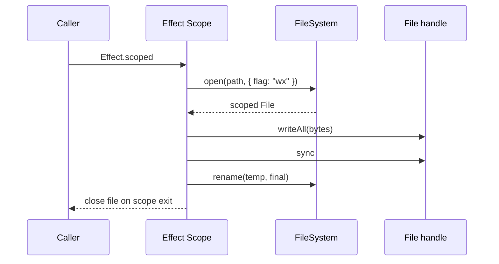

Filesystem errors from `FileSystem` MUST be mapped into tagged `GitStoreError` values at service
boundaries. Lower-level helpers MAY preserve the original `PlatformError` as a `reason` or `cause`
field, but public methods MUST NOT expose raw platform errors directly.

### 9.3 Object Storage

Loose objects MUST live under:

```text
<commonGitDir>/objects/<first-two-hex>/<remaining-hex>
```

`LooseObjectStore` MUST:

1. build canonical object bytes;
2. hash canonical bytes through `ObjectCodec`;
3. compress canonical bytes using the package compression adapter;
4. write compressed bytes to a unique temporary path with exclusive creation;
5. sync the temporary file;
6. rename it to the final loose object path;
7. treat an already existing final object as success when the canonical hash matches.

Compression and decompression MAY be implemented with Node zlib inside `src/internal/compression.ts`
or a small `Compression` service if implementation needs a pluggable adapter. All filesystem IO MUST
still go through Effect `FileSystem`.

Loose object writes MUST follow this Effect flow:

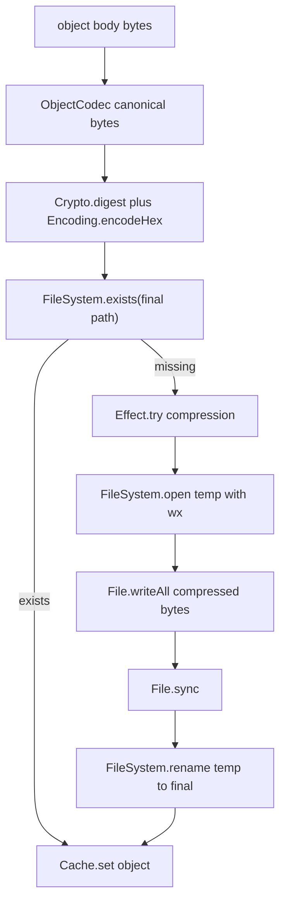

If compression throws, the implementation MUST map the failure with `Effect.try` into a typed object
encoding error. If digesting fails, the implementation MUST map the `Crypto` platform failure into a
typed object ID error.

### 9.4 Packed Objects

`PackIndexStore` and `PackObjectStore` MUST read packed objects created by normal Git tooling.
They MUST support:

- pack index version 2 fanout tables;
- SHA-1 pack indexes with 20-byte object names and SHA-1 pack checksums;
- 32-bit and large 64-bit offsets;
- pack object type decoding for commit, tree, blob, and tag;
- `OBJ_REF_DELTA` and `OBJ_OFS_DELTA` reconstruction;
- object hash verification when enough bytes are available to do so cheaply.

The package MAY initially support only pack index version 2. Unsupported pack versions MUST fail
with a typed unsupported-pack error rather than returning corrupt data.

SHA-256 pack indexes and packfiles are unsupported in the initial implementation and MUST fail with
a typed unsupported-object-format or unsupported-pack error.

The package MUST NOT write packfiles.

Pack object reads SHOULD use `FileSystem.stream` for `.pack` data and bounded `Cache` values for
parsed `.idx` files. Parsing SHOULD use `Stream.mapAccum`, `Stream.mapAccumEffect`, or
`Stream.runFoldEffect` for incremental state machines. Whole-file `readFile` MAY be used for pack
indexes and small fixed-size structures; large pack payloads SHOULD be streamed.

```mermaid
flowchart LR
  Id["ObjectId"]
  IndexCache["Cache<idx path, parsed index>"]
  Locate["PackIndexStore offset lookup"]
  StreamFile["FileSystem.stream(pack, offset)"]
  ParseHeader["Stream state parses object header"]
  Inflate["Compression adapter inflates payload"]
  Delta["Apply ofs/ref delta if needed"]
  Verify["ObjectCodec verifies canonical digest"]
  Object["GitObject"]

  Id --> IndexCache --> Locate --> StreamFile --> ParseHeader --> Inflate --> Delta --> Verify --> Object
```

Packed object streams MUST be finite and bounded by object size once decoded. A corrupt size,
unsupported object type, invalid delta base, or digest mismatch MUST fail the stream with a typed
pack error.

### 9.5 Refs

GitDB-compatible pointer refs MUST use:

```text
<namespace>/<database>/<pointer>
```

For Cycle defaults this is:

```text
refs/gitdb/cycle/main
```

`LooseRefStore` MUST read direct object ID refs under `<commonGitDir>/<ref>`. It SHOULD follow
symbolic refs when encountered and MUST detect symbolic-ref cycles.

`PackedRefsStore` MUST parse `<commonGitDir>/packed-refs`, ignore comments and peeled tag lines
beginning with `^`, and expose packed refs as read-only fallback state.

`RefReader` MUST resolve refs by checking loose refs first and packed refs second. It owns read,
exists, list, and symbolic-ref resolution behavior.

`RefStore` is the public ref facade composed above `RefReader` and `RefTransaction`. It MUST NOT be a
dependency of `RefTransaction`; otherwise the read/write ref layers form a service cycle.

## 10. Ref Transaction Contract

`RefTransaction` owns Git-compatible compare-and-swap updates for loose refs.

A single-ref update MUST follow this protocol:

1. Validate the target ref name and target object ID.
2. Resolve the current effective ref value through `RefReader`.
3. If the caller supplied `expected`, compare it with the current value. Missing refs are `null`.
4. Create `<ref>.lock` with exclusive creation. Lock contention MUST fail with a typed
   `RefLockUnavailableError` unless the caller selected an explicit retry policy.
5. Register a `Scope` finalizer that removes the lockfile if the update is abandoned.
6. Re-read the current effective ref after acquiring the lock and re-check `expected`.
7. Write the new object ID plus trailing newline to the lockfile.
8. Sync the lockfile.
9. Enter an `Effect.uninterruptibleMask` commit section.
10. Rename `<ref>.lock` over `<ref>`.
11. Mark the lock cleanup finalizer as disarmed so the committed ref is not removed.
12. Optionally append reflog data after the ref is updated.

Deletion MUST use the same lock and expected-value protocol when the caller supplies `expected`.
Deleting a loose ref MUST NOT delete packed refs; if a packed ref remains, later reads MAY still
resolve it.

Same-process serialization MAY use a keyed `Semaphore` per ref. Lockfiles remain the correctness
boundary and MUST be used even when a semaphore is present.

Multi-ref transactions are not atomic in core `git-store`. If a higher layer requires hard atomic
multi-ref updates, it MUST provide a journal/recovery layer or a single-file backend strategy.

Effect-backed ref update flow:

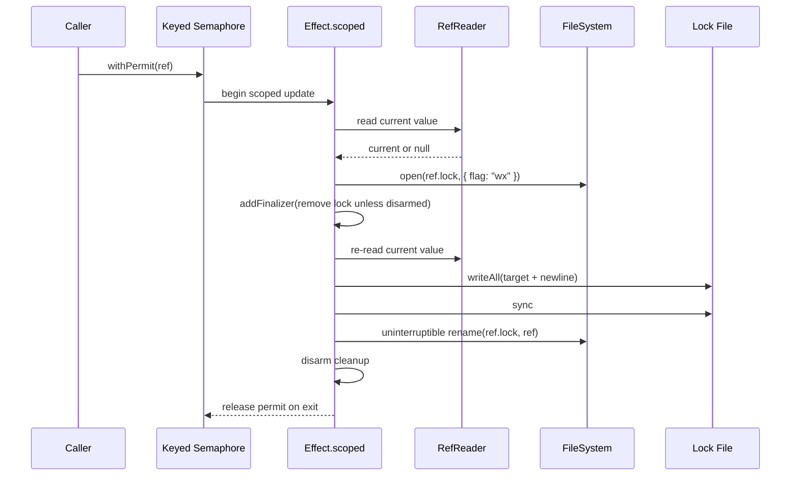

The implementation SHOULD represent the cleanup state with a local `Ref<boolean>` or equivalent
Effect-managed mutable state. The finalizer MUST remove only the lockfile path. It MUST NOT remove
the destination ref path.

## 11. Runtime Workflows

### 11.1 Store Instance Selection

`GitStores.withStore(options, use)` MUST:

1. Decode and validate `GitStoreOpenOptions`.
2. Resolve repository paths through `RepositoryPaths`.
3. Derive a normalized `GitStoreKey`.
4. Acquire the keyed `GitStore` context through `GitStoreInstances`.
5. Run the callback with the selected per-store handle.
6. Release the callback scope when the callback completes, fails, or is interrupted.

`GitStores.scoped(options)` MUST expose the same acquisition path as a scoped effect for advanced
callers that need to hold more than one store handle in a single scope.

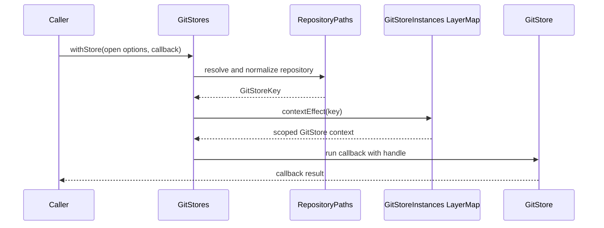

### 11.2 Transaction Callback

`GitStore.transaction(options, use)` MUST:

1. Validate the requested pointer name, defaulting to `defaultPointer`.
2. Resolve the pointer ref.
3. If the ref exists, read the commit snapshot and use its root tree as the base.
4. If the ref is missing, use `base = null`.
5. Create transaction state in Effect-managed mutable state such as `TxRef`, `Ref`, or another
   Effect primitive.
6. Construct a `GitStoreTransaction` view and pass it to the callback.
7. Keep staged mutations in memory until the callback succeeds.
8. Discard staged mutations if the callback fails or is interrupted.
9. Commit staged mutations only after the callback succeeds.

The transaction MUST NOT write blobs, trees, commits, or refs during `put` and `delete` calls. Those
writes occur only in the post-callback commit phase.

Transaction state SHOULD be stored in `TxRef<TxState>` when transaction methods can be called
concurrently or nested in other Effect transactions. If a simpler `Ref<TxState>` is used, the
implementation MUST still make active-state checks and mutation recording atomic with respect to
concurrent callers.

Transaction path conflict rules MUST preserve Git tree invariants:

- A path may be a document path or a tree prefix, but never both in the same transaction result.
- Repeated `put` calls to the exact same document path MAY replace the staged document value.
- `delete(path)` after `put(path, input)` MAY cancel the exact staged put.
- A staged `delete(path)` acts as a tombstone for the base path and its descendants. Later valid
  puts at or below that path rebuild from an empty subtree at that path.
- `put(path, input)` MUST fail with `PathConflictError` if any ancestor of `path` is a document in
  the base snapshot and that ancestor has not already been explicitly deleted in this transaction.
- `put(path, input)` MUST fail with `PathConflictError` if any ancestor of `path` has a staged put.
- `put(path, input)` MUST fail with `PathConflictError` if `path` is a tree in the base snapshot and
  `path` has not already been explicitly deleted in this transaction.
- `put(path, input)` MUST fail with `PathConflictError` if any descendant of `path` has a staged put
  or exists as a base document and `path` has not already been explicitly deleted in this
  transaction.
- `delete(path)` MUST fail with `PathConflictError` if any ancestor of `path` is a staged put.
- `delete(path)` MUST fail with `PathConflictError` if any ancestor of `path` is a document in the
  base snapshot and that ancestor has not already been explicitly deleted in this transaction.
- `delete(path)` MUST fail with `PathConflictError` if any descendant of `path` has a staged put.
  Callers that want to replace or remove a tree path MUST stage `delete(path)` before staging
  descendant puts.

The following examples are normative:

| Mutation sequence | Result |
| --- | --- |
| `put("a", blob)` then `put("a/b", blob)` | fail with `PathConflictError` |
| `put("a/b", blob)` when the base snapshot has `a` as a blob | fail with `PathConflictError` |
| `delete("a")` then `put("a/b", blob)` | allowed |
| `put("a/b", blob)` then `delete("a")` | fail with `PathConflictError` |

Failed `put` or `delete` operations MUST leave staged transaction state unchanged.

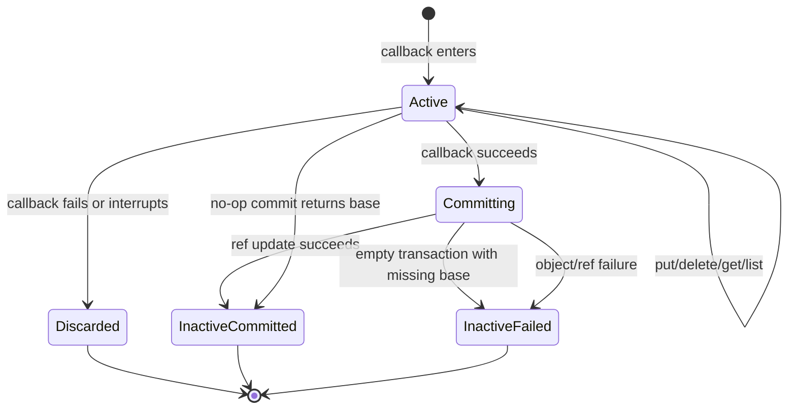

### 11.3 Transaction Reads

Transaction `get` and `list` MUST reflect staged mutations over the base snapshot:

- a staged put hides the base value at the same path;
- a staged delete hides the base value at the same path;
- nested puts and deletes MUST be reflected in list output;
- listing a path that is missing or not a tree MUST return an empty list.

The implementation SHOULD use Effect collection utilities where they keep the code smaller and more
declarative.

### 11.4 Commit Transaction

After the transaction callback succeeds, `GitStore.transaction` MUST:

1. Verify the transaction state is active.
2. Determine `expectedSnapshot` from options when supplied, otherwise from the transaction base.
3. If there are no mutations and the base is not null, verify the pointer still matches
   `expectedSnapshot`, mark the transaction inactive, and return `{ snapshot: base, value }`.
4. If there are no mutations and the base is null, mark the transaction inactive and fail with
   `EmptyTransactionError`.
5. Validate that staged mutations satisfy the path conflict rules in section 11.2.
6. Materialize a new root tree by applying staged mutations over the base tree.
7. Write new blob objects and tree objects before writing the commit.
8. Write the commit object with parents equal to:
   - `[]` when base is null;
   - `[base.id]` for a normal linear commit;
   - an explicit parent list only when the caller selected an advanced commit option.
9. Update the target pointer ref through `RefTransaction` with `expectedSnapshot`.
10. Mark the transaction inactive after a successful ref update.
11. Return `{ snapshot: committedSnapshot, value }`.

If object writing succeeds but ref update fails, the scoped transaction state MUST be marked
inactive before the failed effect exits. The orphaned objects are acceptable because Git object
storage is content-addressed. Callers retry by re-running the whole transaction callback.

Commit flow:

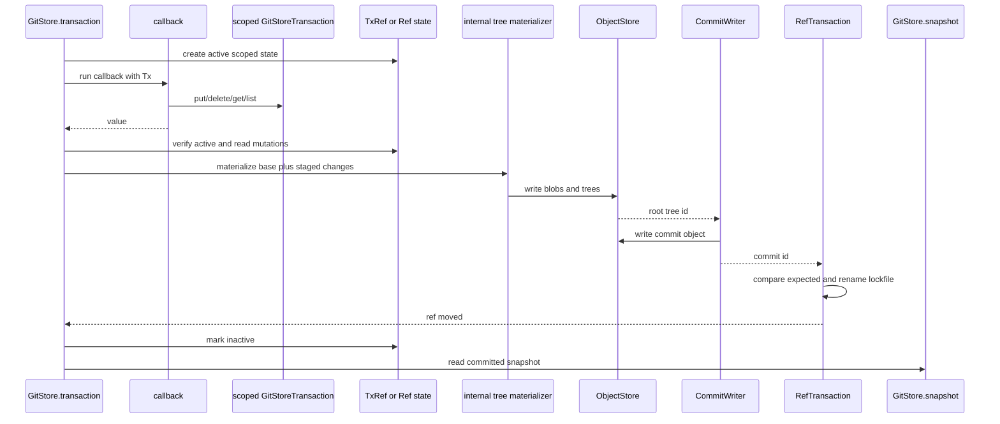

Every public transaction method MUST be an `Effect.fn("GitStoreTransaction.method")` or be created
from an `Effect.fn` implementation. Methods MUST use `Effect.withSpan` and `Effect.annotateLogs` at
the transaction boundary or inherit those annotations from the enclosing `GitStore` method.

### 11.5 Event Append

`EventStore` MUST preserve current GitDB event semantics.

Event files live under:

```text
collections/events/<aggregate-type>/<aggregate-id>/<event-id>.json
collections/events/ticket/<ticket-shard>/<ticket-id>/<event-id>.json
```

Ticket aggregate IDs MUST be sharded by the generated ID segment after the final hyphen when
present, otherwise by the aggregate ID itself. The shard is the first two characters. For example:

```text
UKN-A7ABC -> collections/events/ticket/A7/UKN-A7ABC/<event-id>.json
UKN-00001 -> collections/events/ticket/00/UKN-00001/<event-id>.json
```

For read compatibility, `EventStore.list` MUST also recognize legacy unsharded ticket paths:

```text
collections/events/ticket/<ticket-id>/<event-id>.json
```

`EventStore.append` MUST:

1. validate aggregate type, aggregate ID, and event ID as safe event segments;
2. derive the canonical event path;
3. check the transaction view for an existing document at that path;
4. fail with a typed append conflict if the event already exists;
5. canonicalize the payload as stable JSON, using a supplied schema when present;
6. stage the JSON bytes through the transaction.

Event payloads SHOULD omit generated timestamp, actor, aggregate ID, and event ID fields unless a
domain payload explicitly needs them. Event identity and aggregate targeting are source truth in the
path.

### 11.6 Event Listing and Introduced Events

`EventStore.list` MUST walk event paths from a snapshot or pointer, parse aggregate metadata from
paths, decode JSON payloads, and return events sorted by lexical path.

`EventStore.introduced` MUST compare a snapshot with its parents and return event paths added,
modified, or deleted by that snapshot. Higher layers use this to project new events and detect
append-only violations.

### 11.7 History and Diff

`GitStore.history` MUST traverse commits reachable from a pointer or object ID. It MUST support
bounded `max`, optional path filtering, and optional timestamp range filtering.

`GitStore.diff` MUST compare two commit trees and return added, deleted, and modified document
paths. A path is modified when the object ID at the same path changed.

The implementation MAY choose breadth-first, date-ordered, or topological traversal, but it MUST be
deterministic and documented.

## 12. Repository Identity

`RepositoryIdentity` MUST implement local identity behavior compatible with
`specs/GITDB_REPOSITORY_ID_SPEC.md`.

`RepositoryIdentity` MUST expose two distinct operations:

- `resolveIdentity(): Effect.Effect<RepositoryIdentityInfo | null, GitStoreError>` is read-only.
- `ensureIdentity(): Effect.Effect<RepositoryIdentityInfo, GitStoreError>` may initialize the
  identity ref when it is missing.

### 12.1 Identity Ref

The standard Cycle identity ref is:

```text
refs/gitdb/cycle/main
```

The implementation MUST derive repository identity from this ref only. It MUST NOT inspect user
branches, tags, `HEAD`, Git notes, working-tree files, or local path names for repository identity.

### 12.2 Root Commit

The root commit is the single parentless commit reachable from the identity ref.

If exactly one parentless commit is reachable, that commit is the root.

If the identity ref is missing, `resolveIdentity` MUST return `null` and MUST NOT write objects,
refs, reflogs, config, or working-tree files.

If the identity ref is missing, `ensureIdentity` MUST create the bootstrap root described below and
return the resulting identity.

If more than one parentless commit is reachable, identity resolution MUST fail with a typed
`RepositoryIdentityConflictError`.

### 12.3 Repository ID

The repository ID is:

```text
repo_<first five lowercase hex characters of root commit object ID>
```

It MUST match:

```text
^repo_[0-9a-f]{5}$
```

### 12.4 Bootstrap Root Commit

When `ensureIdentity` creates the identity ref for the first time, `RepositoryIdentity` MUST create a
root commit with:

- no parents;
- an empty tree;
- no event files;
- no working-tree changes;
- no repository-owned metadata files;
- a message containing at least 128 bits of cryptographically secure random seed material.

The message MUST use:

```text
Initialize Cycle GitDB

Seed: <32 lowercase hex chars or stronger>
```

The ref update MUST use `expected = null`.

If `ensureIdentity` loses the `expected = null` ref update race to another local process, it MAY
re-run `resolveIdentity` and return the identity created by the winner when that identity is valid.

### 12.5 Remote Behavior Boundary

Remote fetch-before-create and push-with-lease workflows from
`specs/GITDB_REPOSITORY_ID_SPEC.md` are system-level requirements for Cycle, but they are outside
core `@cycle/git-store`. This package MUST expose local ref reads, expected ref updates, commit
creation, identity resolution, and explicit identity ensure behavior needed by a separate
remote-sync package to implement those workflows.

Core `git-store` MUST NOT perform network access or shell out to `git fetch` / `git push`.

## 13. Integration Contracts

### 13.1 ObjectCodec

`ObjectCodec` MUST provide operations equivalent to:

- `canonicalBytes(type, body)`;
- `hash(type, body)`;
- `encodeLooseObject(type, body)`;
- `decodeObjectBytes(bytes)`.

Hashing is the only non-pure codec behavior and MUST use `Crypto.digest` plus `Encoding.encodeHex`.

`ObjectCodec.hash` MUST:

1. Build canonical object bytes with a pure byte utility.
2. Use `"SHA-1"` as the digest algorithm.
3. Call `const crypto = yield* Crypto.Crypto`.
4. Call `yield* crypto.digest("SHA-1", canonicalBytes)`.
5. Return `Encoding.encodeHex(digest).toLowerCase()`.
6. Map `Crypto` platform failures into a typed package error.

`ObjectCodec.hash` MUST always return a 40-character lowercase SHA-1 hex string. It MUST NOT accept
an object-format parameter in the initial implementation.

`ObjectCodec` MUST NOT use Node `crypto` directly. Tests MAY provide a deterministic `Crypto` layer
with `Crypto.make`.

### 13.2 ObjectStore

`ObjectStore` MUST provide operations equivalent to:

- `readObject(id, expectedType?)`;
- `writeObject(type, body)`;
- `readBlob(id)`;
- `writeBlob(bytes)`;
- `readTree(id)`;
- `writeTree(entries)`;
- `readCommit(id)`;
- `writeCommit(input)`;
- `isCommit(id)`;
- `rootCommits(start)`;
- `isAncestor(ancestor, descendant)`;
- `mergeBase(left, right)`.

Graph operations MAY be implemented with straightforward commit traversal and `Cache`. They MUST
avoid unbounded recursion on cyclic or corrupt graphs.

### 13.3 RefReader

`RefReader` MUST provide read-only operations equivalent to:

- `read(ref)`;
- `exists(ref)`;
- `list(prefix)`;
- `resolve(ref)`;
- `symbolicTarget(ref)`.

`RefReader` MUST depend on `LooseRefStore` and `PackedRefsStore`. It MUST NOT depend on
`RefTransaction` or `RefStore`.

### 13.4 RefTransaction

`RefTransaction` MUST provide mutation operations equivalent to:

- `update(ref, target, options?)`;
- `delete(ref, options?)`.

`RefTransaction` MUST depend on `RefReader` for expected-value validation and re-read checks. It
MUST NOT depend on `RefStore`.

### 13.5 RefStore

`RefStore` is the public facade over `RefReader` and `RefTransaction`. It MUST provide operations
equivalent to:

- `read(ref)`;
- `exists(ref)`;
- `list(prefix)`;
- `resolve(ref)`;
- `update(ref, target, options?)`;
- `delete(ref, options?)`.

Its read operations MUST delegate to `RefReader`. Its mutation operations MUST delegate to
`RefTransaction`. No lower-level service may depend on `RefStore`.

### 13.6 CommitWriter

`CommitWriter` MUST separate object creation from ref movement. It SHOULD expose:

- `writeCommitObject(input)` to write a commit object without moving any ref;
- `commitToRef(input)` to write objects and move one ref with expected-value validation.

Callers that need to write objects first and move refs later MUST be able to do so.

### 13.7 RepositoryIdentity

`RepositoryIdentity` MUST provide operations equivalent to:

- `resolveIdentity()`;
- `ensureIdentity()`.

`resolveIdentity` MUST be read-only and return `null` when the identity ref is missing.

`ensureIdentity` MUST call the same root validation logic as `resolveIdentity`. It MAY create the
bootstrap root commit only when the identity ref is missing.

## 14. Error Contract

`GitStoreErrors.ts` MUST define recoverable errors with `Schema.TaggedErrorClass`. Tags MUST use:

```text
@cycle/git-store/<ErrorName>
```

The package MUST include typed errors for at least:

- missing or unsupported repository;
- invalid configuration, path, pointer, ref, object ID, or event identifier;
- invalid gitdir or commondir file;
- object not found;
- object type mismatch;
- object decode failure;
- pack index or pack object parse failure;
- unsupported pack format;
- ref not found;
- ref expected-value conflict;
- ref lock unavailable;
- path conflict;
- empty transaction;
- transaction inactive;
- invalid JSON document;
- event append conflict;
- missing commit identity;
- repository identity conflict;
- filesystem protocol failure.

`GitStoreErrors.ts` MUST export a `GitStoreError` union covering package recoverable errors.

When raising an error inside `Effect.gen` or `Effect.fn`, implementation code MUST use:

```ts
return yield* new SomeGitStoreError(...)
```

Targeted recovery SHOULD use `Effect.catchTag`, `Effect.catchTags`, `Effect.catchReason`, or
`Effect.catchReasons` where applicable.

## 15. Observability

Core operations SHOULD use `Effect.withSpan` and `Effect.annotateLogs` with stable fields:

- `service: "@cycle/git-store"`;
- `operation`;
- `gitDir`;
- `commonGitDir`;
- `namespace`;
- `database`;
- `pointer` when relevant;
- `ref` when relevant;
- `objectId` when relevant;
- `path` when relevant.

Logs and spans MUST NOT include document bytes, JSON payloads, author email addresses when avoidable,
remote URLs containing credentials, or compression buffers.

Ref conflicts, lock contention, identity conflicts, unsupported pack files, and object corruption
MUST be operator-visible through typed errors and annotated logs.

Observation procedure for every public service method:

1. Define the method with `Effect.fn("ServiceName.method", options?)(body, ...transforms)`.
2. Put static span metadata in the `Effect.fn` options when it is known at construction time.
3. Add `Effect.annotateLogs`, dynamic span attributes, or targeted recovery as additional transforms
   passed to `Effect.fn`, so boundary behavior stays attached to the named function.
4. Redact or omit document contents, raw object payloads, secrets, and credential-bearing URLs.
5. Preserve the typed error channel; logging MUST NOT convert typed errors into defects.

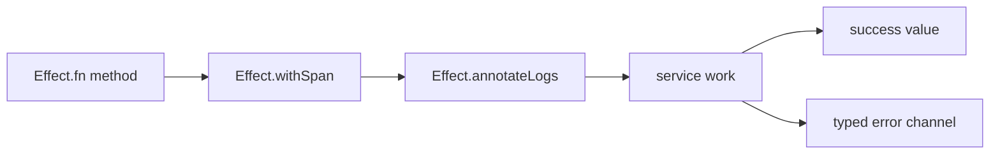

## 16. Failure Model and Recovery

### 16.1 Object Writes

Object writes are content-addressed. If a process crashes after writing an object but before moving a
ref, the object is orphaned and safe. Later Git garbage collection MAY remove it.

If two writers write the same object concurrently, both SHOULD converge on the same final path. An
existing final object with the expected hash MUST be treated as success.

### 16.2 Ref Writes

Refs are the correctness boundary. A failed expected-value check MUST leave the ref unchanged.

If a process crashes before the lockfile rename, the lockfile MAY remain. Later attempts MUST report
lock contention rather than ignoring the lock. Operators or cleanup code MAY remove stale locks only
under an explicit policy outside the default mutation path.

If a process crashes after the rename, the ref is committed. Reflog state is not authoritative and
MUST NOT be used to determine current storage state.

### 16.3 Transaction Failures

If the transaction callback fails or is interrupted before the commit phase, staged mutations MUST be
discarded and no Git objects or refs may be written by that transaction.

If commit object creation fails before ref movement, the transaction state MUST be marked inactive
before the failed effect exits. Callers MAY retry by running the entire transaction callback again.

If ref movement fails due to conflict, the transaction state MUST be marked inactive before the
failed effect exits. Callers MAY retry by running the entire transaction callback again, optionally
with a retry policy around `GitStore.transaction`.

If a caller captures a `GitStoreTransaction` and attempts to use it after the callback exits, the
method MUST fail with `TransactionInactiveError`.

### 16.4 Packed Object Failures

Malformed pack indexes, unsupported pack versions, missing pack files, bad deltas, and digest
mismatches MUST fail with typed errors. The implementation MUST NOT silently fall back to a wrong
object or fabricate an empty object.

## 17. Security and Operational Safety

The package MUST treat repository paths, document paths, ref names, pointer names, event IDs, and
aggregate IDs as partially trusted input.

The implementation MUST:

- reject path traversal and NUL bytes;
- reject `.lock` path/ref segments where they can interfere with Git lockfiles;
- reject ref names that violate the `RefName` Git safety rules before opening or renaming lockfiles;
- confine document paths to Git tree paths, never filesystem paths;
- confine pointer refs under `namespace/database`;
- avoid command execution in core storage;
- avoid network access in core storage;
- avoid reading secrets from raw environment variables;
- avoid logging document contents and credential-bearing URLs.

The package SHOULD be safe to run against repositories containing user-authored Git objects. Corrupt
objects MUST produce typed failures, not process crashes.

## 18. Reference Algorithms

### 18.1 Write Loose Object

```text
writeObject(type, body):
  canonical = bytes("<type> <body.length>\0") + body
  id = hex(digest(SHA-1, canonical))
  final = commonGitDir / "objects" / id[0..2] / id[2..]
  if final exists:
    return id
  compressed = deflate(canonical)
  scoped tmp = exclusive temp file in dirname(final)
  write tmp compressed
  sync tmp
  rename tmp final
  release tmp finalizer
  return id
```

### 18.2 Update Ref

```text
updateRef(ref, target, expected):
  validate ref and target
  before = RefReader.read(ref)
  if expected is supplied and before != expected:
    fail RefConflict
  scoped lock = open(ref + ".lock", wx)
  afterLock = RefReader.read(ref)
  if expected is supplied and afterLock != expected:
    fail RefConflict
  write lock target + "\n"
  sync lock
  uninterruptible:
    rename lock ref
    release lock cleanup
  append reflog if enabled
```

### 18.3 Commit Transaction

```text
transaction(options, use):
  scoped:
    pointerRef = resolve pointer from options.pointer ?? defaultPointer
    base = read snapshot at pointerRef or null
    state = active transaction state with base and empty mutations
    tx = scoped transaction view over state
    value = use(tx)
    expected = options.expectedSnapshot ?? base?.id ?? null
  if callback failed or interrupted:
    deactivate state
    discard mutations
    fail with callback error
  if no mutations and base exists:
    assert ref == expected
    deactivate state
    return { snapshot: base, value }
  if no mutations and base is null:
    deactivate state
    fail EmptyTransaction
  validatePathConflicts(base, state.mutations)
  rootTree = materialize(base?.root ?? emptyTree, state.mutations)
  treeId = ObjectStore.writeTree(rootTree)
  commitId = CommitWriter.writeCommitObject(treeId, parents, identity, message)
  RefTransaction.update(pointerRef, commitId, expected)
  snapshot = GitStore.snapshot(commitId)
  deactivate state
  return { snapshot, value }
```

### 18.4 Append Event

```text
appendEvent(tx, input):
  aggregateType = validateEventSegment(input.aggregateType)
  aggregateId = validateEventSegment(input.aggregateId)
  eventId = validateEventSegment(input.eventId)
  path = eventPath(aggregateType, aggregateId, eventId)
  if tx.get(path) != null:
    fail EventAppendConflict
  bytes = stableJsonBytes(encodeSchema(input.schema, input.payload))
  tx.put(path, Bytes(bytes))
  return path
```

### 18.5 Resolve Repository Identity

```text
resolveIdentity(pointer = "main"):
  ref = "refs/gitdb/cycle/" + pointer
  current = RefReader.read(ref)
  if current is null:
    return null
  roots = findParentlessCommits(current)
  if roots.length != 1:
    fail RepositoryIdentityConflict
  rootCommitId = roots[0]
  return {
    ref,
    rootCommitId: lowercase(rootCommitId),
    repositoryId: "repo_" + lowercase(rootCommitId)[0..5]
  }
```

### 18.6 Ensure Repository Identity

```text
ensureIdentity(pointer = "main"):
  identity = resolveIdentity(pointer)
  if identity is not null:
    return identity
  bootstrap = createBootstrapRoot(expected = null)
  return resolveIdentity(pointer) ?? identityFromBootstrap(bootstrap)
```

## 19. Test and Validation Matrix

### 19.1 Package Boundary

- `packages/git-store` builds without importing from `@cycle/git-db`.
- Core runtime source does not import from `node:child_process`.
- Public exports do not expose `src/internal/*`.
- Every root service file exports one primary service and its matching live layer.
- Testing layers are exported only from `@cycle/git-store/testing`.
- Each root service file defines its service with class-style `Context.Service`.
- Every live service layer uses `Layer.effect` or `Layer.succeed` and returns `ServiceName.of(...)`.
- Final live composition uses `Layer.provide` or `Layer.provideMerge`, not method-local dependency
  wiring.
- Ref services are acyclic: `RefReader` depends on loose and packed refs, `RefTransaction` depends
  on `RefReader`, and `RefStore` may only depend on `RefReader` plus `RefTransaction`.
- `GitStores` can open multiple normalized `GitStoreKey` instances in the same runtime without
  re-providing global configuration.
- Linked worktrees with `.git` files and `commondir` resolve to a `commonGitDir`, and stores opened
  from worktrees sharing that directory share the same `GitStoreKey`.

### 19.2 Effect Integration

- Public effect-returning functions and service methods are defined with `Effect.fn("name")`.
- Multi-step workflows use `Effect.gen`.
- Boundary code uses `Effect.succeed`, `Effect.sync`, `Effect.try`, or `Effect.tryPromise` according
  to the source of the value or side effect.
- `FileSystem.open` uses scoped `File` handles for writes that require `sync`.
- Ref lock cleanup is registered with `Effect.addFinalizer` or `Effect.acquireRelease`.
- Ref rename commit sections use `Effect.uninterruptibleMask`.
- Same-process ref serialization, when present, uses `Semaphore.withPermit`.
- Transaction state uses `TxRef` or `Ref` with atomic active-state checks.
- Keyed store instances use `LayerMap.Service` or an equivalent Effect `LayerMap` service rather
  than a hand-written mutable map.
- Object, tree, commit, pack index, and packed refs caches use bounded `Cache`.
- Commit and reflog timestamps come from `Clock`.
- Tests override platform dependencies with layers such as `ConfigProvider.layer`,
  deterministic `Crypto`, and test filesystem services.

### 19.3 Object Compatibility

- `ObjectCodec.hash("blob", utf8("hello"))` returns
  `b6fc4c620b67d95f953a5c1c1230aaab5db5a1b0` for SHA-1.
- `ObjectId` validation rejects 39-character, 41-character, 64-character, and non-hex values.
- Repository discovery accepts absent `extensions.objectFormat` and explicit `sha1`.
- Repository discovery rejects `extensions.objectFormat = sha256` with a typed unsupported object
  format error.
- Repository discovery reads objects, loose refs, packed refs, and common config from
  `commonGitDir`, not the per-worktree `gitDir`, when `commondir` is present.
- Loose object writes create standard Git object files under `objects/aa/bb...`.
- Tree parsing and writing use exactly 20 raw object ID bytes per entry.
- Objects written by `git-store` can be read by `git cat-file` in an integration test.
- Objects written by normal Git can be read by `git-store`.
- After `git gc`, `git-store` can read the same blob, tree, and commit from packfiles.
- SHA-256 pack indexes and packfiles are rejected rather than partially parsed.

### 19.4 Ref Correctness

- Ref update with `expected = null` creates a missing ref.
- Ref update with a matching expected value moves the ref.
- Ref update with a stale expected value fails and leaves the ref unchanged.
- Concurrent lock acquisition produces a typed lock error.
- Abandoned scoped lockfiles are removed on interruption before commit.
- A successful lockfile rename disarms lock cleanup and does not remove the committed ref.
- `RefName` validation rejects names containing `..`, `@{`, ASCII control characters, DEL, space,
  `~`, `^`, `:`, `?`, `*`, `[`, or backslash.
- `RefName` validation rejects one-level names, a single `@`, leading slash, trailing slash,
  repeated slash, trailing dot, leading-dot segments, empty segments, and `.lock` suffixes.
- Invalid refs fail before filesystem path derivation, lockfile creation, or ref mutation.

### 19.5 Transaction Behavior

- A transaction can put a JSON document, commit, and read it from the pointer.
- A transaction can put bytes and text without JSON re-encoding.
- A transaction can delete a document and commit the deletion.
- `get` and `list` inside a transaction reflect staged changes.
- Transactions are executed through `GitStore.transaction(options, callback)`, not through a public
  `begin` method.
- Transaction callback failure or interruption discards staged mutations.
- Commit conflict marks the scoped transaction inactive and callers retry by re-running the callback.
- A captured transaction handle fails with `TransactionInactiveError` after the callback exits.
- A transaction with no mutations and no base snapshot fails with `EmptyTransactionError`.
- `put("a", blob)` then `put("a/b", blob)` fails with `PathConflictError`.
- `put("a/b", blob)` over a base blob at `a` fails with `PathConflictError`.
- `delete("a")` then `put("a/b", blob)` is allowed.
- `put("a/b", blob)` then `delete("a")` fails with `PathConflictError`.

### 19.6 Event Compatibility

- `EventStore.append` writes canonical stable JSON.
- Duplicate event append in the same transaction view fails.
- Ticket event sharding matches current GitDB behavior.
- Legacy unsharded ticket event paths are read by `EventStore.list`.
- `EventStore.introduced` reports added event files from a commit diff.

### 19.7 Existing GitDB Compatibility

- A fixture repository created by `@cycle/git-db` can be opened by `@cycle/git-store`.
- `git-store` reads existing snapshots, event files, tree entries, and documents.
- `git-store` derives the same repository ID from the existing root commit.
- A new `git-store` commit on top of an existing GitDB pointer is readable by normal Git tooling.

### 19.8 Identity

- Missing `refs/gitdb/cycle/main` makes `resolveIdentity` return `null` without writing objects or
  refs.
- Missing `refs/gitdb/cycle/main` initializes an empty root commit only when `ensureIdentity` is
  requested.
- Bootstrap commit has no parents, an empty tree, and the required random seed message.
- Reopening derives `repo_<root5>` from the same root.
- Multiple reachable parentless roots fail with `RepositoryIdentityConflictError`.

## 20. Implementation Checklist

An implementation is conformant when:

1. `packages/git-store` has its own package manifest, TypeScript config, tests, and source files.
2. No existing package is modified for initial implementation except optional repository-level build
   metadata if a later task explicitly authorizes it.
3. Core services are implemented as `Context.Service` classes with matching live layers.
4. Effects use `Effect.fn` for exported effect-returning functions and `Effect.gen` for multi-step
   logic.
5. Boundary code uses `Effect.sync`, `Effect.try`, or `Effect.tryPromise` deliberately.
6. Errors are `Schema.TaggedErrorClass` values with `@cycle/git-store/...` tags.
7. File and ref writes use scoped cleanup and typed failure channels.
8. Pack reading, loose object writing, ref transactions, document transactions, event helpers, and
   repository identity all have deterministic tests.
9. Object handling is SHA-1-only: object IDs are 40 hex characters, tree object IDs are 20 raw
   bytes, and SHA-256 repositories are rejected.
10. `GitStores` supports several keyed `GitStore` instances in one runtime through Effect-managed
   scoped resources.
11. Document writes use scoped transaction callbacks, not a public `begin` method returning a
   transaction pointer.
12. The package can read data created by `@cycle/git-db` without migration.
13. Remote sync remains outside the package.

## 21. Implementation-Defined Areas

The following choices are implementation-defined, but the implementation MUST document the chosen
behavior in source comments or tests:

1. The deterministic traversal order used by `GitStore.history`.
2. Whether compression is an internal utility or a small service adapter.
3. Whether default commit identity is supplied only by explicit layer options or also by a Git
   config parser.
4. Whether stale ref lock cleanup is exposed as an optional maintenance operation. The default ref
   mutation path MUST NOT silently remove stale locks.

## 22. Developer Ergonomics Examples

The examples in this section are non-normative, but they show the expected API feel.

Single document commit:

```ts
const program = Effect.gen(function* () {
  const stores = yield* GitStores

  return yield* stores.withStore({ cwd: "/repo", database: "cycle" }, (store) =>
    store.transaction({ pointer: "main", message: "Add ticket TCK-123" }, (tx) =>
      tx.put("tickets/TCK-123.json", Document.json({
        id: "TCK-123",
        title: "Add git-store package",
        status: "open"
      }))
    )
  )
})
```

Multi-file commit with a callback return value:

```ts
const program = Effect.gen(function* () {
  const stores = yield* GitStores

  return yield* stores.withStore({ cwd: "/repo", database: "cycle" }, (store) =>
    store.transaction({ pointer: "main", message: "Add ticket assets" }, (tx) =>
      Effect.gen(function* () {
        yield* tx.put("tickets/TCK-124.json", Document.json({ id: "TCK-124" }))
        yield* tx.put("tickets/TCK-124/notes.md", Document.text("# Notes\n"))
        yield* tx.put("tickets/TCK-124/blob.bin", Document.bytes(new Uint8Array([1, 2, 3])))

        return yield* tx.list("tickets/TCK-124")
      })
    )
  )
})
```

Several stores open in one runtime:

```ts
const program = Effect.gen(function* () {
  const stores = yield* GitStores

  return yield* Effect.scoped(Effect.gen(function* () {
    const appStore = yield* stores.scoped({ cwd: "/repos/app", database: "cycle" })
    const docsStore = yield* stores.scoped({ cwd: "/repos/docs", database: "cycle" })

    const appHead = yield* appStore.resolveSnapshotId("main")
    const docsHead = yield* docsStore.resolveSnapshotId("main")

    return { appHead, docsHead }
  }))
})
```

Conflict-aware write:

```ts
const writeSettings = (expectedSnapshot: ObjectId | null) =>
  Effect.gen(function* () {
    const stores = yield* GitStores

    return yield* stores.withStore({ cwd: "/repo", database: "cycle" }, (store) =>
      store.transaction(
        { pointer: "main", expectedSnapshot, message: "Update project settings" },
        (tx) => tx.put("settings/project.json", Document.json({ gitStore: true }))
      )
    )
  }).pipe(
    Effect.catchTag("@cycle/git-store/RefExpectedValueConflictError", (error) =>
      Effect.succeed({ _tag: "Conflict", error })
    )
  )
```
