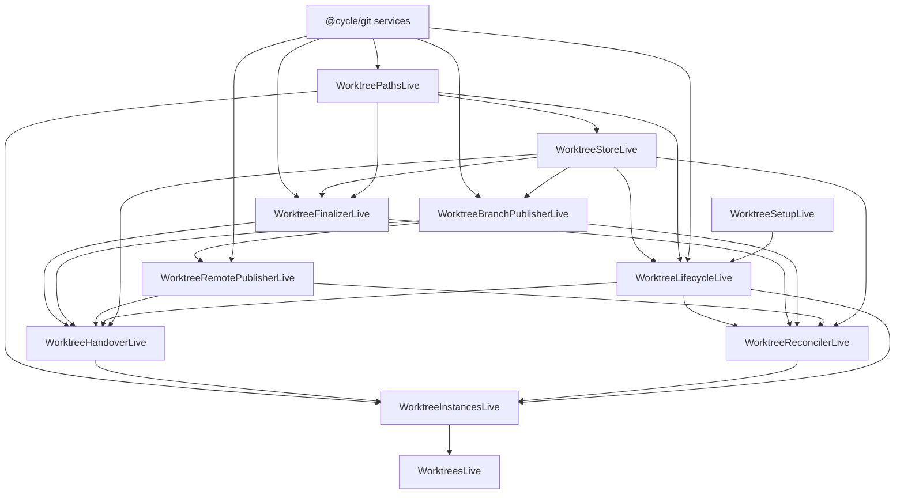

# Git Worktrees Package Specification

Status: Draft implementation specification

Version: 0.1.0

Package: `@cycle/git-worktrees`

Location: `packages/git-worktrees`

## 1. Purpose

`@cycle/git-worktrees` is an Effect-native package for managing Git worktrees used by Cycle agent
work. It owns the lifecycle of disposable and implementation worktrees from request, creation,
setup, agent handoff, finalization, branch publication, remote push, handover, reconciliation, and
cleanup.

The package replaces the former git-package worktree lifecycle service entirely. `@cycle/git`
remains the base Git access layer and repository command boundary. `@cycle/git-worktrees` is the
canonical owner of worktree lifecycle behavior, durable lifecycle records, branch associations,
backup handling, and handover orchestration.

The primary operational requirement is high-volume local isolation: Cycle MUST be able to run many
agent jobs in parallel, potentially tens or hundreds, where each agent works in a dedicated Git
worktree with a controlled setup process and a bounded cleanup policy. Worktrees consume large
amounts of filesystem space, so they MUST be short-lived by default and MUST be reconciled after
crashes or stale jobs.

## 2. Normative Language

The key words `MUST`, `MUST NOT`, `REQUIRED`, `SHOULD`, `SHOULD NOT`, and `MAY` in this document
are to be interpreted as described in RFC 2119 and RFC 8174 when, and only when, they appear in all
capitals.

`Implementation-defined` means an implementation may choose the mechanism, but it MUST document the
choice when callers, tests, or operators need to reason about behavior.

## 3. Context And Reference Inputs

This specification is informed by:

1. The former git-package worktree service, which provided a small service for detached worktree
   creation, branch publication, commit, and cleanup.
2. The `@cycle/git-store` package layout and Effect service style.
3. The Agent Work orchestration specifications that require implementation work to happen outside
   the primary user worktree.
4. The Codex app worktrees documentation at
   `https://developers.openai.com/codex/app/worktrees`, reviewed on 2026-07-08, which describes
   worktrees as the isolation primitive used by Codex app tasks. Cycle adopts the same isolation
   goal while adding durable lifecycle state, setup, handover, push, and reconciliation tailored to
   local Agent Work.

## 4. Problem Statement

Cycle currently has low-level worktree mechanics in `@cycle/git`, but it does not have a first-class
package that owns durable worktree lifecycle state, setup, handover, crash recovery, push, or
cleanup policy. As a result, higher-level agent orchestration would need to stitch together Git
commands, local task records, branch metadata, and ticket handover behavior itself.

That boundary is too weak for parallel agent execution. A worktree can be expensive to create,
expensive to keep, dangerous to delete without preserving uncommitted work, and easy to leak after
process crashes. The lifecycle must be observable and deterministic, and every transition must be
recoverable or explicitly operator-visible.

`@cycle/git-worktrees` solves this by becoming the package-level state machine and orchestration
owner for source worktrees. It delegates raw Git access to `@cycle/git`, delegates agent execution to
`@cycle/agents`, and delegates ticket/comment/status writes through injected handover ports, but it
owns the sequence and failure behavior around those integrations.

## 5. Goals

`@cycle/git-worktrees` MUST:

1. Replace the former git-package worktree service as the canonical worktree lifecycle API.
2. Provide Effect-first services, schemas, typed errors, layers, and testing utilities following the
   current `@cycle/git-store` package layout.
3. Depend on `@cycle/git` as the base access layer for Git repository discovery and Git command
   execution. It MUST NOT duplicate low-level Git access primitives unless they are internal
   validation helpers.
4. Create dedicated Git worktrees for implementation and disposable jobs without modifying the
   primary user worktree, the primary index, or `HEAD`.
5. Create worktrees detached by default and publish final work by updating normal Git branches.
6. Track durable lifecycle state for every managed worktree.
7. Include a setup stage after Git worktree creation and before a worktree becomes available to an
   agent.
8. Support repository-specific setup profiles for dependency installation, generated files,
   bootstrap checks, and other preparation needed before the agent starts.
9. Support disposable and implementation worktrees through the same state machine.
10. Finalize implementation work by inspecting changes, committing work, creating or updating a
    local branch, pushing that branch in phase 1, and producing handover output.
11. Own handover orchestration, including ordering, idempotency, retry records, and cleanup
    decisions.
12. Integrate ticket comments, ticket status transitions, pull request creation, and other product
    handover side effects through package-defined ports rather than direct imports from higher
    product packages.
13. Back up orphaned, stale, or unknown-state worktrees to backup branches before removing their
    directories whenever there is any uncommitted or unpublished work.
14. Remove managed worktrees as soon as they are no longer required, unless explicit retention is
    requested by policy or operator action.
15. Support remote push in phase 1.
16. Leave room for pull request creation in phase 2 through a provider-neutral handover port.
17. Expose reconciliation operations that can run at startup, on a timer, or by explicit operator
    action.
18. Emit structured lifecycle events and logs sufficient to audit why a worktree was created,
    retained, backed up, pushed, handed over, or deleted.
19. Provide deterministic tests for path safety, state transitions, setup, finalization, push,
    backup, cleanup, crash recovery, and parallel execution.

## 6. Non-Goals

`@cycle/git-worktrees` MUST NOT:

1. Execute agent turns directly. Agent providers, prompts, sessions, and streaming events remain
   owned by `@cycle/agents` or higher orchestration services.
2. Own Agent Work queue scheduling, ticket assignment policy, pause gates, provider selection, or
   model selection.
3. Import from `@cycle/api`, `@cycle/desktop`, or renderer packages.
4. Mutate Cycle ticket state directly through database internals. Ticket comments and status
   transitions MUST go through handover ports supplied by the caller.
5. Preserve compatibility aliases for the removed git-package worktree service as a long-term API.
6. Keep worktrees around for convenience after successful handover unless explicit retention policy
   says so.
7. Delete a dirty or unknown-state worktree without first creating a durable backup branch, unless
   an explicit destructive cleanup policy is supplied by an operator-level caller.
8. Guarantee remote pull request creation in phase 1.
9. Support non-Git source control systems.
10. Support SHA-256 Git object-format repositories unless `@cycle/git` supports them and this
    package adds explicit conformance tests.

## 7. Package Structure

### 7.1 Package Layout

The package SHOULD follow this shape:

```text
packages/git-worktrees/
  package.json
  tsconfig.json
  vitest.config.ts
  SPEC.md
  README.md
  src/
    WorktreePaths.ts
    WorktreeStore.ts
    WorktreeLifecycle.ts
    WorktreeSetup.ts
    WorktreeFinalizer.ts
    WorktreeBranchPublisher.ts
    WorktreeRemotePublisher.ts
    WorktreeHandover.ts
    WorktreeReconciler.ts
    WorktreeInstances.ts
    Worktrees.ts
    WorktreeSchemas.ts
    WorktreeErrors.ts
    index.ts
    internal/
      branch.ts
      ids.ts
      path-policy.ts
      process-output.ts
      state-machine.ts
    testing/
      index.ts
  test/
    effect-vitest.ts
    worktree-lifecycle.test.ts
    worktree-finalizer.test.ts
    worktree-reconciler.test.ts
```

Each root `src/ServiceName.ts` file MUST define one primary public service. Internal helpers MUST
live under `src/internal/`. Testing-only fakes and helper layers MUST live under `src/testing/`.

### 7.2 Package Exports

The package SHOULD expose owned public modules through package exports:

```json
{
  "exports": {
    ".": "./src/index.ts",
    "./paths": "./src/WorktreePaths.ts",
    "./store": "./src/WorktreeStore.ts",
    "./lifecycle": "./src/WorktreeLifecycle.ts",
    "./setup": "./src/WorktreeSetup.ts",
    "./finalizer": "./src/WorktreeFinalizer.ts",
    "./branch-publisher": "./src/WorktreeBranchPublisher.ts",
    "./remote-publisher": "./src/WorktreeRemotePublisher.ts",
    "./handover": "./src/WorktreeHandover.ts",
    "./reconciler": "./src/WorktreeReconciler.ts",
    "./instances": "./src/WorktreeInstances.ts",
    "./worktrees": "./src/Worktrees.ts",
    "./schemas": "./src/WorktreeSchemas.ts",
    "./errors": "./src/WorktreeErrors.ts",
    "./testing": "./src/testing/index.ts"
  }
}
```

The root export MAY export package-owned public symbols from these modules. It MUST NOT re-export
types, services, or helpers owned by `@cycle/git`, `@cycle/agents`, `@cycle/usecases`, or
`@cycle/contracts` as convenience facades.

### 7.3 Dependencies

Runtime source under `packages/git-worktrees/src` SHOULD depend only on:

- `effect`;
- `@effect/platform-node` when a Node live layer is needed at a platform boundary;
- `@cycle/git`;
- optional small infrastructure dependencies explicitly approved for the durable store
  implementation.

The package MUST NOT invoke `node:child_process` directly for Git commands. It MUST call through
`@cycle/git` or an injected `@cycle/git` service. Setup commands MAY be executed through a dedicated
setup runner service, but command execution MUST be isolated behind `WorktreeSetup`.

### 7.4 Effect Service Style

Every public service MUST use:

```ts
export class ServiceName extends Context.Service<ServiceName, ServiceNameShape>()(
  "@cycle/git-worktrees/ServiceName",
) {}
```

Every live implementation MUST return implementations with `ServiceName.of(...)`. Multi-step
workflows MUST use `Effect.gen`. Functions returning effects SHOULD use `Effect.fn("name")` with a
name matching the exported function or service operation. Custom recoverable errors MUST use
`Schema.TaggedErrorClass` or `Schema.ErrorClass`.

Layers MUST be composed with `Layer.effect`, `Layer.succeed`, `Layer.provide`, and
`Layer.provideMerge`. Keyed long-lived repository resources MUST use `LayerMap.Service` rather than
hand-rolled maps.

## 8. System Overview

### 8.1 Main Components

| Component | Responsibility |
| --- | --- |
| `WorktreePaths` | Resolve and validate repository paths, storage paths, worktree paths, forbidden paths, and backup branch names. |
| `WorktreeStore` | Own the durable state contract for worktree records, branch associations, handover records, lifecycle events, and leases. |
| `WorktreeSetup` | Run setup profiles after `git worktree add` and before `ready`. |
| `WorktreeLifecycle` | Create, prepare, acquire, release, retain, fail, cancel, and cleanup managed worktrees. |
| `WorktreeFinalizer` | Inspect worktree changes, create managed commits, detect agent-created commits, create backup commits, and produce finalization output. |
| `WorktreeBranchPublisher` | Resolve branch names, handle collisions, create or update local branches, and maintain branch associations. |
| `WorktreeRemotePublisher` | Push branches and backup refs to remotes in phase 1. |
| `WorktreeHandover` | Orchestrate finalization, branch publication, remote push, handover side effects, and cleanup. |
| `WorktreeReconciler` | Recover stale records and orphaned directories after crashes, restarts, failed jobs, and stale leases. |
| `WorktreeInstances` | Manage keyed scoped worktree runtime resources for repositories. |
| `Worktrees` | Application-facing facade for opening scoped repository worktree services. |

### 8.2 Responsibility Boundaries

`@cycle/git-worktrees` owns:

- worktree lifecycle state and transitions;
- setup execution state;
- path validation for managed worktrees;
- branch naming and branch association records;
- local branch publication;
- remote push of final and backup branches;
- handover orchestration sequence;
- cleanup and backup policy;
- reconciliation of stale worktrees and stale records.

`@cycle/git` owns:

- repository discovery and validation;
- low-level Git command execution;
- Git error mapping at the command boundary.

`@cycle/agents` owns:

- provider selection;
- session creation;
- agent prompts;
- command streaming;
- runtime events;
- cancellation and steering of agent turns.

Higher-level Cycle usecases own:

- deciding which ticket should run;
- when a job is allowed to start;
- which agent and model should be used;
- supplying handover ports for ticket comments, ticket status transitions, and pull request
  creation.

### 8.3 Dependency Graph

Arrows point from a provided dependency to the service that consumes it.



## 9. Core Domain Model

### 9.1 Identifiers

The package MUST define branded or schema-validated identifiers for:

- `WorktreeId`
- `WorktreeLeaseId`
- `WorktreeSetupRunId`
- `WorktreeHandoverId`
- `BranchAssociationId`
- `RepositoryId`
- `JobId`
- `TicketId`
- `AgentRunId`

Identifiers generated by this package SHOULD use timestamp-sortable random IDs with a stable
prefix, for example `worktree_...`, `worktree_lease_...`, and `worktree_handover_...`.

### 9.2 Worktree Mode

`WorktreeMode` MUST be:

- `implementation`
- `disposable`

Implementation worktrees MAY publish implementation branches. Disposable worktrees MUST NOT create
or update ticket implementation branches by default, but MAY create backup branches during
reconciliation or cleanup if work must be preserved before deletion.

### 9.3 Worktree Status

Worktree status MUST describe the durable filesystem resource lifecycle, not every sub-step of
setup, agent execution, branch publication, push, or handover. Sub-step progress MUST be represented
by setup run records, leases, and handover records.

The canonical lifecycle status set MUST include:

- `creating`
- `initialising`
- `ready`
- `removing`
- `removed`
- `retained`
- `failed`

`ready` means the worktree exists, setup has completed, and the worktree is eligible to be leased by
an agent run or finalization workflow. A `ready` worktree MAY have an active lease; agent execution
MUST be represented by `WorktreeLease` or equivalent execution metadata, not a separate worktree
status.

Commit creation, local branch publication, remote push, and handover side-effect progress MUST be
represented by `WorktreeHandoverRecord.status` and related finalizer output, not by additional
worktree statuses.

`removed`, `retained`, and `failed` are terminal for normal operation. A failed record MAY be
reopened only by explicit recovery or retry operation that records a new lifecycle event.

Allowed worktree status transitions MUST be:

| From | To | Trigger |
| --- | --- | --- |
| `creating` | `initialising` | Git worktree exists at the recorded `baseSha` and path policy remains valid. |
| `creating` | `failed` | Git worktree creation or base SHA verification fails. |
| `creating` | `removing` | Create operation is cancelled after a directory or Git registration may exist. |
| `initialising` | `ready` | Setup profile succeeds and setup baseline policy passes. |
| `initialising` | `failed` | Setup profile or setup baseline policy fails. |
| `initialising` | `removing` | Initialisation is cancelled and cleanup is safe or backed up. |
| `ready` | `removing` | Handover, disposable completion, cancellation, reconciliation, or operator cleanup starts removal. |
| `ready` | `retained` | Explicit retain operation with reason, actor, and expiry or operator classification. |
| `ready` | `failed` | Worktree becomes unusable or violates an invariant before it can be safely removed. |
| `removing` | `removed` | Git worktree registration and directory removal succeed. |
| `removing` | `failed` | Removal is blocked or fails after retry policy is exhausted. |
| `failed` | `ready` | Explicit recovery operation repairs the invariant and records a recovery event. |
| `failed` | `removing` | Explicit operator or reconciler cleanup after backup or destructive policy approval. |
| `retained` | `removing` | Explicit operator or retention-expiry cleanup. |
| `removed` | none | Terminal. |

Any transition not listed in this table MUST fail with `WorktreeStateConflictError` or an equivalent
typed state-machine error.

### 9.4 Worktree Record

`WorktreeRecord` MUST include:

- `worktreeId`
- `repositoryId`
- `repositoryPath`
- `gitDir`
- `commonGitDir`
- `jobId`
- `mode`
- `status`
- `path`
- `storageRoot`
- `baseRef`
- `baseSha`
- `readySha`
- `createdAt`
- `updatedAt`
- `setupProfileId`
- `setupRunId`
- `setupDirtyPolicy`
- `setupArtifactPaths`
- `setupGeneratedChangesSummary`
- `agentRunId`
- `ticketId`
- `ticketSlugSource`
- `ticketType`
- `desiredBranchName`
- `branchAssociationId`
- `remoteName`
- `remoteBranchRef`
- `retention`
- `cleanupPolicy`
- `lastError`
- `lastReconciledAt`

Optional fields MUST be absent rather than set to empty strings unless the schema explicitly allows
`null`.

### 9.5 Worktree Lease

`WorktreeLease` MUST represent exclusive authority to mutate a worktree record or its filesystem
resource for a bounded operation. Agent execution MUST be represented by a lease rather than by
changing the worktree status.

`WorktreeLease` MUST include:

- `leaseId`
- `worktreeId`
- `repositoryId`
- `purpose`
- `ownerId`
- `actor`
- `fencingToken`
- `acquiredAt`
- `heartbeatAt`
- `heartbeatDeadline`
- `releasedAt`
- `status`

Lease purpose MUST include:

- `create`
- `agent`
- `handover`
- `cleanup`
- `reconcile`

Lease status MUST include:

- `active`
- `released`
- `expired`
- `stolen`

Every state-mutating store operation performed under a lease MUST include the lease's
`fencingToken`. The store MUST reject writes with a stale fencing token. This prevents a stalled
process from resuming after reconciliation has acquired a newer lease and then mutating stale state
or filesystem resources.

### 9.6 Branch Association

`BranchAssociation` MUST include:

- `branchAssociationId`
- `repositoryId`
- `ticketId`
- `jobId`
- `worktreeId`
- `branchName`
- `branchRef`
- `baseSha`
- `headSha`
- `remoteName`
- `remoteRef`
- `pushedAt`
- `status`
- `createdAt`
- `updatedAt`
- `handoverId`

Branch association status MUST include:

- `active`
- `superseded`
- `failed`
- `abandoned`

If a desired branch name already exists and is associated with the same ticket, the branch MAY be
updated. If the branch exists and is associated with a different ticket, the package MUST create a
non-conflicting branch name or fail with a typed branch collision error.

### 9.7 Setup Run

`WorktreeSetupRun` MUST include:

- `setupRunId`
- `worktreeId`
- `profileId`
- `startedAt`
- `completedAt`
- `status`
- `commands`
- `redactedEnvironment`
- `outputSummary`
- `artifactPaths`
- `readySha`
- `dirtyPolicy`
- `generatedChangesSummary`
- `lastError`

Setup status MUST include:

- `queued`
- `running`
- `succeeded`
- `failed`
- `cancelled`

Setup output MUST be redacted and bounded. Full raw setup output MUST NOT be persisted unless an
operator-level diagnostics policy explicitly enables it.

### 9.8 Handover Record

`WorktreeHandoverRecord` MUST include:

- `handoverId`
- `worktreeId`
- `repositoryId`
- `jobId`
- `ticketId`
- `status`
- `currentStep`
- `completedSteps`
- `summary`
- `validation`
- `commits`
- `branchAssociationId`
- `branchName`
- `remoteName`
- `remoteRef`
- `remoteUrl`
- `backupBranchName`
- `targetStatus`
- `commentId`
- `pullRequestUrl`
- `createdAt`
- `updatedAt`
- `completedAt`
- `lastError`

Handover status MUST include:

- `in_progress`
- `completed`
- `failed`

Handover status MUST describe the whole handover workflow, not each sub-step. Step-level progress
MUST be represented by `currentStep`, `completedSteps`, artifact fields, and durable lifecycle
events.

Handover step names SHOULD include:

- `prepare_output`
- `publish_branch`
- `push_branch`
- `deliver_handover`
- `remove_worktree`

### 9.9 Lifecycle Event

Every lifecycle transition MUST append a durable `WorktreeLifecycleEvent` containing:

- `eventId`
- `sequence`
- `worktreeId`
- `repositoryId`
- `jobId`
- `ticketId`
- `eventType`
- `occurredAt`
- `actor`
- `dedupeKey`
- `previousStatus`
- `nextStatus`
- `payload`

Consumers MUST ignore event types or event versions they do not understand.

## 10. Configuration

### 10.1 Worktree Storage Root

The default storage root SHOULD be:

```text
~/.cycle/worktrees
```

The root MUST be configurable by the backend or runtime composition layer. All managed worktree
paths MUST be inside the configured storage root after realpath normalization.

### 10.2 Path Safety Policy

The path policy MUST reject any worktree path that is:

- the primary worktree;
- inside the primary worktree;
- a parent of the primary worktree;
- the Git directory;
- a parent or child of the Git directory;
- inside GitDB or Cycle store storage;
- outside the configured worktree storage root;
- a symlink escape after realpath normalization;
- a caller-provided forbidden path.

### 10.3 Branch Naming

The default implementation branch pattern MUST be:

```text
cycle/{type-segment}/{ticket-id}-{slug}
```

The default backup branch pattern MUST be:

```text
cycle/backup/worktrees/{worktree-id}-{timestamp}
```

Branch name segments MUST be normalized to Git-safe ASCII path segments. Ticket IDs SHOULD be
uppercased. Empty slugs MUST fall back to `work`.

### 10.4 Remote Push Policy

Phase 1 MUST support remote push. The push policy MUST be configurable per handover:

- `disabled`: do not push; local branch publication is sufficient.
- `best_effort`: attempt push, record failure, continue handover if local branch exists.
- `required`: fail handover if push fails.

The default application policy SHOULD be `required` for implementation handover when a remote is
configured and `best_effort` for backup branches created during reconciliation.

### 10.5 Retention Policy

Retention MUST be explicit. The package SHOULD support:

- `delete_after_handover`
- `retain_until`
- `retain_for_debug`
- `retain_on_failure`
- `operator_retained`

The default for implementation and disposable worktrees MUST be `delete_after_handover` or
equivalent cleanup immediately after successful completion.

### 10.6 Setup Profiles

Setup profiles are implementation-defined configuration supplied by the runtime. A setup profile MAY
contain:

- a profile ID;
- display name;
- command list;
- working directory relative to the worktree root;
- environment variable names and redaction policy;
- timeout;
- dependency cache policy;
- expected generated artifact paths;
- failure cleanup policy.

Setup profiles MUST NOT persist secrets. They MAY reference secret names that are resolved by an
injected setup runner at execution time.

### 10.7 Setup Baseline Policy

After setup succeeds, `WorktreeSetup` MUST inspect worktree dirtiness before transitioning the
worktree to `ready`.

By default, setup MUST leave the worktree clean except for ignored files and explicitly allowed
setup artifact paths. If setup leaves tracked changes, untracked files, or generated artifacts
outside the setup profile's allowed artifact policy, setup MUST fail.

A setup profile MAY choose a documented baseline policy that records setup-generated changes as part
of the worktree baseline instead of failing. When it does, the package MUST record:

- `readySha`;
- `setupDirtyPolicy`;
- `setupArtifactPaths`;
- `setupGeneratedChangesSummary`.

Finalization MUST compare agent output against the recorded setup baseline. It MUST NOT commit setup
noise as agent implementation work.

### 10.8 Backup Inclusion Policy

Backup branch creation MUST preserve user and agent work without accidentally committing secrets or
large generated artifacts.

By default, backup creation MUST NOT include ignored files. Backup creation MUST apply the
repository backup include/exclude policy before staging untracked files.

Backup creation MUST reject or require operator approval when it detects:

- secret-like paths such as `.env`, credentials, private keys, tokens, or local config files;
- files above the configured per-file size limit;
- aggregate backup size above the configured backup size limit;
- paths excluded by repository backup policy;
- known dependency, cache, build-output, database, or temporary directories unless explicitly
  included.

If backup is blocked by policy, cleanup MUST be blocked unless an operator-level destructive cleanup
policy is supplied.

## 11. Durable State Ownership

The package MUST own the durable state contract. The concrete storage backing is
implementation-defined during initial implementation, but the service graph MUST include a
`WorktreeStore` port that provides atomic, durable operations.

Production use of `@cycle/git-worktrees` is non-conformant without durable storage. In-memory
storage is allowed only for tests and examples.

`WorktreeStore` MUST support:

- create worktree record if absent;
- update record with expected status or expected version;
- append lifecycle event;
- acquire, heartbeat, and release leases;
- validate fencing tokens on every leased mutation;
- create and update setup run records;
- create and update branch associations;
- create and update handover records;
- list active records by repository;
- list stale records by status and heartbeat;
- find records by job, ticket, branch, path, and worktree ID;
- idempotent lookup by dedupe key;
- atomic record update plus lifecycle-event append.

If a backing store cannot provide atomic record update plus lifecycle-event append directly, it MUST
implement a documented write-ahead or recovery protocol that provides the same externally observable
guarantee. The protocol MUST pass crash-conformance tests that interrupt execution between record
write, event write, lease update, branch association update, and handover update boundaries.

The initial package MAY provide either:

- a package-local SQLite implementation;
- an adapter implemented in a higher infrastructure package;
- a file-backed implementation suitable for local-only runtimes.

Whichever production implementation is selected MUST satisfy the same conformance tests.

## 12. Runtime Workflows

### 12.1 Create And Prepare Worktree

Creation MUST follow this sequence:

1. Validate repository and path policy.
2. Resolve base ref to `baseSha`.
3. Create a `creating` record with a dedupe key.
4. Acquire a create lease.
5. Create a detached Git worktree under the configured storage root using `baseSha`, not `baseRef`.
6. Verify the new worktree `HEAD` equals `baseSha`.
7. Record base SHA and path.
8. Transition to `initialising`.
9. Run the selected setup profile.
10. If setup succeeds, transition to `ready`.
11. If setup fails, transition to `failed` and apply cleanup policy.
12. Release create lease.

The Git worktree SHOULD be detached even when an implementation branch name is known. Final branch
publication MUST happen through `WorktreeBranchPublisher`. Creation MUST NOT pass a moving ref to
`git worktree add` after resolving `baseSha`, because later finalization and safety checks depend on
the recorded base SHA being the worktree's actual starting point.

### 12.2 Acquire For Agent Run

An agent runtime MAY acquire a `ready` worktree for execution.

Acquire MUST:

- require expected `worktreeId`;
- require expected `jobId` unless caller has operator authority;
- create a lease with heartbeat deadline;
- leave the worktree status as `ready`;
- record the active lease owner, purpose, heartbeat deadline, and optional `agentRunId`;
- return `workspacePath`, `worktreeId`, `baseSha`, branch hints, and setup metadata.

The package MUST provide enough context for `@cycle/agents` to run the provider inside the worktree,
but it MUST NOT execute the agent itself.

### 12.3 Complete Agent Run

Completion SHOULD be reported by higher orchestration with:

- `worktreeId`
- `agentRunId`
- assistant summary;
- validation commands and results;
- requested handover target status;
- push policy;
- cleanup policy override if any.

Completion MUST NOT immediately delete the worktree. It MUST call `WorktreeHandover` or leave a
record requiring reconciliation.

### 12.4 Handover Implementation Work

Implementation handover MUST be idempotent for the same `handoverId` or dedupe key.

The handover sequence MUST be:

1. Acquire a handover lease.
2. Leave the worktree status as `ready` while finalizer and handover records track progress.
3. Set handover status to `in_progress` and current step to `prepare_output`.
4. Inspect HEAD, base SHA, staged changes, unstaged changes, and untracked files.
5. Create a managed commit when required.
6. Set current step to `publish_branch`.
7. Create or update the local implementation branch.
8. Set current step to `push_branch` when push policy is not `disabled`.
9. Push the branch according to push policy.
10. Set current step to `deliver_handover`.
11. Call handover side-effect ports, such as comment creation or ticket transition.
12. Set current step to `remove_worktree`.
13. Transition the worktree to `removing`.
14. Remove the Git worktree and directory.
15. Transition the worktree to `removed`.
16. Set handover status to `completed`.
17. Release the handover lease.

If handover side effects fail after branch publication or push, the package MUST preserve enough
handover state to retry side effects without requiring the worktree directory.

Cleanup after partial handover failure MUST follow this policy:

| Failure point | Work preserved by | Can remove worktree? |
| --- | --- | --- |
| Finalization fails before commit | Worktree only | No, unless backup succeeds or operator destructive policy is supplied. |
| Local branch published and push is disabled | Local branch | Yes. |
| Local branch published and best-effort push fails | Local branch | Yes, record push failure for handover visibility. |
| Required push fails before remote ref exists | Local branch or backup branch | Only when local branch or backup branch preservation is verified; otherwise retain or mark cleanup-blocked. |
| Push succeeds and handover side effects fail | Remote branch | Yes, retry side effects from handover record without requiring the worktree. |
| Handover side effects succeed and removal fails | Branch, remote branch, or backup branch | Mark removal blocked and let reconciliation retry. |
| Backup creation is blocked by inclusion policy | None or partial backup | No, unless operator destructive policy is supplied. |

### 12.5 Disposable Worktree Completion

Disposable worktrees MUST use the same create, setup, lease, finalization, backup, and cleanup
machinery. By default, disposable worktrees MUST NOT publish implementation branches and MUST be
removed after the job.

If a disposable worktree contains changes that must be preserved, cleanup MUST create a backup
branch before deletion.

### 12.6 Retain

Retain MUST require:

- explicit reason;
- actor;
- expiry or `operator_retained` classification;
- expected current status.

Retained worktrees MUST still be visible to reconciliation and status surfaces. Retention MUST NOT
be the default response to ordinary failures.

## 13. Finalization Rules

### 13.1 Change Detection

Finalization MUST inspect:

- current HEAD;
- whether base SHA is an ancestor of HEAD;
- staged changes;
- unstaged changes;
- untracked files;
- ignored files only when explicitly configured.

### 13.2 Commit Scenarios

The finalizer MUST support these scenarios:

| Scenario | Required behavior |
| --- | --- |
| HEAD equals base and worktree is dirty | Stage allowed changes and create one managed implementation commit. |
| HEAD is ahead of base and worktree is clean | Use HEAD as final target and record existing commits. |
| HEAD is ahead of base and worktree is dirty | Create a trailing managed commit on top of existing commits. |
| HEAD is not descended from base | Fail normal handover, create backup branch, and remove only after backup succeeds. |
| No changes and `allowEmpty` is false | Fail with `NoWorktreeChangesError`. |
| No changes and `allowEmpty` is true | Create an empty managed commit or produce a no-change handover result according to caller policy. |

Agents SHOULD be instructed not to create commits themselves. The package MUST still handle
agent-created commits defensively because provider behavior cannot be fully controlled.

### 13.3 Commit Identity

Managed commits MUST use the local user's configured Git identity unless the caller supplies an
explicit Cycle-managed identity policy. Agent co-author trailers MUST NOT be added by default.
Co-author trailers supplied by an agent SHOULD be removed from managed commit messages.

### 13.4 Backup Branches

Backup branches MUST preserve work before cleanup when:

- the worktree is orphaned;
- the worktree cannot be associated with a live job;
- normal handover fails after changes exist;
- HEAD moved to an unexpected history;
- cleanup is requested for a dirty disposable worktree;
- reconciliation finds a managed worktree path not represented by a live lease.

Backup branch creation MUST include eligible untracked files according to the repository backup
include/exclude policy. It MUST NOT include ignored files by default, and it MUST reject or require
operator approval for secret-like paths, oversized files, oversized aggregate backups, dependency
caches, build output, local databases, and temporary directories unless policy explicitly allows
them.

The backup commit message MUST include the worktree ID, repository ID, job ID when known, source
status, and reason.

The package MUST NOT remove a dirty or unknown-state worktree until a backup branch has been
created, backup is blocked by documented policy and surfaced as cleanup-blocked, or an explicit
destructive cleanup policy is supplied by an operator-level caller.

## 14. Branch Publication And Push

### 14.1 Local Branch Publication

`WorktreeBranchPublisher` MUST:

- derive desired branch names from ticket metadata;
- validate branch names with Git;
- detect existing local branches;
- consult existing branch associations;
- update same-ticket branches;
- create non-conflicting branch names for cross-ticket collisions;
- update refs only after target commits exist;
- record branch association changes durably.

Local branch publication MUST be idempotent for the same worktree, target SHA, and branch name.

### 14.2 Remote Push

`WorktreeRemotePublisher` MUST support phase 1 branch push. It SHOULD call through `@cycle/git` or a
small package-owned transport port that itself uses `@cycle/git`.

Push MUST record:

- remote name;
- local branch ref;
- remote branch ref;
- target SHA;
- push started time;
- push completed time;
- push output summary;
- failure category when failed.

Push SHOULD avoid clobbering unrelated remote work. Updating an existing remote branch SHOULD use a
lease or expected old SHA when supported. If remote conflict is detected, handover MUST fail with a
typed push conflict error unless caller policy allows local-only handover.

### 14.3 Pull Requests

Pull request creation is phase 2. The package MUST leave a provider-neutral port for PR creation so
future implementations can create PRs after push without changing the handover state machine.

The phase 2 PR port SHOULD accept:

- repository identity;
- remote name;
- branch name;
- base branch;
- title;
- body;
- labels;
- draft flag;
- handover metadata.

## 15. Handover Orchestration

`WorktreeHandover` owns the handover sequence. It MUST expose a provider-neutral port for product
side effects. A conforming handover side-effect adapter MAY add Cycle ticket comments, transition a
ticket to `needs-review`, attach branch metadata, or create a pull request.

The package MUST own:

- side-effect ordering;
- idempotency keys;
- retry records;
- partial failure state;
- cleanup decision after side effects;
- operator-visible handover status.

The package MUST NOT import ticket usecases directly. Instead, it MUST define a service such as
`WorktreeHandoverTarget` or equivalent with methods like:

- `publishComment`
- `transitionTicket`
- `attachBranch`
- `createPullRequest`

All handover target methods MUST be idempotent by handover ID.

The default implementation handover SHOULD:

1. include branch name;
2. include commit SHA or SHAs;
3. include remote branch when pushed;
4. include concise implementation summary;
5. include validation commands and results;
6. include handover notes;
7. include risks and follow-up recommendations;
8. request transition to `needs-review`.

The package MUST NOT transition tickets to `done`.

## 16. Reconciliation

### 16.1 Reconciliation Triggers

`WorktreeReconciler` MUST be safe to run:

- at application startup;
- periodically;
- after job cancellation;
- after handover failure;
- by explicit operator action.

Reconciliation MUST be idempotent.

### 16.2 Stale Lease Handling

If a `ready`, `initialising`, or `removing` record has an expired lease, reconciliation MUST inspect
the worktree and decide one of:

- reacquire and continue cleanup;
- retry handover side effects;
- create backup branch and remove;
- mark failed and operator-visible if safe cleanup cannot proceed.

### 16.3 Orphaned Worktrees

An orphaned worktree is a managed worktree directory or Git worktree registration that has no live
lease and is not required by an active job.

For orphaned worktrees, reconciliation MUST:

1. inspect Git status and HEAD;
2. create a backup branch if changes or unpublished commits exist;
3. record backup branch details;
4. remove the Git worktree registration;
5. remove the directory;
6. mark the worktree `removed` or `failed` with an operator-visible error.

If backup creation fails, reconciliation MUST NOT delete the worktree by default. It MUST mark the
record failed with a cleanup-blocked reason and emit a high-severity lifecycle event.

### 16.4 Missing Directories

If a durable record references a missing directory:

- if the record was already `removing`, `removed`, or terminal after branch publication, it MAY be
  marked `removed`;
- otherwise it MUST be marked `failed` with a missing-directory reason and surfaced for operator
  review.

### 16.5 Worktree Registration Cleanup

The reconciler SHOULD remove stale Git worktree registrations after it has established that the
directory is gone or has been backed up and removed.

## 17. Concurrency And Scaling

The package MUST support many concurrent worktrees in the same repository.

It MUST provide:

- per-worktree leases;
- per-repository branch publication serialization where required by Git refs;
- per-branch expected-value checks;
- configurable max active worktrees per repository;
- configurable max setup concurrency;
- bounded setup output capture;
- efficient listing of active records;
- reconciliation pagination or batching.

The package MUST NOT rely on a single global mutex for all repositories. It MAY serialize operations
that mutate the same branch or the same worktree record.

The conformance suite SHOULD include a test that creates, prepares, and cleans at least 50
worktrees in parallel against a local test repository, with higher-volume stress tests allowed to be
marked as slow.

## 18. Errors

Errors MUST be typed with `Schema.TaggedErrorClass` or `Schema.ErrorClass`.

The package SHOULD define at least:

- `WorktreePathPolicyError`
- `WorktreeRepositoryError`
- `WorktreeCreateError`
- `WorktreeSetupError`
- `WorktreeStateConflictError`
- `WorktreeLeaseConflictError`
- `WorktreeNotFoundError`
- `WorktreeDirtyError`
- `NoWorktreeChangesError`
- `WorktreeFinalizeError`
- `BranchNameError`
- `BranchCollisionError`
- `BranchPublishError`
- `RemotePushError`
- `RemotePushConflictError`
- `HandoverTargetError`
- `WorktreeCleanupError`
- `WorktreeBackupError`
- `WorktreeReconciliationError`
- `WorktreeStoreError`

Errors MUST include enough context for operators and logs:

- worktree ID when known;
- repository ID when known;
- job ID when known;
- path when safe to expose locally;
- Git operation name;
- lifecycle status;
- retryability;
- cause when available.

Secrets MUST NOT appear in error messages.

## 19. Observability

Every service boundary operation SHOULD use spans or structured log annotations.

Lifecycle logs MUST include:

- `worktreeId`
- `repositoryId`
- `jobId`
- `ticketId`
- `status`
- `operation`
- `path`
- `branchName`
- `remoteName`
- `durationMs`
- `retryable`

The package SHOULD expose status queries for:

- active worktrees;
- disk usage by storage root and repository;
- retained worktrees;
- failed cleanup records;
- stale leases;
- pending handover side effects;
- recent backup branches;
- setup failures.

The package SHOULD emit metrics or metric-friendly events for:

- create latency;
- setup latency;
- finalization latency;
- push latency;
- cleanup latency;
- active worktree count;
- retained worktree count;
- cleanup failure count;
- backup branch count;
- storage bytes consumed.

## 20. Security And Safety

### 20.1 Filesystem Safety

All destructive filesystem operations MUST be constrained by path policy. Cleanup MUST only delete
paths that belong to a managed worktree record and are inside the configured storage root after
normalization.

### 20.2 Command Safety

Setup commands are partially trusted configuration. They MUST run only inside the managed worktree
or an explicitly allowed child directory. Environment variables MUST be redacted according to the
setup profile. Setup output MUST be bounded.

### 20.3 Git Safety

The package MUST NOT mutate the primary user worktree, primary index, or primary `HEAD`.

Branch updates MUST use expected-value checks where possible. Remote push MUST avoid overwriting
unrelated remote branches.

### 20.4 Secrets

Secrets MUST NOT be persisted in worktree records, setup records, lifecycle events, handover
records, logs, or errors. Secret-like environment keys MUST be redacted.

### 20.5 Operator Actions

Destructive cleanup without backup MUST require an operator-level policy. The default API MUST not
make this path easy to call accidentally.

## 21. Reference Algorithms

### 21.1 Implementation Worktree Creation

```text
createImplementation(input):
  repository = resolveRepository(input.repositoryPath)
  baseRef = input.baseRef ?? repository.defaultBranchOrHead
  baseSha = git.revParse(baseRef)
  worktreeId = ids.worktree()
  path = paths.allocate(storageRoot, worktreeId)
  validatePathPolicy(path)

  store.create({
    worktreeId,
    status: "creating",
    baseRef,
    baseSha,
    path,
    mode: "implementation"
  })

  lease = store.acquireLease(worktreeId, "create")
  try:
    git.worktreeAddDetached(path, baseSha)
    assert git.revParse(path, "HEAD") == baseSha
    store.transition(worktreeId, "creating", "initialising")
    setup.run(profile, path)
    store.transition(worktreeId, "initialising", "ready")
    return store.get(worktreeId)
  catch error:
    store.fail(worktreeId, error)
    cleanup according to failure policy
    raise typed error
  finally:
    store.releaseLease(lease)
```

### 21.2 Handover

```text
handover(input):
  lease = store.acquireLease(input.worktreeId, "handover")
  try:
    handover.status("in_progress")
    handover.step("prepare_output")
    finalized = finalizer.finalize(input)

    handover.step("publish_branch")
    branch = branchPublisher.publish(finalized)

    if input.pushPolicy != "disabled":
      handover.step("push_branch")
      remote = remotePublisher.push(branch, input.pushPolicy)

    handover.step("deliver_handover")
    handoverRecord = handoverTargets.publish({
      finalized,
      branch,
      remote,
      summary: input.summary,
      validation: input.validation
    })

    handover.step("remove_worktree")
    store.transition(input.worktreeId, "ready", "removing")
    lifecycle.cleanup(input.worktreeId)
    store.transition(input.worktreeId, "removing", "removed")
    handover.status("completed")
    return handoverRecord
  catch error:
    handover.status("failed")
    record partial state
    if branch or backup exists and cleanup is safe:
      attempt cleanup
    raise typed error
  finally:
    store.releaseLease(lease)
```

### 21.3 Orphan Cleanup

```text
cleanupOrphan(record):
  inspection = finalizer.inspect(record.path)

  if inspection.hasChanges or inspection.hasUnpublishedCommits:
    backup = finalizer.createBackupBranch(record, reason="orphaned")
    store.recordBackup(record.worktreeId, backup)

  if inspection.dirtyOrUnknown and no backup:
    store.fail(record.worktreeId, cleanupBlocked)
    return

  git.worktreeRemoveForce(record.path)
  filesystem.removeDirectory(record.path)
  store.transition(record.worktreeId, current, "removed")
```

## 22. Integration Contracts

### 22.1 Agent Runtime Contract

The package MUST expose a DTO that higher orchestration can pass to `@cycle/agents`:

- `workspacePath`
- `worktreeId`
- `repositoryId`
- `jobId`
- `ticketId`
- `authorityMode`
- `branchName`
- `baseSha`
- `setupProfileId`

`authorityMode` for implementation jobs SHOULD be `implementation-worktree`.

### 22.2 Handover Target Contract

Handover targets MUST be idempotent. A handover target call MUST include:

- `handoverId`
- `worktreeId`
- `repositoryId`
- `jobId`
- `ticketId`
- `branchName`
- `remoteRef`
- `commits`
- `summary`
- `validation`
- `targetStatus`
- `dedupeKey`

The target MUST return stable IDs for created comments, transitions, PRs, or linked records when
available.

### 22.3 Remote Publisher Contract

The remote publisher MUST normalize errors into:

- authentication failure;
- authorization failure;
- remote not found;
- branch conflict;
- network failure;
- rejected push;
- unknown failure.

Retries MUST be bounded. Required push failures MUST block handover completion but MUST NOT delete
the worktree unless a backup or local branch makes recovery safe.

## 23. Migration From The Legacy Service

The old git-package worktree service MUST be treated as superseded.

Migration SHOULD happen in phases:

1. Add `@cycle/git-worktrees` with complete schemas, errors, store port, and tests.
2. Port existing branch naming and path safety behavior into the new package.
3. Add setup, durable state, handover, push, backup, and reconciliation.
4. Update backend composition to provide `WorktreesLive`.
5. Update Agent Work orchestration to request worktrees through `@cycle/git-worktrees`.
6. Remove API runtime plumbing for the old service.
7. Delete the old service after all consumers migrate.

The new package MUST NOT rely on the old implementation as its lifecycle engine.
It MAY temporarily reuse small pure helpers only if they are moved or copied into the new package
with clear ownership.

## 24. Test And Validation Matrix

### 24.1 Unit Tests

Unit tests MUST cover:

- branch name derivation;
- branch collision resolution;
- path policy validation;
- state machine allowed transitions;
- lease fencing-token rejection;
- retention policy evaluation;
- setup profile validation;
- setup baseline policy validation;
- backup include/exclude policy validation;
- error schema encoding;
- redaction helpers.

### 24.2 Integration Tests

Integration tests with real local Git repositories MUST cover:

- create implementation worktree outside primary worktree;
- create worktree from resolved `baseSha` and verify HEAD equals `baseSha`;
- reject stale moving-ref races during creation;
- create disposable worktree;
- setup success transitions to `ready`;
- setup failure records error and applies cleanup policy;
- setup dirtiness outside allowed artifact policy fails or records a documented baseline;
- agent-style dirty changes are committed by finalizer;
- agent-created commits are detected and published;
- dirty work after agent-created commits gets a trailing managed commit;
- branch publish creates expected local branch;
- same-ticket branch update is idempotent;
- cross-ticket branch collision creates a renamed branch;
- push success records remote metadata;
- push conflict records typed failure;
- successful handover cleans worktree directory;
- handover side-effect failure after push can remove worktree and retry from handover record;
- disposable cleanup creates backup branch when dirty;
- backup branch creation excludes ignored files and blocks secret-like or oversized untracked files;
- orphan reconciliation commits backup branch and removes directory;
- backup failure blocks destructive cleanup;
- missing directory reconciliation records failure or removed status according to prior state.

### 24.3 Concurrency Tests

Concurrency tests SHOULD cover:

- many worktrees created in parallel for one repository;
- concurrent branch publication for different branches;
- serialized updates to the same branch;
- lease conflict rejection;
- stale fencing token write rejection;
- stale lease recovery;
- cleanup under concurrent status polling.

### 24.4 Boundary Tests

Static or dependency tests SHOULD verify:

- `@cycle/git-worktrees` does not import `@cycle/api`, `@cycle/desktop`, or renderer code;
- root exports only expose package-owned symbols;
- production code does not import `node:child_process` directly;
- internal helpers are not exported as public package subpaths.

## 25. Definition Of Done

The initial implementation is complete when:

1. `packages/git-worktrees` has its own package manifest, TypeScript config, tests, and README.
2. Every public service follows the `Context.Service` style used by `@cycle/git-store`.
3. Durable lifecycle schemas and typed errors are implemented.
4. Worktree creation, setup, agent acquisition, finalization, branch publication, push, handover,
   cleanup, and reconciliation are implemented behind service boundaries.
5. Orphaned worktrees are backed up to branches and removed by reconciliation.
6. Disposable worktrees share the same state machine and clean by default.
7. Handover side effects are delegated through idempotent ports.
8. The new package replaces the old service in backend composition.
9. The validation matrix passes against local Git repositories.
10. Documentation explains operational cleanup policy, backup branches, and failure recovery.

## 26. Open Implementation-Defined Choices

The following choices are intentionally left implementation-defined, but MUST be decided and
documented before production rollout:

1. The concrete production backing store for `WorktreeStore`.
2. The default setup profile discovery mechanism.
3. The default remote push policy for repositories without configured remotes.
4. Whether backup branches are pushed by default during reconciliation.
5. The exact operator UI or API surface for retained and cleanup-blocked worktrees.
