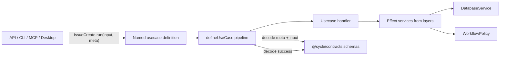

# @cycle/usecases

Effect-native usecase definitions for Cycle.

This package owns executable application workflows such as `IssueCreate`,
`IssueTransition`, `RepositoryList`, and `CommentAdd`. Each usecase is a named
definition with a bound `run(input, meta?)` function.

It does not re-export contracts or schemas. Import shared schemas, payload
types, and boundary contracts from `@cycle/contracts` or
`@cycle/contracts/schemas`.

## Public Shape

```ts
import { IssueCreate } from "@cycle/usecases";

const result =
  yield *
  IssueCreate.run(
    {
      repository: { id: "cycle" },
      input: {
        title: "Wire usecases through layers",
        type: "task",
      },
    },
    {
      requestId: "req_123",
      source: "api",
    },
  );
```

`run()` returns an `Effect` whose environment is the services required by that
usecase. Apps provide those services with layers.

```ts
import { DatabaseService } from "@cycle/database";
import { IssueCreate, UseCaseServicesLive } from "@cycle/usecases";
import { Effect, Layer } from "effect";

const DatabaseLive = Layer.succeed(DatabaseService, DatabaseService.of(hostDatabase));
const AppUseCasesLive = Layer.mergeAll(DatabaseLive, UseCaseServicesLive);

await Effect.runPromise(
  IssueCreate.run({
    repository: { id: "cycle" },
    input: { title: "Create from API", type: "task" },
  }).pipe(Effect.provide(AppUseCasesLive)),
);
```

`UseCaseServicesLive` provides usecase-owned services such as workflow policy.
The host app still provides storage and platform services, usually
`DatabaseService`.

## Architecture



`defineUseCase()` owns the shared execution pipeline:

- metadata decode
- input decode
- idempotency and dry-run checks
- deadline handling
- span and log annotations
- handler execution
- failure mapping
- success decode

Usecase files only describe the workflow-specific handler. They should not
repeat schema validation, output normalization, tracing boilerplate, or custom
`run()` plumbing.

## Boundaries

Use `@cycle/contracts` for:

- contract schemas
- request and response payload types
- usecase metadata/failure boundary shapes

Use `@cycle/usecases` for:

- named runnable definitions
- `defineUseCase()` / `defineContractUseCase()`
- usecase-owned services such as `WorkflowPolicy`
- test layer helpers such as `UseCaseTest`

Use app packages for:

- database layer construction
- API/CLI/MCP/Desktop adapter concerns
- auth, transport, serialization, and response formatting

## Validation

State-independent validation belongs in schemas. For example, required ticket
type IDs and non-empty comment body rules are schema concerns.

State-dependent rules belong in services. For example, transition approval,
protected-section checks, and relation policy live behind `WorkflowPolicy`.

Handlers consume services directly:

```ts
export const IssueTransition = defineContractUseCase("IssueTransition", (input, context) =>
  Effect.gen(function* () {
    const db = yield* DatabaseService;
    const policy = yield* WorkflowPolicy;
    const current = yield* readRequiredTicket(db, context, input.input.id);

    yield* policy.validateTransition(context, current, input.input.status);

    return yield* db.transitionTicket(input.repository.id, input.input.id, {
      reason: input.input.reason,
      status: input.input.status,
    });
  }),
);
```

## Testing

Use `UseCaseTest()` for tests that need the in-memory database and default
workflow policy.

```ts
import { IssueCreate, UseCaseTest } from "@cycle/usecases";
import { Effect } from "effect";

const program = IssueCreate.run({
  repository: { id: "test-repository" },
  input: { title: "Test issue", type: "task" },
});

const created = await Effect.runPromise(program.pipe(Effect.provide(UseCaseTest())));
```

For focused tests, provide a small `DatabaseService` layer and merge it with
`UseCaseServicesLive`.

## Adding A Usecase

1. Add or update schemas in `@cycle/contracts`.
2. Add the usecase definition in `UseCases.ts`.
3. Put stateless validation in schemas.
4. Put stateful rules in `WorkflowPolicy` or another service.
5. Add focused tests for decode, policy, storage, and success-shape behavior.

Keep the public API concrete:

```ts
import { IssueCreate, RepositoryStatusGet } from "@cycle/usecases";
```

Avoid adding dynamic name dispatch, aliases, or contract re-exports here.
