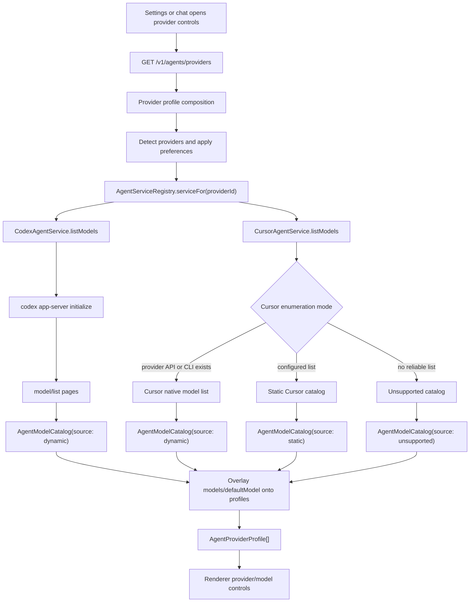
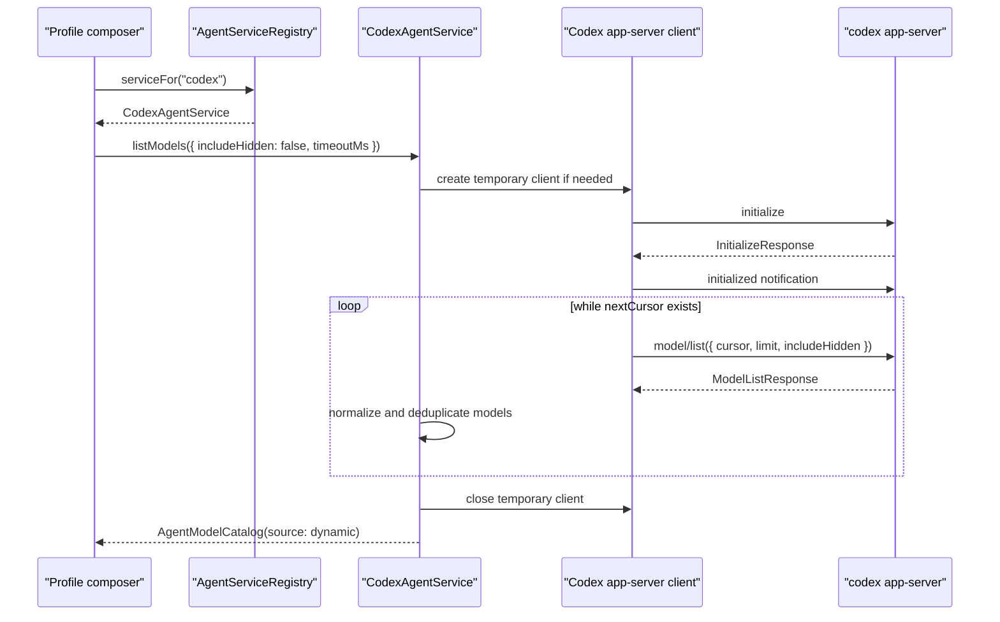
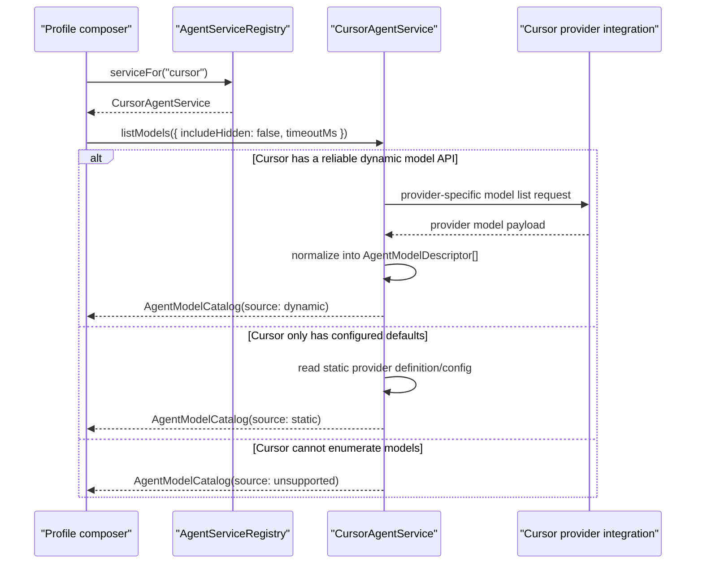
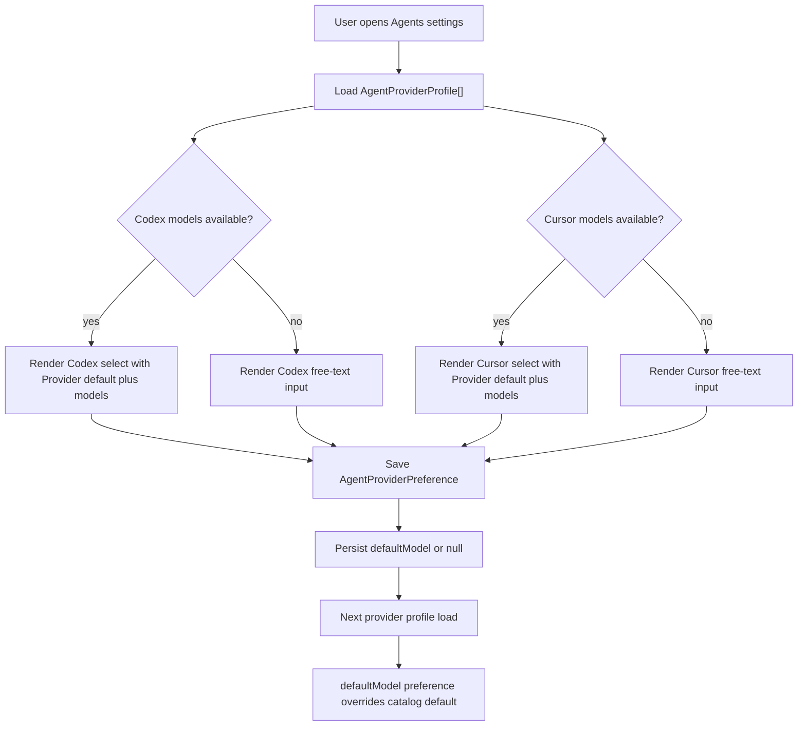
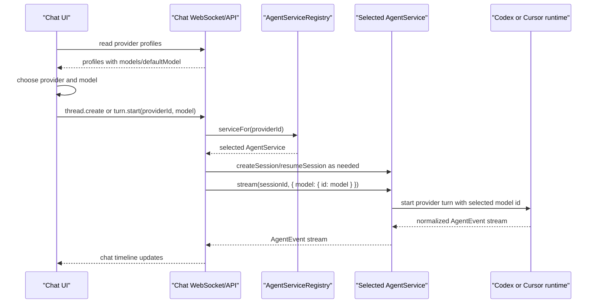
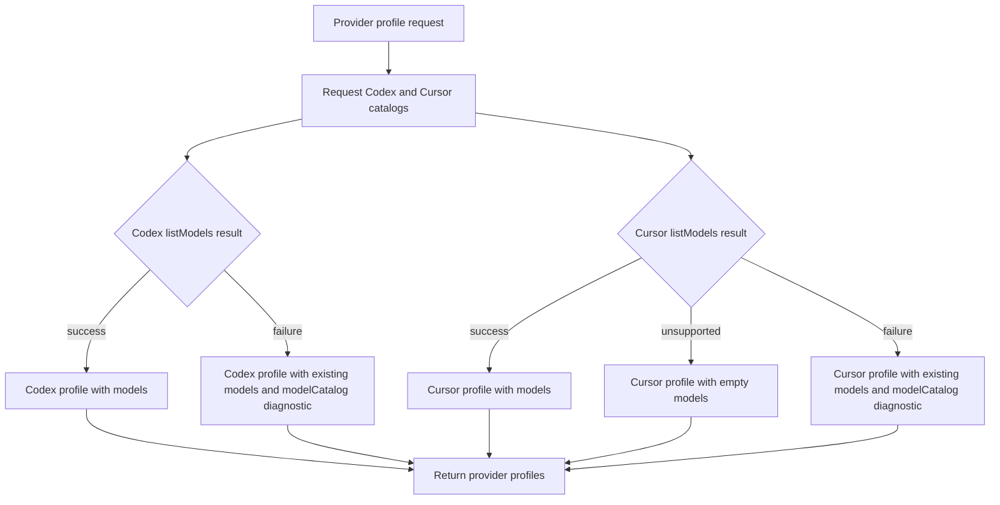

# Agent Provider Model Listing Specification

Status: Draft implementation specification
Date: 2026-07-02
Target packages: `@cycle/agents`, `@cycle/codex-app-server`, `@cycle/api`, `@cycle/desktop`
Related branch: `origin/feature/codex-model-dropdown`

## 1. Purpose

Cycle MUST expose provider model selection through the provider-neutral agent service boundary.
Each registered agent provider MUST be able to report the models it can run, or explicitly report
that model enumeration is unsupported or unavailable. For Codex, the implementation MUST call the
Codex app-server `model/list` request and normalize the response before API, desktop, settings, or
chat code consume it.

This replaces the prototype shape in `feature/codex-model-dropdown`, where model listing is wired
through standalone provider catalog helpers and called directly from `DesktopApi`.

## 2. Normative Language

The keywords MUST, MUST NOT, REQUIRED, SHOULD, SHOULD NOT, and MAY are to be interpreted as
described in RFC 2119 and RFC 8174.

Implementation-defined means an implementation may choose the concrete TypeScript names, cache
storage, or internal helper layout, but it MUST preserve the externally observable contract
described in this specification and MUST be covered by tests where behavior affects callers.

## 3. Problem Statement

Cycle already has provider profiles with `models` and `defaultModel` fields, and chat/settings UI
already knows how to render provider/model choices. The missing boundary is provider-neutral model
enumeration.

The prototype branch proves that Codex can list models through app-server `model/list`, but it
introduces these design problems:

- `@cycle/agents/src/providers/modelCatalog.ts` is a parallel provider registry outside
  `AgentService`.
- `DesktopApi` imports and calls provider model enrichment helpers directly.
- failures are swallowed without a normalized status or error category.
- the returned shape is a string list, so useful provider data such as display names, hidden state,
  descriptions, and default flags is discarded too early.
- API and desktop composition decide when to start Codex app-server instead of delegating that to
  the Codex service.

Cycle needs model listing to be owned by the same provider service that owns provider execution,
configuration, executable paths, environment, app-server startup, and provider error mapping.

## 4. Goals

1. Add a standard `listModels` operation to `AgentService`.
2. Normalize provider model data into a shared `AgentModelCatalog` domain shape.
3. Make Codex `listModels` call app-server `initialize`, send `initialized`, page through
   `model/list`, and close temporary clients when it created them.
4. Preserve existing `AgentProviderProfile.models` and `defaultModel` output for current API and UI
   consumers.
5. Keep `@cycle/api` and `@cycle/desktop` free of Codex-specific model-listing logic.
6. Report model-listing failures without making provider detection or `/v1/agents/providers` fail
   wholesale.
7. Allow future providers such as Cursor, Claude Code, OpenCode, or Copilot to implement model
   enumeration behind the same service method.

## 5. Non-Goals

1. This spec does not require a new public HTTP endpoint for model refresh.
2. This spec does not require changing chat turn execution or the selected model request shape.
3. This spec does not require model pricing, token limits, account entitlement details, or upgrade
   flows.
4. This spec does not require providers without an enumeration API to invent a dynamic list.
5. This spec does not require persisting model catalogs across application restarts.
6. This spec does not require replacing the broader `AgentRuntime` redesign.

## 6. System Overview

The target flow is:

```text
Desktop/API profile composition
        |
        v
AgentServiceRegistry.serviceFor(providerId)
        |
        v
AgentService.listModels(request)
        |
        +--> Codex service: Codex app-server initialize + model/list
        +--> Cursor service: provider-native, static, or unsupported catalog
        +--> Claude Code service: static/unsupported/SDK-backed implementation
        +--> Future services: provider-specific enumeration
        |
        v
AgentModelCatalog
        |
        v
AgentProviderProfile.models/defaultModel
        |
        v
Settings and chat provider/model controls
```

Responsibility boundaries:

- `@cycle/codex-app-server` owns typed JSON-RPC method support for `model/list`.
- `@cycle/agents` owns the `AgentService.listModels` contract, provider normalization, timeout
  handling, provider error mapping, and optional in-memory caching.
- `@cycle/api` owns HTTP serialization of `AgentProviderProfile`.
- `@cycle/desktop` owns app config preferences and profile composition, but it MUST call
  `AgentService.listModels` through the registry instead of importing provider-specific helpers.
- Renderer UI owns presentation only. It MUST NOT spawn provider processes, call app-server, or
  normalize raw provider model payloads.

Cursor is not implemented in the current repository. In this specification, Cursor means a future
agent provider with provider id `cursor` or another stable provider id chosen by its implementation.
The Cursor service MUST still satisfy `AgentService.listModels`; the provider-specific mechanism is
implementation-defined.

## 7. Domain Model

### 7.1 AgentModelDescriptor

`@cycle/agents` MUST define a normalized reasoning effort descriptor equivalent to:

```ts
export type AgentReasoningEffort = {
  readonly id: string;
  readonly label: string;
  readonly description?: string;
  readonly disabled?: boolean;
};
```

`@cycle/agents` MUST define a normalized model descriptor equivalent to:

```ts
export type AgentModelDescriptor = {
  readonly id: string;
  readonly provider: AgentProviderId;
  readonly label: string;
  readonly description?: string;
  readonly status: "available" | "hidden" | "unavailable" | "deprecated";
  readonly isDefault?: boolean;
  readonly disabled?: boolean;
  readonly supportedReasoningEfforts?: readonly AgentReasoningEffort[];
  readonly defaultReasoningEffortId?: string | null;
  readonly metadata?: JsonObject;
};
```

Field rules:

- `id` MUST be the value callers pass as `AgentTurnRequest.model.id`.
- `id` MUST be stable for the provider and MUST NOT be localized display text.
- `provider` MUST equal the owning `AgentService.provider`.
- `label` MUST be non-empty and SHOULD prefer provider display names when available.
- `description` MAY contain concise provider-supplied model detail.
- `status` MUST describe whether Cycle should normally show or select the model.
- `disabled` SHOULD be true when the model is visible but cannot be selected.
- `supportedReasoningEfforts` SHOULD contain provider-normalized reasoning effort choices for the
  model when the provider reports them.
- `defaultReasoningEffortId` SHOULD be the provider-reported default reasoning effort for that
  model when known.
- `metadata` MAY contain bounded provider-neutral or provider-specific fields, but it MUST NOT
  contain secrets, auth tokens, account identifiers, large raw payloads, or full provider responses.

### 7.2 AgentModelCatalog

`AgentService.listModels` MUST return a catalog equivalent to:

```ts
export type AgentModelCatalog = {
  readonly provider: AgentProviderId;
  readonly models: readonly AgentModelDescriptor[];
  readonly defaultModelId: string | null;
  readonly reasoningEfforts?: readonly AgentReasoningEffort[];
  readonly defaultReasoningEffortId?: string | null;
  readonly source: "dynamic" | "static" | "unsupported" | "unavailable";
  readonly fetchedAt: string;
  readonly stale?: boolean;
};
```

Field rules:

- `models` MUST be deduplicated by `id`.
- Model order MUST follow provider order after deduplication.
- `defaultModelId` MUST be either `null` or the `id` of one returned model.
- `reasoningEfforts` SHOULD be derived from the default or first selectable model when available.
- `defaultReasoningEffortId` SHOULD be either `null` or the `id` of one returned reasoning effort.
- `source: "dynamic"` means a provider API was queried successfully.
- `source: "static"` means the service returned a configured or hardcoded list.
- `source: "unsupported"` means the provider does not support model enumeration.
- `source: "unavailable"` means model enumeration was skipped because the provider cannot currently
  be queried.
- `fetchedAt` MUST be an ISO timestamp generated when the result was produced.
- `stale` MAY be true only when returning a cached catalog after refresh failure.

### 7.3 AgentListModelsRequest

`AgentService.listModels` MUST accept an optional request equivalent to:

```ts
export type AgentListModelsRequest = {
  readonly includeHidden?: boolean;
  readonly refresh?: boolean;
  readonly signal?: AbortSignal;
  readonly timeoutMs?: number;
};
```

Field rules:

- `includeHidden` defaults to false.
- `refresh` defaults to false and requests bypassing an implementation cache when one exists.
- `signal` MUST cancel provider work where possible.
- `timeoutMs` defaults to an implementation-defined provider timeout. Codex SHOULD use 10 seconds.

Provider service construction already carries executable paths, environment, config, and session
stores. Callers MUST NOT pass Codex-specific `cwd`, `CODEX_HOME`, app-server clients, or env maps
through the public `listModels` request.

## 8. AgentService Contract

`AgentService` MUST add:

```ts
listModels(request?: AgentListModelsRequest): Promise<AgentModelCatalog>;
```

Required semantics:

- Every concrete `AgentService` MUST implement `listModels`.
- Providers with `capabilities().providerFeatures?.modelSelection !== true` SHOULD return an empty
  catalog with `source: "unsupported"`.
- Providers that support model selection but cannot dynamically enumerate models MAY return a
  static catalog.
- Direct `listModels` callers SHOULD receive a rejected promise for provider, timeout,
  authentication, protocol, or schema failures.
- Profile composition callers MUST catch those failures and degrade the profile rather than failing
  the entire provider list response.
- `listModels` MUST NOT create or mutate agent sessions.
- `listModels` MUST NOT persist selected model preferences.
- `listModels` MUST NOT start a turn or require an active chat thread.
- `listModels` MUST close any provider process or client it creates only for model listing.
- `listModels` MUST NOT close clients or runtimes owned by active sessions.

The existing `AgentProviderProfile.models: string[]` contract MAY remain in the first
implementation phase. Profile composition MUST map `AgentModelCatalog.models` to model ids for that
field and MUST set `defaultModel` from user preference first, then `catalog.defaultModelId`, then the
first available model id, then `null`.

## 9. Codex App-Server Contract

`@cycle/codex-app-server` MUST expose `model/list` as a typed client request.

Required protocol additions:

- Add `"model/list"` to `CLIENT_REQUEST_METHODS`.
- Add `ModelListParams` to `ClientRequestParamsByMethod`.
- Add `ModelListResponse` to `ClientRequestResponsesByMethod`.
- Export normalized wrapper types for generated `Model`, `ModelListParams`, and
  `ModelListResponse`.
- Validate `cursor` as optional string or null.
- Validate `limit` as optional number.
- Validate `includeHidden` as optional boolean.
- Validate response `data` as an array of model objects with at least string `id` and string
  `model`.
- Validate `nextCursor` as optional string or null.

The protocol package MUST remain provider-protocol-only. It MUST NOT import `@cycle/agents`, app
config, desktop code, or UI types.

## 10. Codex AgentService Implementation

Codex `listModels` MUST:

1. Create or reuse a Codex app-server client according to the existing Codex service options.
2. Call `initialize` with Cycle client metadata.
3. Send the `initialized` notification when initialization succeeds.
4. Request `model/list` with `includeHidden` from the request and an implementation-defined page
   size. The first implementation SHOULD use 100.
5. Continue requesting pages while `nextCursor` is a non-empty string.
6. Normalize each model object into `AgentModelDescriptor`.
7. Deduplicate by descriptor `id`.
8. Select `defaultModelId` from the provider default flag when available, otherwise the first
   available model.
9. Return `source: "dynamic"`.
10. Close a temporary app-server client in a `finally` path.

Codex normalization rules:

- Descriptor `id` MUST be `model.model` when non-empty, otherwise `model.id`.
- Descriptor `label` SHOULD use `displayName` when non-empty, otherwise `id`.
- Descriptor `description` SHOULD use provider `description` when non-empty.
- Descriptor `status` MUST be `"hidden"` when provider `hidden === true`; otherwise
  `"available"` unless a later provider field clearly indicates deprecation or unavailability.
- Hidden models MUST be omitted unless `includeHidden` is true.
- A provider default flag SHOULD set `isDefault: true`.
- Codex `supportedReasoningEfforts` MUST normalize to `AgentReasoningEffort[]`.
- Codex `defaultReasoningEffort` SHOULD set `defaultReasoningEffortId`.
- Additional Codex-specific model details MAY be preserved under `metadata` only when bounded and
  JSON-serializable.

Codex error mapping:

- spawn failure maps to `AgentError.code: "provider_error"` unless a more specific code exists.
- app-server schema encode/decode failure maps to `"invalid_request"` or `"provider_error"` based
  on whether Cycle or Codex supplied the malformed payload.
- timeout maps to `"timeout"` and MUST be retryable.
- authentication/account failures SHOULD map to `"authentication_error"` when detectable.
- request cancellation maps to `"cancelled"`.

## 11. Profile Composition

Provider profile composition MUST use this order:

1. Detect provider executable or SDK availability.
2. Build the base `AgentProviderProfile` from detection and provider definition.
3. Apply desktop/provider preferences: enabled state, configured executable path, max concurrency,
   configured default model, and provider config.
4. If the resulting profile status is `available` and model selection is supported, call
   `AgentService.listModels`.
5. Overlay catalog models onto the profile.
6. Return the profile even when model listing fails.

Profile overlay rules:

- `profile.models` MUST contain selectable model ids in catalog order.
- Hidden models MUST NOT appear in `profile.models` unless the profile composition path explicitly
  asks for hidden models.
- `profile.defaultModel` MUST preserve a non-empty user preference even when the current catalog
  does not include it.
- If no user preference exists, `profile.defaultModel` MUST use `catalog.defaultModelId`.
- If model listing fails, `profile.models` SHOULD remain the provider definition or detection
  value, usually `[]`.
- If model listing fails, profile `configuration` SHOULD include bounded diagnostic metadata under
  `modelCatalog`, for example status, error code, and checked timestamp.

`DesktopApi` MUST NOT import Codex model catalog helpers. It MAY define provider-neutral profile
composition helpers that depend on `AgentServiceRegistry`.

## 12. API and UI Behavior

The existing `/v1/agents/providers` response MUST continue to return provider profiles with
`models` and `defaultModel`.

The chat WebSocket provider profile mapping SHOULD continue to emit model option objects derived
from `AgentProviderProfile.models`. When richer `AgentModelDescriptor` values are exposed in a
future contract revision, chat mapping MAY use descriptor labels and disabled state directly.

Settings UI behavior:

- When `profile.models` is non-empty, settings SHOULD render a model select containing "Provider
  default" plus the reported model ids.
- When `profile.models` is empty, settings MAY keep the current free-text default model input.
- A saved default model not present in the current catalog SHOULD remain visible as a saved value so
  users can clear it.
- Saving "Provider default" MUST persist `defaultModel: null`.

Chat UI behavior:

- Chat SHOULD use `profile.defaultModel` when a thread has no selected model.
- Chat MUST NOT send a model value that is unavailable for the selected provider unless it is a
  previously saved thread value being preserved.
- Chat MUST continue to pass selected models as `AgentTurnRequest.model.id`.

### 12.1 End-to-End Flow Diagrams

The following diagrams define the access patterns this feature MUST support when Codex and Cursor
are both registered providers. The important invariant is that API, desktop, and UI code only depend
on `AgentServiceRegistry`, `AgentService.listModels`, and `AgentProviderProfile`; provider-specific
model enumeration remains inside each provider service.

#### Provider Profile Listing With Codex And Cursor



Required behavior:

- Codex MUST use dynamic app-server model listing when the provider is available.
- Cursor MUST return dynamic, static, unsupported, or unavailable catalogs through the same
  `listModels` method.
- Profile composition MUST be able to request Codex and Cursor catalogs in parallel.
- A failure in either provider's model listing MUST NOT prevent the other provider profile from
  returning.

#### Codex Dynamic Model List Sequence



Required behavior:

- The Codex service MUST own app-server startup, pagination, timeout, normalization, and cleanup.
- The profile composer MUST NOT know about `initialize`, `initialized`, `model/list`, cursors, or
  Codex model response fields.
- Temporary clients MUST close on success, timeout, cancellation, and schema/protocol failure.

#### Cursor Model List Sequence



Required behavior:

- Cursor MUST hide provider-specific enumeration details behind `AgentService.listModels`.
- If Cursor uses a CLI or local process, it MUST follow the same read-only and cleanup rules as
  Codex.
- If Cursor returns `source: "unsupported"`, settings MUST still allow a free-text saved default
  model and chat MUST still pass explicitly selected model ids through the normal request shape.

#### Settings Default Model Save Flow



Required behavior:

- Selecting "Provider default" MUST persist `defaultModel: null`.
- Selecting a listed model MUST persist that model id.
- A saved model missing from a later catalog MUST remain visible as a saved value so the user can
  clear or replace it.
- This flow MUST be identical for Codex and Cursor.

#### Chat Model Selection And Turn Execution Flow



Required behavior:

- Chat MUST treat Codex and Cursor model ids as opaque provider-specific strings.
- API MUST validate provider availability, then route execution through the selected
  `AgentService`.
- Model listing and model execution MUST share the same provider id and service boundary.
- A provider MAY reject an unavailable model at turn start with a normalized provider error; chat
  MUST surface that as a turn failure rather than retrying with a different model silently.

#### Model Listing Failure Isolation Flow



Required behavior:

- Profile composition MUST catch per-provider `listModels` failures.
- The response MUST preserve each provider's availability status separately from model catalog
  status.
- Diagnostics MUST be bounded and stored under profile `configuration.modelCatalog`.
- A provider model-listing failure MUST NOT disable another provider or hide it from the UI.

## 13. Caching, Concurrency, and Timeouts

`AgentService.listModels` MAY cache successful catalogs in memory.

If caching is implemented:

- cache keys MUST include provider id, configured executable path or provider runtime identity, and
  `includeHidden`;
- cache TTL SHOULD be short, for example 5 minutes;
- `refresh: true` MUST bypass the cache;
- concurrent identical refreshes SHOULD share one provider request;
- failed refreshes MUST NOT overwrite a successful non-stale cache entry;
- stale cache responses MUST be marked with `stale: true`.

Codex model listing MUST use a timeout. On timeout, the service MUST close a temporary client it
created for the listing request. It MUST NOT close a shared active session runtime.

## 14. Observability

Model-listing failures SHOULD be logged with:

- provider id;
- executable path when known;
- operation name `listModels`;
- request options excluding secrets;
- error code;
- concise message;
- elapsed time;
- whether a cached/stale catalog was returned.

Logs MUST NOT include environment variables, bearer tokens, raw provider responses, account ids, or
large model metadata.

## 15. Security and Operational Safety

Model listing is read-only. Implementations MUST NOT:

- modify provider config;
- create Cycle agent sessions;
- start turns;
- persist secrets;
- expose raw environment variables;
- require MCP attachment;
- write repository files.

Provider subprocesses started for listing MUST receive only the environment and executable path
already configured for that provider service.

## 16. Implementation Plan

### Phase 1: Protocol Support

1. Add typed `model/list` request and response support to `@cycle/codex-app-server`.
2. Add protocol tests for request encoding and response decoding.
3. Keep the protocol package free of Cycle provider profile logic.

### Phase 2: AgentService Contract

1. Add `AgentModelDescriptor`, `AgentModelCatalog`, and `AgentListModelsRequest` types.
2. Add `listModels` to `AgentService`.
3. Implement default empty/static behavior for providers that cannot enumerate models.
4. Implement Codex dynamic model listing through app-server.
5. Add unit tests for normalization, pagination, deduplication, hidden filtering, timeout, and
   client cleanup.

### Phase 3: Profile Integration

1. Update provider profile composition to call `AgentServiceRegistry.serviceFor(id).listModels`.
2. Remove `@cycle/agents/src/providers/modelCatalog.ts` and provider-specific profile enrichment
   helpers from the prototype branch.
3. Keep `/v1/agents/providers` compatible with current `AgentProviderProfile`.
4. Add tests proving profile listing survives model-list failures.

### Phase 4: Settings UI

1. Use `profile.models` to render a select when models are available.
2. Keep free-text fallback when no models are reported.
3. Preserve saved model values that are no longer in the catalog.
4. Add renderer tests for provider default, saved unavailable model, and empty catalog states.

## 17. Validation Matrix

| Area                        | Requirement                                                                     | Validation                                                                         |
| --------------------------- | ------------------------------------------------------------------------------- | ---------------------------------------------------------------------------------- |
| Protocol                    | `model/list` is a typed Codex client request                                    | `@cycle/codex-app-server` protocol test encodes params and decodes paged responses |
| Service contract            | All providers implement `listModels`                                            | TypeScript compile plus provider service tests                                     |
| Codex pagination            | Multiple Codex pages are merged in order                                        | Codex mock app-server test with `nextCursor`                                       |
| Deduplication               | Duplicate model ids appear once                                                 | Unit test with duplicate `model` values                                            |
| Hidden filtering            | Hidden models are excluded by default                                           | Unit test for `includeHidden: false` and `true`                                    |
| Defaults                    | Provider default is selected when reported                                      | Unit test for default flag and fallback to first available                         |
| Failure isolation           | Provider profile list does not fail when model listing fails                    | API or profile-composition test                                                    |
| Preferences                 | Saved default model overrides provider default                                  | Desktop profile composition test                                                   |
| Cleanup                     | Temporary Codex client closes on success, failure, and timeout                  | Mock client test                                                                   |
| UI fallback                 | Settings uses select with catalog and input without catalog                     | Renderer component test                                                            |
| Multi-provider profile flow | Codex and Cursor profile model listing run through `AgentServiceRegistry`       | Profile-composition test with mock Codex and Cursor services                       |
| Cursor dynamic flow         | Cursor dynamic model payload normalizes to `AgentModelCatalog`                  | Cursor provider service test when Cursor implementation exists                     |
| Cursor unsupported flow     | Cursor can report `source: "unsupported"` without breaking settings or chat     | Profile and renderer tests with empty Cursor catalog                               |
| Chat execution flow         | Selected Codex or Cursor model id reaches `AgentTurnRequest.model.id` unchanged | Chat API/renderer integration test                                                 |

## 18. Definition of Done

1. `AgentService` includes a provider-neutral `listModels` operation.
2. Codex `listModels` calls app-server `model/list` and returns `AgentModelCatalog`.
3. API/desktop code no longer imports Codex-specific model catalog helpers.
4. Provider profiles expose model ids and default model values through the existing contract.
5. Model-listing errors are normalized, logged, and isolated from provider profile listing.
6. Tests cover protocol, service, profile composition, and settings UI behavior.
7. The prototype branch's standalone model catalog/enrichment path is removed or replaced by the
   service-bound implementation.

## 19. Open Questions

1. Should a future API contract expose rich `AgentModelDescriptor` objects directly instead of
   `models: string[]`?
2. Should Cycle add a manual "refresh models" action in settings, or is profile-list refresh enough
   for the first implementation?
3. Should Claude Code return a static catalog from config/docs in the first phase, or report
   `source: "unsupported"` until the SDK provides a reliable list operation?
4. Which Cursor integration will own dynamic model enumeration: a Cursor CLI command, a local
   provider API, a static Cycle catalog, or unsupported enumeration until Cursor exposes a reliable
   provider contract?
