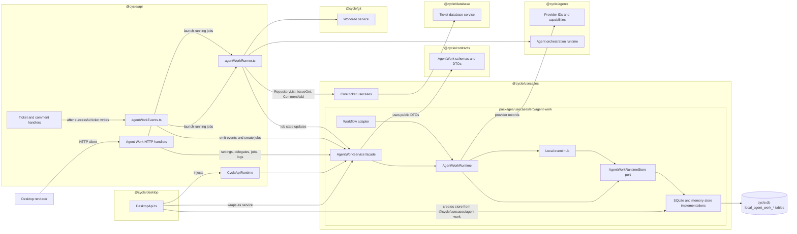
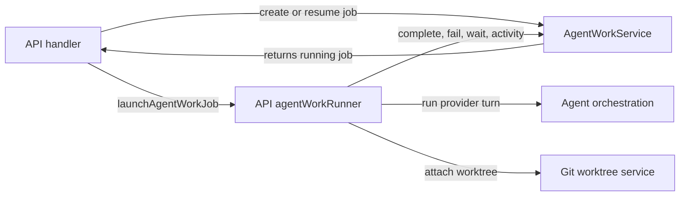
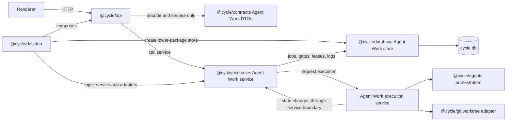
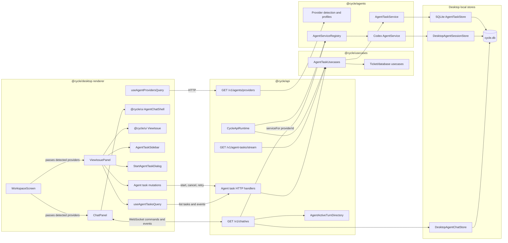
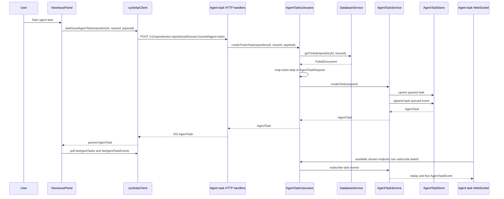
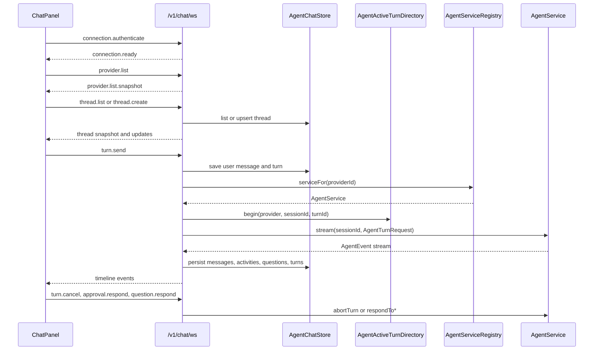
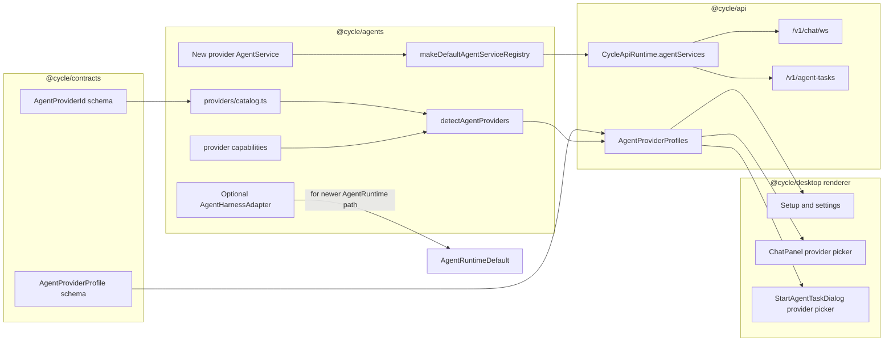

# Agent Work Architecture Diagram

This file started as a map of the old `packages/usecases/src/agent-work` boundary. The first
section is useful pre-refactor context; the later sections describe the current AgentTask and
agent page shape after the execution-boundary refactor.

## Pre-Refactor Agent Work Placement



## Why It Feels Wrong

`agent-work` is now below `@cycle/api`, which is the right direction, but it is doing too many kinds of work for a usecase package:

- It exposes an HTTP-shaped service facade in `httpAdapter.ts`.
- It owns product/runtime state transitions in `runtime.ts`.
- It owns the storage port and concrete SQLite schema/store in `store.ts`.
- It imports provider concepts from `@cycle/agents`.
- It still relies on `@cycle/api` to actually run jobs through `agentWorkRunner.ts`.

So the dependency direction is partially fixed, but the responsibility split is not. `@cycle/usecases/agent-work` is acting as service boundary, scheduler/runtime, persistence package, and HTTP DTO adapter. Meanwhile the most operational part, provider execution, still lives in an HTTP handler module.

The awkward loop is:



That loop is why the boundary feels off: API is both the HTTP adapter and the job runner, while `usecases/agent-work` is both the service and the durable storage implementation.

## Intended Shape

The boundary spec points toward this shape:



In that target shape, API stops running provider turns. `@cycle/usecases` owns the Agent Work product operations and runner boundary. `@cycle/database` owns concrete persistence. `@cycle/contracts` owns the wire types. Desktop only composes the pieces.

## Ideal Separation Of Concerns

This is the cleaner shape you described: `@cycle/agents` owns generic agent execution, while `@cycle/usecases` owns ticket-specific setup and projections.

```mermaid
flowchart LR
    subgraph clients ["Clients"]
        renderer[Desktop renderer]
        cli[CLI or MCP client]
    end

    subgraph apiPkg ["@cycle/api"]
        httpAdapter[HTTP adapter]
        requestContext[Auth and request context]
        usecaseBridge[Usecase bridge]
    end

    subgraph contractsPkg ["@cycle/contracts"]
        wireDtos[HTTP DTO schemas]
        usecaseContracts[Usecase command schemas]
    end

    subgraph usecasesPkg ["@cycle/usecases"]
        agentWorkUsecases[Agent Work usecases]
        ticketUsecases[Ticket usecases]
        taskMapper[Ticket to AgentTask mapper]
        agentExecutionPort[AgentExecutionPort]
        ticketRepoPort[TicketRepository port]
        agentWorkRepoPort[AgentWorkRepository port]
        workspacePort[WorkspaceProvisioner port]
    end

    subgraph agentsPkg ["@cycle/agents"]
        agentService[Agent execution service]
        workflowEngine[Workflow orchestrator]
        providerRegistry[Provider registry]
        providerAdapter[Agent provider adapters]
        runEvents[Agent run event stream]
    end

    subgraph gitPkg ["@cycle/git"]
        worktreeAdapter[Worktree provisioner]
    end

    subgraph databasePkg ["@cycle/database"]
        ticketRepository[Ticket repository]
        agentWorkRepository[Agent Work repository]
    end

    db[(cycle.db)]
    providers[Codex and other providers]

    renderer -->|"HTTP"| httpAdapter
    cli -->|"HTTP or MCP"| httpAdapter
    httpAdapter --> requestContext
    requestContext -->|"decode"| wireDtos
    requestContext --> usecaseBridge
    usecaseBridge -->|"run command/query"| agentWorkUsecases
    usecaseBridge -->|"run command/query"| ticketUsecases

    agentWorkUsecases -->|"load ticket/delegate/job"| ticketRepoPort
    agentWorkUsecases -->|"persist job/log/activity"| agentWorkRepoPort
    agentWorkUsecases -->|"prepare workspace when needed"| workspacePort
    agentWorkUsecases -->|"map ticket intent"| taskMapper
    taskMapper -->|"generic task request"| agentExecutionPort
    agentExecutionPort -->|"implemented by"| agentService

    agentService --> workflowEngine
    workflowEngine --> providerRegistry
    providerRegistry --> providerAdapter
    providerAdapter --> providers
    workflowEngine --> runEvents
    runEvents -->|"generic run events"| agentWorkUsecases

    ticketRepoPort -->|"implemented by"| ticketRepository
    agentWorkRepoPort -->|"implemented by"| agentWorkRepository
    workspacePort -->|"implemented by"| worktreeAdapter
    ticketRepository --> db
    agentWorkRepository --> db

    wireDtos --> usecaseContracts
```



The important boundary is that `@cycle/agents` receives a generic task, not a ticket job:

```text
AgentTaskRequest
  providerId
  agentId
  instructions
  context
  authority
  workspace
  tools
  metadata
```

`@cycle/usecases` is where ticket concepts are translated into that request. It can read tickets, delegates, settings, repository state, and job records; decide whether a worktree is needed; create or update Agent Work jobs; then call an `AgentExecutionPort`.

`@cycle/agents` should not know `ticketId`, `delegate`, `AgentWorkJob`, or HTTP DTOs as domain concepts. It should know how to run a provider-backed workflow for a task and emit generic run events:

```text
AgentExecutionPort
  startTask(request) -> run handle
  streamEvents(runId) -> AgentRunEvent stream
  cancelRun(runId)
  resumeRun(runId, checkpoint)
```

That gives each layer a narrow reason to exist:

- `@cycle/api`: transport only. Auth, decode, response envelopes, OpenAPI.
- `@cycle/usecases`: application policy. Ticket-to-task mapping, job lifecycle, scheduler gates, repository coordination.
- `@cycle/agents`: execution runtime. Provider selection, workflow orchestration, delegation, tool/MCP plumbing, run events.
- `@cycle/database`: persistence implementations. Ticket and Agent Work repositories.
- `@cycle/git`: workspace/worktree implementation.
- `@cycle/contracts`: shared schemas crossing API/usecase boundaries.

## Current Read

The current `agent-work` folder is not inherently misplaced. A service contract for Agent Work belongs near usecases. The uncomfortable part is that the folder is carrying lower-level and adapter-level responsibilities at the same time, while one major service responsibility remains in `@cycle/api`.

## Current Agent Page Surfaces

This is the current visible agent composition in the desktop renderer. There are two agent-facing
surfaces:

- The main chat page, backed by `/v1/chat/ws`.
- The issue detail agent task panel, backed today by `/v1/agent-tasks` HTTP polling. The API
  also exposes `/v1/agent-tasks/stream`, but the current renderer query path uses polling.



## Current Issue Agent Task Flow

The issue page currently queues an `AgentTask`. It does not directly run a provider turn from the
task service yet; `AgentTaskService.startScheduler()` currently returns a no-op handle.



The request that crosses from usecases into the agents task subsystem is generic:

```ts
type AgentTaskRequest = {
  agentId: string;
  providerId: string;
  requestedBy: string;
  instructions: string;
  input: string | JsonObject;
  context: JsonObject;
  authority: {
    mode: "read-only" | "workspace-write" | "full-access";
    allowedTools?: readonly string[];
  };
  workspace?: {
    path: string;
    workspaceId?: string;
    branchName?: string;
    metadata?: JsonObject;
  };
  model?: string;
  tools?: readonly AgentTaskToolRequest[];
  responseFormat?: AgentTaskResponseFormat;
  metadata?: JsonObject;
  origin?: JsonObject;
  idempotencyKey?: string;
  maxAttempts?: number;
};
```

## Current Chat Agent Flow

The chat page is the path that currently executes provider turns end to end. It uses a WebSocket
command protocol and calls `AgentServiceRegistry.serviceFor(providerId)` from the chat handler.



## Provider Interface That Runs Today

For a provider to be usable by the current chat page and current API runtime, it must implement
`AgentService` and be registered in `makeDefaultAgentServiceRegistry`.

```ts
type AgentService = {
  readonly provider: AgentProvider;
  capabilities(): AgentCapabilities;
  createSession(input?: CreateAgentSessionInput): Promise<AgentSession>;
  resumeSession(sessionId: string): Promise<AgentSession>;
  run<TStructured = unknown>(
    sessionId: string,
    request: AgentTurnRequest<TStructured>,
  ): Promise<AgentTurnResult<TStructured>>;
  stream<TStructured = unknown>(
    sessionId: string,
    request: AgentTurnRequest<TStructured>,
  ): AsyncIterable<AgentEvent<TStructured>>;
  respondToApproval(
    sessionId: string,
    requestId: string,
    decision: AgentApprovalDecision,
  ): Promise<AgentInteractionResponseResult>;
  respondToUserInput(
    sessionId: string,
    requestId: string,
    answers: readonly AgentUserInputAnswer[],
  ): Promise<AgentInteractionResponseResult>;
  abortTurn(sessionId: string, turnId?: string): Promise<AbortTurnResult>;
  close(): Promise<void>;
};
```

The provider receives this per-turn request:

```ts
type AgentTurnRequest<TStructured = unknown> = {
  input: AgentInput;
  model?: AgentModelRef;
  instructions?: string;
  runtimeMode?: "read-only" | "workspace-write" | "full-access";
  responseFormat?: AgentResponseFormat<TStructured>;
  mcp?: AgentMcpAttachment;
  context?: JsonObject;
  signal?: AbortSignal;
  metadata?: JsonObject;
};
```

The provider streams normalized `AgentEvent` values. The UI and API handlers already understand
these event families:

```text
turn.started
text.delta
content.delta
turn.plan.updated
turn.diff.updated
item.started / item.updated / item.completed
approval.requested / approval.resolved
user-input.requested / user-input.resolved
runtime.warning / runtime.error
progress
artifact
usage
turn.completed / turn.failed / turn.cancelled
```

## Provider Wiring For The Next Provider



Current hard constraints for the next provider:

- `packages/contracts/src/schemas/Agents.ts` currently defines `AgentProviderId` as only `"codex"`.
- `packages/agents/src/providers/catalog.ts` lists the Codex and Claude Code providers and `isAgentProviderId` accepts both ids.
- `packages/desktop/src/renderer/lib/agentProviders.ts` also has a local `isAgentProviderId` that only accepts `"codex"`.
- `packages/agents/src/DefaultAgentServices.ts` registers Codex and Claude Code provider services.
- The current chat execution path uses `AgentServiceRegistry`, so a new provider needs an `AgentService` implementation to run today.
- `packages/agents/src/AgentHarnessRegistry.ts` and `packages/agents/src/AgentCodexHarness.ts` define the newer harness seam. Implementing that is useful for the runtime direction, but it is not the primary path the current chat page uses.

## Current Read

The issue agent task page now has a cleaner task boundary than the old `agent-work` folder: usecases
map ticket data into a generic `AgentTaskRequest`, and `@cycle/agents` owns task state and
events. The part that still feels incomplete is execution: queued tasks are persisted and visible,
but the task scheduler is not yet wired through to a provider runtime.

The chat page has the opposite shape: provider execution works, but the API WebSocket handler owns a
lot of chat thread, turn, event mapping, cancellation, approval, and user-input glue around
`AgentService`. For the next provider, the shortest path is to implement and register a new
`AgentService`; the cleaner long-term path is to move execution through the newer
`AgentHarnessAdapter`/`AgentRuntime` boundary and have both chat and AgentTask consume that runtime.
