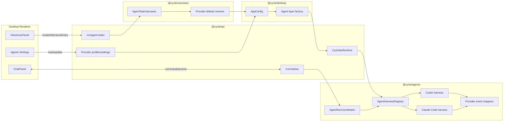

# Claude Code Multi-Provider Agents Specification

Status: Draft  
Target implementation: Cycle desktop/API/agents packages  
Primary provider addition: Claude Code  
Future provider compatibility targets: OpenCode SDK, GitHub Copilot SDK

## 1. Purpose

Cycle MUST support Claude Code as a first-class agent provider on parity with the existing Codex
provider. The implementation MUST also reshape the provider boundary so future providers such as
OpenCode and GitHub Copilot can be added behind the same application-facing contracts without
rewriting chat, task, settings, or usecase code.

This specification also restores the Agents settings area removed during the AgentTask refactor. The
settings area MUST show available providers, executable paths, capabilities, enablement, provider
defaults, and per-provider concurrency controls.

## 2. Normative Language

The keywords MUST, MUST NOT, SHOULD, SHOULD NOT, and MAY are to be interpreted as described in RFC 2119. "Implementation-defined" means the implementation may choose the concrete mechanism, but the
choice MUST be documented in code or tests and MUST preserve the observable behavior required by
this specification.

## 3. Problem Statement

The current application has a Codex-specific provider stack and several hard-coded assumptions:

- `packages/contracts/src/schemas/Agents.ts` defines `AgentProviderId` as only `"codex"`.
- `packages/agents/src/providers/catalog.ts` lists Codex and Claude Code, and
  `isAgentProviderId` accepts both ids.
- `packages/desktop/src/renderer/lib/agentProviders.ts` has a renderer-local `"codex"` guard.
- `packages/agents/src/DefaultAgentServices.ts` registers the Codex and Claude Code services.
- The chat runtime path currently executes through `AgentServiceRegistry`.
- The newer `AgentHarnessAdapter` and `AgentRuntime` abstractions exist, but they are not the
  primary execution path for the whole application.
- The Agents settings route still exists, but it now renders an empty page shell.

Adding Claude Code by copying Codex-specific paths would compound these problems. The provider
runtime must instead expose a single provider-neutral execution boundary, while settings and task
creation must be able to resolve provider-specific defaults from application configuration.

## 4. Goals

1. Add Claude Code as a supported provider with parity to Codex for chat and AgentTask execution.
2. Make `@cycle/agents` own the common provider harness interface, provider registry, provider
   configuration validation, provider profile reporting, session execution, event normalization, and
   provider concurrency enforcement.
3. Restore a functional Agents settings page that shows provider availability, executable path,
   capabilities, enablement, default model, provider-specific configuration, and max concurrent runs
   per provider.
4. Store provider preferences in desktop app config and use those preferences when composing provider
   Effect layers and when preparing AgentTask requests.
5. Use `@anthropic-ai/claude-agent-sdk` for Claude Code integration and rely on the SDK's default
   Claude Code CLI settings behavior unless a future explicit setting overrides it.
6. Preserve a provider-neutral event vocabulary for chat, AgentTask streaming, approvals, user input,
   usage, artifacts, tool activity, failures, and cancellation.
7. Prepare the implementation for future OpenCode and Copilot providers without implementing those
   providers in this phase.

## 5. Non-Goals

1. This spec does not require OpenCode or Copilot provider implementations.
2. This spec does not require storing Claude API keys, GitHub tokens, or provider secrets in Cycle
   app config.
3. This spec does not require a global agent concurrency limit. Concurrency is per provider only.
4. This spec does not require a new user-facing auth flow for Claude Code. The first implementation
   MUST use the Claude Code SDK and provider-native defaults.
5. This spec does not require preserving legacy `AgentWork` endpoints, wrapper imports, or facades.
6. This spec does not require provider-specific UI controls beyond fields defined in this spec and
   schema-driven provider configuration.

## 6. System Overview

### 6.1 Package Boundaries

`@cycle/contracts`

- MUST define shared provider ids and provider profile schemas.
- MUST include `"codex"` and `"claude-code"` provider ids.
- SHOULD avoid forcing renderer/API code to duplicate provider-id guards.

`@cycle/agents`

- MUST own provider harness interfaces, provider catalogs, provider detection, provider config
  validation, provider runtime execution, event normalization, and provider concurrency.
- MUST provide Codex and Claude Code harness implementations.
- MUST expose browser-safe schemas separately from Node/provider SDK imports.

`@cycle/api`

- MUST remain transport and runtime composition.
- MUST expose provider profile and agent settings endpoints or equivalent existing app-config
  endpoints.
- MUST NOT contain provider-specific Claude/Codex execution logic.

`@cycle/usecases`

- MUST map Cycle domain requests into generic AgentTask requests.
- MUST apply provider defaults from app config when a request omits provider/model/config fields.
- MUST NOT fetch provider-specific session files or call provider SDKs.

`@cycle/desktop`

- MUST persist provider preferences in app config.
- MUST compose the API and agents layers using persisted provider preferences.
- MUST render the restored Agents settings UI.

`@cycle/ui`

- MAY expose reusable settings components, but MUST NOT import provider SDKs or Node-only modules.

### 6.2 Current-To-Target Execution Shape



## 7. Core Domain Model

### 7.1 AgentProviderId

`AgentProviderId` MUST include:

- `"codex"`
- `"claude-code"`

Future provider ids SHOULD use stable kebab-case strings, for example `"opencode"` and
`"github-copilot"`.

Provider ids MUST be stable persistence keys. They MUST NOT be derived from executable path, package
name, display name, or model name.

### 7.2 AgentProviderDefinition

`@cycle/agents` MUST define provider definitions with at least:

```ts
type AgentProviderDefinition = {
  readonly id: AgentProviderId;
  readonly name: string;
  readonly executable: string;
  readonly packageName?: string;
  readonly documentationUrl?: string;
  readonly defaultEnabled: boolean;
  readonly defaultMaxConcurrentRuns: number | null;
  readonly capabilities: AgentCapabilities;
  readonly configurationSchema: JsonSchema;
};
```

For Claude Code:

- `id`: `"claude-code"`
- `name`: `"Claude Code"`
- `executable`: `"claude"`
- `packageName`: `"@anthropic-ai/claude-agent-sdk"`
- `defaultEnabled`: `true` when detected and available
- `defaultMaxConcurrentRuns`: `1`

### 7.3 Provider Profile

Provider profiles returned to API and UI MUST include:

- provider id;
- display name;
- executable name;
- executable path when known;
- SDK package name when known;
- status;
- status message when degraded, missing, disabled, or unsupported;
- checked timestamp;
- capabilities;
- supported models when known;
- default model from app config when set;
- max concurrent runs from app config;
- current active run count;
- configuration metadata needed to render provider-specific settings.

Provider status MUST distinguish at least:

- `available`: provider can start runs;
- `missing`: required executable or SDK runtime is not available;
- `disabled`: user disabled the provider in app config;
- `degraded`: provider is present but some capability or configuration check failed;
- `unsupported`: provider exists but cannot run on the current platform/configuration.

### 7.4 Provider Preferences

Desktop app config MUST extend `agentProviders.preferences` from `{ id, enabled }` to:

```ts
type AgentProviderPreference = {
  readonly id: AgentProviderId;
  readonly enabled: boolean;
  readonly maxConcurrentRuns: number | null;
  readonly defaultModel?: string | null;
  readonly executablePath?: string | null;
  readonly config?: JsonObject;
};
```

Field rules:

- `maxConcurrentRuns` MUST be `null` for unlimited or an integer >= 1.
- `defaultModel` MUST be omitted or `null` to use the provider default.
- `executablePath` MUST be omitted or `null` to use SDK/provider discovery.
- `config` MUST be JSON-serializable and provider-specific.
- `config` MUST NOT contain secrets.

The app config schema version MUST be incremented. Migration MUST preserve existing provider
preferences by assigning default provider values:

```ts
{
  id,
  enabled,
  maxConcurrentRuns: 1,
  defaultModel: null,
  executablePath: null,
  config: {}
}
```

### 7.5 AgentTask Provider Defaults

`AgentTaskRequest` MAY continue to contain `providerId`, `agentId`, `model`, `metadata`, and
provider-neutral fields. Before task creation or execution, the application MUST resolve:

1. explicit request provider;
2. selected issue/chat/thread provider;
3. first enabled available provider in app config/catalog order.

Model resolution MUST use:

1. explicit request model;
2. provider preference default model;
3. provider SDK/runtime default.

Provider config resolution MUST use:

1. provider preference config from app config;
2. implementation-defined task-level config in request metadata only when explicitly supported by
   the target harness;
3. provider harness defaults.

Resolved provider config SHOULD be persisted on the task/run as redacted metadata sufficient for
diagnostics, not as raw provider SDK objects.

## 8. Provider Runtime Boundary

### 8.1 Primary Interface

The primary provider abstraction MUST be Effect-based and provider-neutral. The implementation SHOULD
use the existing `AgentHarnessAdapter` boundary rather than adding a parallel abstraction.

The core operations MUST be equivalent to:

```ts
type AgentHarnessAdapter = {
  readonly harnessId: string;
  readonly providerId: AgentProviderId;
  readonly capabilities: Effect.Effect<AgentHarnessCapabilities, AgentRuntimeError>;
  readonly openSession: (
    request: HarnessOpenSessionRequest,
  ) => Effect.Effect<AgentProviderBindingRecord, AgentRuntimeError>;
  readonly execute: (
    request: HarnessExecuteRequest,
  ) => Stream.Stream<AgentEvent, AgentRuntimeError>;
  readonly cancel: (
    request: HarnessCancelRequest,
  ) => Effect.Effect<HarnessCancelResult, AgentRuntimeError>;
  readonly resolveInteraction: (
    request: HarnessInteractionResponse,
  ) => Effect.Effect<HarnessInteractionResult, AgentRuntimeError>;
  readonly steer: (
    request: HarnessSteerRequest,
  ) => Effect.Effect<HarnessSteerResult, AgentRuntimeError>;
};
```

The registry MUST also be an Effect service:

```ts
class AgentHarnessRegistry extends Context.Service<
  AgentHarnessRegistry,
  {
    readonly get: (harnessId: string) => Effect.Effect<AgentHarnessAdapter, AgentRuntimeError>;
    readonly list: () => Effect.Effect<readonly AgentHarnessAdapter[], AgentRuntimeError>;
  }
>()("@cycle/agents/AgentHarnessRegistry") {}
```

Provider implementations MUST live in separate files by responsibility:

- provider constants;
- provider capabilities;
- provider configuration schema/decoder;
- provider detection/profile;
- provider harness;
- provider event mapper;
- provider tests.

### 8.2 Transitional Compatibility

Current chat execution uses `AgentServiceRegistry`. The implementation MUST NOT preserve two
independent provider abstractions long term.

The implementation MUST choose one of these transition paths:

1. migrate chat and AgentTask execution directly to `AgentHarnessRegistry` and delete
   provider-execution usage of `AgentServiceRegistry`; or
2. implement `AgentService` as a compatibility adapter around `AgentHarnessAdapter`, and mark
   direct provider implementations of `AgentService` as deprecated.

The preferred path is direct migration to `AgentHarnessRegistry` because it is already Effect-based
and matches the requested provider-layer model.

### 8.3 Event Contract

Every provider harness MUST emit normalized `AgentEvent` values equivalent to the existing event
families:

- `turn.started`
- `text.delta`
- `content.delta`
- `turn.plan.updated`
- `turn.diff.updated`
- `item.started`
- `item.updated`
- `item.completed`
- `approval.requested`
- `approval.resolved`
- `user-input.requested`
- `user-input.resolved`
- `runtime.warning`
- `runtime.error`
- `progress`
- `artifact`
- `usage`
- `turn.completed`
- `turn.failed`
- `turn.cancelled`

Provider raw payloads MAY be attached only inside redacted diagnostics fields. UI-facing events MUST
not depend on provider-native message types.

## 9. Claude Code Provider

### 9.1 SDK Dependency

`@cycle/agents` MUST add `@anthropic-ai/claude-agent-sdk` as the Claude Code integration dependency.
The harness MUST use the SDK package types rather than shelling out to `claude` directly for primary
execution.

The implementation SHOULD rely on the SDK-bundled native binary. If the bundled binary is unavailable
or if the user configures an executable override, the harness MUST pass the configured executable
path to the SDK using its supported executable-path option.

### 9.2 Settings And Auth

The initial Claude Code harness MUST use the Claude Code SDK's default settings behavior. Cycle MUST
NOT set `settingSources` for Claude Code unless a future explicit provider setting requires it.

The harness MUST allow Claude Code to use the same filesystem settings and provider-native auth state
that the Claude Code CLI would use by default. Cycle MUST NOT persist Claude API keys in app config.

Claude provider config MAY include non-secret execution options, for example:

```ts
type ClaudeCodeProviderConfig = {
  readonly permissionMode?:
    | "default"
    | "acceptEdits"
    | "bypassPermissions"
    | "plan"
    | "dontAsk"
    | "auto";
  readonly executablePath?: string | null;
  readonly maxTurns?: number | null;
  readonly systemPromptMode?: "cycle-default" | "provider-default";
  readonly sdkOptions?: JsonObject;
};
```

`sdkOptions` MUST be validated and redacted. It MUST NOT accept arbitrary secrets by default.

### 9.3 Capability Parity

Claude Code MUST be presented as capability-parity with Codex where supported by the SDK:

- streaming: MUST be supported;
- file changes: MUST be supported in workspace-write mode;
- command execution: MUST be supported according to provider permissions;
- session resume: MUST be supported when provider session identifiers are available;
- abort/cancel: MUST be supported through AbortSignal and provider cancellation when available;
- approvals/user input: MUST be surfaced through normalized interaction events;
- usage reporting: MUST be mapped when SDK messages provide usage/cost details;
- structured output: MUST be supported when SDK output format can satisfy the requested response
  format, otherwise MUST fail with `unsupported_option`;
- MCP attachments: MUST support the same application-level MCP path Codex supports in the current
  product.

If Claude cannot support a requested capability at runtime, the harness MUST fail before execution
with a normalized `harness_unsupported` or `unsupported_option` error.

### 9.4 Runtime Mode Mapping

Claude Code MUST mirror current Codex behavior for user-facing defaults.

Runtime mode mapping:

- `read-only`: provider may read project context and must not intentionally write workspace files.
- `workspace-write`: provider may mutate only the supplied workspace path.
- `full-access`: provider may use broader authority only when explicitly requested and supported.

The Claude harness MUST map Cycle runtime modes to Claude SDK permission and sandbox options in the
least surprising way for users familiar with Claude Code CLI defaults.

Cycle MUST NOT silently grant more authority than the requested runtime mode. If provider-native
settings would grant broader authority, Cycle MUST either constrain the run or surface a visible
warning/failure.

### 9.5 Claude Event Mapping

The Claude harness MUST map SDK messages into normalized events:

- assistant text deltas to `content.delta` or `text.delta`;
- tool start/update/end to item/tool events;
- permission prompts to `approval.requested`;
- user questions to `user-input.requested`;
- usage/cost to `usage`;
- terminal result to `turn.completed`;
- SDK errors to `turn.failed`;
- AbortSignal cancellation to `turn.cancelled`.

The event mapper MUST be unit-tested with representative SDK message fixtures.

## 10. Future Provider Compatibility

OpenCode and Copilot MUST be treated as design constraints for the common interface.

OpenCode compatibility implications:

- OpenCode exposes session-oriented operations such as session create/list/prompt/abort.
- The Cycle harness boundary MUST not assume provider execution is only an async generator.
- The harness MUST be able to map request/response style session APIs into normalized streams.

Copilot compatibility implications:

- Copilot SDK uses a client/session/event-handler model.
- The Cycle harness boundary MUST allow a provider client lifecycle separate from a session
  lifecycle.
- The harness MUST support provider-native permission callbacks through normalized approval events.

No OpenCode or Copilot code is required in this phase, but the Claude implementation MUST NOT add
Claude-specific assumptions to chat, AgentTask, settings, or usecase code.

## 11. Settings UI

### 11.1 Agents Page

The Agents settings page MUST be restored as a functional page. It MUST show one section per
provider and support at least:

- provider display name;
- provider id;
- status indicator;
- executable name;
- executable path when known;
- SDK package name when known;
- checked timestamp;
- reported capabilities;
- enabled/disabled toggle;
- max concurrent runs for that provider;
- default model for that provider;
- provider-specific configuration controls when configuration schema exposes editable fields.

There MUST be no global concurrency setting in the first implementation.

### 11.2 Provider Card Behavior

Each provider card MUST:

- show missing/degraded/disabled provider states without crashing;
- prevent enabling a provider that is missing or unsupported;
- prevent starting runs through a disabled provider;
- allow changing max concurrent runs while provider is enabled or disabled;
- allow clearing default model to use provider default;
- show executable override if configured;
- show detected executable path separately from configured executable override.

### 11.3 Provider-Specific Settings

Provider-specific controls MUST be schema-driven or implemented by a small provider settings adapter.
Claude Code settings MUST include at least:

- default model;
- optional executable path override;
- max concurrent runs;
- enabled toggle.

Claude Code MAY expose permission mode in the first implementation only if it can be mapped safely
and tested. Otherwise permission mode MUST remain provider-default and be called out as unsupported
in the UI.

### 11.4 Existing Advanced Page

The Advanced settings page MAY continue to show aggregate provider detection status and agent
worktree paths. It MUST NOT be the only place where provider details and controls are visible.

## 12. Configuration And Layer Composition

### 12.1 App Config Ownership

Desktop app config is the source of truth for provider preferences. The API runtime and agents layer
MUST be composed from the current app config at API startup.

If provider settings change while the API server is running, the implementation MUST choose and test
one of:

1. dynamically update the provider registry/concurrency service; or
2. restart/recompose the local API runtime after persisting settings.

The chosen behavior MUST be observable in tests and visible in failure logs.

### 12.2 Provider Defaults In Requests

When a chat turn or AgentTask request omits provider/model config, the system MUST resolve defaults
from app config before provider execution.

The resolved provider id and model MUST be visible in:

- chat thread/turn records;
- AgentTask records;
- provider run metadata;
- logs.

Provider config MUST be passed to the harness through typed configuration, not by embedding raw app
config into prompt text.

### 12.3 Provider Layer Factory

`@cycle/desktop` or `@cycle/api` MUST include a provider layer factory equivalent to:

```ts
type AgentProviderLayerFactory = {
  readonly fromAppConfig: (
    config: AppConfigState,
  ) => Layer.Layer<AgentHarnessRegistry | AgentRunCoordinator, AgentConfigError>;
};
```

The factory MUST:

- validate provider config;
- create Codex and Claude harness layers;
- apply executable overrides;
- apply default models;
- apply per-provider concurrency limits;
- mark disabled providers as unavailable for execution while retaining profiles for UI.

## 13. Provider Concurrency

### 13.1 Scope

Concurrency is per provider. There is no global concurrency limit in this phase.

A provider run is any non-terminal chat turn or AgentTask execution using a provider. Runs count
toward the provider limit from the moment execution starts until the run reaches a terminal state.

### 13.2 Limits

`maxConcurrentRuns` behavior:

- `null`: unlimited;
- integer >= 1: no more than that many running provider executions may exist for the provider.

The default limit for Codex and Claude Code MUST be `1`.

### 13.3 Queuing

If the provider limit is reached:

- AgentTasks MUST remain queued until a slot is available.
- Chat turns SHOULD remain queued and visible to the user if chat persistence supports queued turns.
- If chat queuing cannot be implemented in the same phase, chat turn submission MUST fail with a
  visible `provider_concurrency_limit` error instead of starting a run beyond the limit.

The selected behavior for chat MUST be specified in implementation tests.

### 13.4 Reconciliation

On process restart, the runtime MUST reconcile active provider runs and release stale concurrency
slots. A stale slot MUST NOT permanently block future runs.

## 14. AgentTask Integration

Claude Code MUST be available anywhere Codex is available for AgentTask execution.

The AgentTask scheduler MUST:

- resolve provider defaults from app config;
- check provider enabled/available status;
- check provider capabilities against requested authority/tools;
- acquire a provider concurrency slot;
- execute through the common harness interface;
- persist normalized provider events as AgentTask events;
- release the provider concurrency slot on terminal completion/failure/cancellation.

AgentTask creation MUST continue to return a durable task immediately and MUST NOT wait for provider
execution completion.

## 15. Chat Integration

Chat MUST support Claude Code on parity with Codex:

- provider picker includes Claude Code when detected or configured;
- unavailable Claude Code is visible but disabled;
- default provider/model resolution uses app config;
- turn execution uses the common harness boundary or a compatibility adapter over it;
- provider events drive the existing chat timeline;
- cancel, approval, user-input, usage, and failures behave consistently across Codex and Claude.

Chat code MUST NOT contain Claude SDK imports or Claude-specific event parsing.

## 16. Provider Detection

Provider detection MUST support:

- Codex executable detection as today;
- Claude Code SDK availability;
- Claude executable path detection when available;
- configured Claude executable path override;
- disabled providers;
- degraded providers.

Detection MUST be resilient. A missing Claude executable or SDK binary MUST mark Claude as missing
or degraded, not crash provider listing.

Provider detection MUST not mutate app config except through explicit user settings changes or
onboarding completion.

## 17. API Contracts

The API MUST expose provider profiles that include enough information for the restored Agents page.

The API MUST expose a way to update provider preferences. This MAY be:

- an extension to existing app-config/local-settings endpoints; or
- dedicated agent settings endpoints.

Required update operations:

- enable/disable provider;
- set provider max concurrent runs;
- set provider default model;
- set provider executable path override;
- update provider-specific config.

All update operations MUST validate:

- provider id exists;
- max concurrent runs is null or integer >= 1;
- provider-specific config matches that provider's schema;
- secrets are not accepted in known non-secret fields.

## 18. Failure Model

Failures MUST be normalized into existing or new agent runtime error codes.

Required error categories:

- `provider_missing`;
- `provider_disabled`;
- `provider_unavailable`;
- `provider_authentication_failed`;
- `provider_configuration_invalid`;
- `provider_concurrency_limit`;
- `provider_rate_limited`;
- `provider_timeout`;
- `provider_run_failed`;
- `provider_cancel_failed`;
- `unsupported_option`;
- `workspace_unavailable`;
- `mcp_unavailable`;
- `unknown`.

Every provider failure visible to users MUST include:

- provider id;
- run/task/turn id when available;
- retryable flag when known;
- user-safe message;
- redacted diagnostic message in logs.

## 19. Security And Safety

Provider config MUST NOT store raw secrets.

Claude Code MUST use provider-native auth and settings defaults. Cycle MUST not override Claude
settings sources in the initial implementation.

Provider event payloads and provider raw messages MUST be treated as untrusted input:

- do not render unsanitized HTML;
- do not log raw secrets;
- bound persisted payload sizes;
- redact environment variables and auth headers;
- redact MCP bearer tokens.

Runtime authority MUST be enforced by Cycle before provider execution. A provider MUST NOT be allowed
to run with broader filesystem or command authority than the selected Cycle runtime mode.

## 20. Observability

Structured logs MUST include:

- provider id;
- harness id;
- session id when available;
- run id;
- task id or chat thread/turn id when available;
- runtime mode;
- model;
- status transition;
- error code;
- retryable flag;
- concurrency slot acquired/released.

The Agents settings UI MUST show enough status information to diagnose:

- provider missing;
- executable path problem;
- disabled provider;
- invalid config;
- active run limit reached;
- authentication unavailable when detectable.

## 21. Reference Algorithms

### 21.1 Resolve Provider Defaults

```text
resolveProviderDefaults(request, appConfig, profiles):
  providerId =
    request.providerId
    or request.threadProviderId
    or first enabled available provider from appConfig in catalog order

  if providerId is missing:
    fail provider_missing

  preference = appConfig.agentProviders.preferences[providerId] or provider defaults
  profile = profiles[providerId]

  if preference.enabled is false:
    fail provider_disabled

  if profile.status is not available:
    fail provider_unavailable

  model = request.model or preference.defaultModel or undefined
  providerConfig = mergeProviderDefaults(providerId, preference.config)

  return { providerId, model, providerConfig, maxConcurrentRuns: preference.maxConcurrentRuns }
```

### 21.2 Execute Provider Run

```text
executeProviderRun(run):
  resolved = resolveProviderDefaults(run.request, appConfig, providerProfiles)
  harness = harnessRegistry.get(resolved.providerId)
  assert harness capabilities support requested runtime mode/tools
  slot = providerConcurrency.acquire(resolved.providerId, run.id)

  try:
    session = harness.openSession(run)
    for event in harness.execute(run with session and resolved config):
      persist normalized event
      publish normalized event
    mark run terminal
  catch error:
    persist normalized failure
    publish normalized failure
  finally:
    providerConcurrency.release(slot)
```

### 21.3 Update Provider Preference

```text
updateProviderPreference(providerId, patch):
  assert providerId is known
  current = appConfig.read()
  nextPreference = merge(current.preference(providerId), patch)
  validate common fields
  validate nextPreference.config with provider config schema
  persist appConfig with nextPreference
  refresh or restart provider runtime composition
  return updated provider profile
```

## 22. Test And Validation Matrix

### 22.1 Contracts

- `AgentProviderId` accepts `"codex"` and `"claude-code"`.
- Provider profile schemas round-trip Codex and Claude profiles.
- App config migration preserves existing Codex preferences and adds default fields.
- Invalid provider preference values fail decoding.

### 22.2 Provider Registry

- Registry lists Codex and Claude harnesses.
- Disabled providers remain visible in profiles but cannot execute.
- Missing Claude SDK/binary returns missing or degraded status without throwing.
- Configured executable path override is reflected in profile and harness options.

### 22.3 Claude Harness

- Claude harness maps a streamed assistant response to normalized text/content events.
- Claude harness maps tool events to normalized item/tool events.
- Claude harness maps permission/user-input events to normalized interaction events.
- Claude harness maps usage/cost when available.
- Claude harness returns normalized terminal success, failure, and cancellation.
- Claude harness uses SDK default settings behavior when provider config omits settings sources.

### 22.4 Settings UI

- Agents page renders Codex and Claude provider cards.
- Missing Claude provider is visible and disabled.
- Provider executable path is displayed.
- Max concurrent runs can be changed per provider.
- Default model can be set and cleared per provider.
- Disabled provider cannot be selected for new chat/task execution.

### 22.5 Chat

- Chat provider picker includes Claude Code.
- A Claude chat turn streams normalized events into the existing timeline.
- Cancel invokes the harness cancel path.
- Approval and user-input responses are forwarded to the harness.
- Provider defaults from app config apply when turn settings omit model.

### 22.6 AgentTask

- Creating a task without provider uses first enabled available provider.
- Creating a task with Claude provider persists provider id and resolved model.
- Scheduler executes Claude task through the harness boundary.
- Provider events are persisted as AgentTask events.
- Provider concurrency limit keeps excess tasks queued.

### 22.7 Concurrency

- Codex and Claude each enforce independent limits.
- A running Codex task does not consume a Claude slot.
- Slot is released after completed, failed, or cancelled run.
- Restart reconciliation releases stale slots.

## 23. Implementation Checklist

1. Extend provider ids and schemas in `@cycle/contracts`.
2. Extend desktop app config provider preferences and migrations.
3. Restore Agents settings page using current provider profiles and app-config mutations.
4. Add `@anthropic-ai/claude-agent-sdk` dependency to `@cycle/agents`.
5. Add Claude provider constants, capabilities, config schema, detection, event mapper, and harness.
6. Convert provider runtime execution to `AgentHarnessRegistry`, or add a temporary `AgentService`
   compatibility adapter over harnesses.
7. Add provider layer factory that builds Codex and Claude harness layers from app config.
8. Add provider concurrency service and enforce it for chat and AgentTask execution.
9. Update chat provider list/default resolution to use app-config provider preferences.
10. Update AgentTask scheduler/default resolution to use app-config provider preferences.
11. Add API/local-settings support for reading and updating provider preferences.
12. Add tests from the validation matrix.
13. Remove hard-coded renderer provider guards that only accept `"codex"`.

## 24. Source Notes

The Claude Code SDK reference describes the TypeScript SDK package, `query()` streaming interface,
session helpers, permission modes, MCP helpers, settings controls, and sandbox options:
<https://code.claude.com/docs/en/agent-sdk/typescript>

The OpenCode SDK reference shows a session API with session create/list/prompt/abort operations that
the common harness boundary must be able to adapt:
<https://opencode.ai/docs/sdk/>

The GitHub Copilot SDK README describes a client/session/event-handler model over Copilot CLI
JSON-RPC that the common harness boundary must be able to adapt later:
<https://raw.githubusercontent.com/github/copilot-sdk/refs/heads/main/nodejs/README.md>

## 25. Open Questions

1. Should chat turns over provider concurrency limit queue visibly, or should the first implementation
   reject with `provider_concurrency_limit` while AgentTask queues?
2. Should Claude permission mode be exposed in the first settings UI, or stay provider-default until
   there is a tested permission mapping?
3. Should provider settings changes dynamically recompose the runtime, or restart the local API
   process after persistence?
